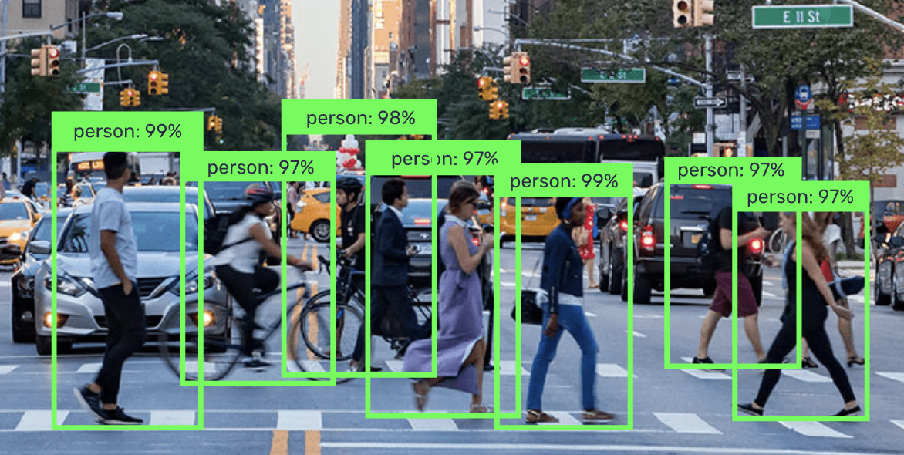

<div align="center">
  
 <br/><br/>
  
**Easily train or fine-tune SOTA computer vision models with one open source training library**
[](https://twitter.com/intent/tweet?text=Easily%20train%20or%20fine-tune%20SOTA%20computer%20vision%20models%20from%20one%20training%20repository&url=https://github.com/Deci-AI/super-gradients&via=deci_ai&hashtags=AI,deeplearning,computervision,training,opensource)
______________________________________________________________________
 <p align="center">
  <a href="https://www.supergradients.com/">Website</a> •
  <a href="#why-use-supergradients">Why Use SG?</a> •
  <a href="https://deci-ai.github.io/super-gradients/user_guide.html#introducing-the-supergradients-library">User Guide</a> •
  <a href="https://deci-ai.github.io/super-gradients/super_gradients.common.html">Docs</a> •
  <a href="#computer-vision-models---pretrained-checkpoints">SOTA Pretrained Models</a> •
  <a href="#community">Community</a> •
  <a href="#license">License</a> •
  <a href="#deci-lab">Deci Lab</a>
</p>
  
  <a href="https://github.com/Deci-AI/super-gradients#prerequisites">
  <a href="https://github.com/Deci-AI/super-gradients#prerequisites">
  <a href="https://pypi.org/project/super-gradients/">
  <a href="https://github.com/Deci-AI/super-gradients#computer-vision-models-pretrained-checkpoints" >
  <a href="https://github.com/Deci-AI/super-gradients/releases">
  <a href="https://join.slack.com/t/supergradients-comm52/shared_invite/zt-10vz6o1ia-b_0W5jEPEnuHXm087K~t8Q">
  <a href="https://github.com/Deci-AI/super-gradients/blob/master/LICENSE.md">
  <a href="https://deci-ai.github.io/super-gradients/welcome.html">
    
</div>

# SuperGradients

## Introduction
Welcome to SuperGradients, a free, open-source training library for PyTorch-based deep learning models.
SuperGradients allows you to train or fine-tune SOTA pre-trained models for all the most commonly applied computer vision tasks with just one training library. We currently support object detection, image classification and semantic segmentation for videos and images.

Docs and full user guide[](#)
### Why use SuperGradients?
 
**Built-in SOTA Models**

Easily load and fine-tune production-ready, [pre-trained SOTA models](https://github.com/Deci-AI/super-gradients#pretrained-classification-pytorch-checkpoints) that incorporate best practices and validated hyper-parameters for achieving best-in-class accuracy.
    
**Easily Reproduce our Results**
       
Why do all the grind work, if we already did it for you? leverage tested and proven [recipes](https://github.com/Deci-AI/super-gradients/tree/master/src/super_gradients/recipes) & [code examples](https://github.com/Deci-AI/super-gradients/tree/master/src/super_gradients/examples) for a wide range of computer vision models generated by our team of deep learning experts. Easily configure your own or use plug & play hyperparameters for training, dataset, and architecture.
    
**Production Readiness and Ease of Integration**
    
All SuperGradients models’ are production ready in the sense that they are compatible with deployment tools such as TensorRT (Nvidia) and OpenVino (Intel) and can be easily taken into production. With a few lines of code you can easily integrate the models into your codebase.

<div align="center">

</div>


## What's New
* 【07/02/2022】 We added RegSeg recipes and pre-trained models to our [Semantic Segmentation models](#pretrained-semantic-segmentation-pytorch-checkpoints).
* 【01/02/2022】 We added issue templates for feature requests and bug reporting.
* 【20/01/2022】 STDC family - new recipes added with even higher mIoU💪
* 【17/01/2022】 We have released transfer learning example [notebook](https://colab.research.google.com/drive/1ZR_cvy8tQB_fTZwB2SQxg3RfIVKxNxRO?usp=sharing) for object detection (YOLOv5).

Check out SG full [release notes](https://github.com/Deci-AI/super-gradients/releases).

## Comming soon
- [ ] YOLOX models (recipes, pre-trained checkpoints).
- [ ] SSD MobileNet models (recipes, pre-trained checkpoints) for edge devices deployment.
- [ ] Transfer learning example notebook for semantic segmentation (STDC).
- [ ] Dali implementation.
- [ ] Integration with professional tools.

__________________________________________________________________________________________________________
### Table of Content
<details> 
<summary>See Table </summary>
<!-- toc -->

- [Getting Started](#getting-started)
    - [Quick Start Notebook - classification example](#quick-start-notebook---classification)
    - [Quick Start Notebook - object detection example](#quick-start-notebook---object-detection)
    - [Walkthrough Notebook](#supergradients-complete-walkthrough-notebook)
    - [Transfer Learning with SG Notebook - Object detection example](#transfer-learning-with-sg-notebook---object-detection)
- [Installation Methods](#installation-methods)
    - [Prerequisites](#prerequisites)
    - [Quick Installation](#quick-installation)
- [Computer Vision Models - Pretrained Checkpoints](#computer-vision-models---pretrained-checkpoints)
  - [Pretrained Classification PyTorch Checkpoints](#pretrained-classification-pytorch-checkpoints)
  - [Pretrained Object Detection PyTorch Checkpoints](#pretrained-object-detection-pytorch-checkpoints)
  - [Pretrained Semantic Segmentation PyTorch Checkpoints](#pretrained-semantic-segmentation-pytorch-checkpoints)
- [Contributing](#contributing)
- [Citation](#citation)
- [Community](#community)
- [License](#license)
- [Deci Lab](#deci-lab)

<!-- tocstop -->
  
</details>

## Getting Started

### Quick Start Notebook - Classification

Get started with our quick start notebook for image classification tasks on Google Colab for a quick and easy start using free GPU hardware.

<table class="tfo-notebook-buttons" align="left">
 <td>
   <a target="_blank" href="https://colab.research.google.com/drive/12cURMPVQrvhgYle-wGmE2z8b_p90BdL0?usp=sharing">SuperGradients Quick Start in Google Colab</a>
 </td>
  <td>
   <a href="https://minhaskamal.github.io/DownGit/#/home?url=https://github.com/Deci-AI/super-gradients/blob/master/src/super_gradients/examples/SG_quickstart_classification.ipynb">Download notebook</a>
 </td>
 <td>
   <a target="_blank" href="https://github.com/Deci-AI/super-gradients/tree/master/src/super_gradients/examples">View source on GitHub</a>
 </td>
</table>
 </br></br>

### Quick Start Notebook - Object Detection

Get started with our quick start notebook for object detection tasks on Google Colab for a quick and easy start using free GPU hardware.

<table class="tfo-notebook-buttons" align="left">
 <td>
   <a target="_blank" href="https://colab.research.google.com/drive/1l8nrU3MCj4AMKuucCPzfznfCg4D08SCh?usp=sharing">SuperGradients Quick Start in Google Colab</a>
 </td>
  <td>
   <a href="https://minhaskamal.github.io/DownGit/#/home?url=https://github.com/Deci-AI/super-gradients/blob/master/src/super_gradients/examples/SG_quickstart_detection.ipynb">Download notebook</a>
 </td>
 <td>
   <a target="_blank" href="https://github.com/Deci-AI/super-gradients/tree/master/src/super_gradients/examples">View source on GitHub</a>
 </td>
</table>
 </br></br>

### SuperGradients Complete Walkthrough Notebook

Learn more about SuperGradients training components with our walkthrough notebook on Google Colab for an easy to use tutorial using free GPU hardware

<table class="tfo-notebook-buttons" align="left">
 <td>
   <a target="_blank" href="https://colab.research.google.com/drive/1smwh4EAgE8PwnCtwsdU8a9D9Ezfh6FQK?usp=sharing">SuperGradients Walkthrough in Google Colab</a>
 </td>
  <td>
   <a href="https://minhaskamal.github.io/DownGit/#/home?url=https://github.com/Deci-AI/super-gradients/blob/master/src/super_gradients/examples/SG_Walkthrough.ipynb">Download notebook</a>
 </td>
 <td>
   <a target="_blank" href="https://github.com/Deci-AI/super-gradients/tree/master/src/super_gradients/examples">View source on GitHub</a>
 </td>
</table>
 </br></br>

 ### Transfer Learning with SG Notebook - Object Detection

Learn more about SuperGradients transfer learning or fine tuning abilities with our COCO pre-trained YoloV5nano fine tuning into a sub-dataset of PASCAL VOC example notebook on Google Colab for an easy to use tutorial using free GPU hardware

<table class="tfo-notebook-buttons" align="left">
 <td>
   <a target="_blank" href="https://colab.research.google.com/drive/1ZR_cvy8tQB_fTZwB2SQxg3RfIVKxNxRO?usp=sharing">SuperGradients Transfer Learning in Google Colab</a>
 </td>
  <td>
   <a href="https://minhaskamal.github.io/DownGit/#/home?url=https://github.com/Deci-AI/super-gradients/blob/master/src/super_gradients/examples/SG_TransferLearningDetection.ipynb">Download notebook</a>
 </td>
 <td>
   <a target="_blank" href="https://github.com/Deci-AI/super-gradients/tree/master/src/super_gradients/examples">View source on GitHub</a>
 </td>
</table>
 </br></br>

## Installation Methods
### Prerequisites
<details>
  
<summary>General requirements</summary>
  
- Python 3.7, 3.8 or 3.9 installed.
- torch>=1.9.0
  - https://pytorch.org/get-started/locally/
- The python packages that are specified in requirements.txt;

</details>
    
<details>
  
<summary>To train on nvidia GPUs</summary>
  
- [Nvidia CUDA Toolkit >= 11.2](https://developer.nvidia.com/cuda-11.2.0-download-archive?target_os=Linux&target_arch=x86_64&target_distro=Ubuntu)
- CuDNN >= 8.1.x
- Nvidia Driver with CUDA >= 11.2 support (≥460.x)
  
</details>
    
### Quick Installation

<details>
  
<summary>Install stable version using PyPi</summary>

See in [PyPi](https://pypi.org/project/super-gradients/)
```bash
pip install super-gradients
```

That's it !

</details>
    
<details>
  
<summary>Install using GitHub</summary>


```bash
pip install git+https://github.com/Deci-AI/super-gradients.git@stable
```

</details>


## Documentation
Check SuperGradients [Docs](https://deci-ai.github.io/super-gradients/welcome.html) for full documentation, user guide, and examples. 


## Computer Vision Models - Pretrained Checkpoints

### Pretrained Classification PyTorch Checkpoints


| Model | Dataset |  Resolution |    Top-1    |    Top-5   | Latency b1<sub>T4</sub> | Throughput b1<sub>T4</sub> |
|-------------------- |------ | ---------- |----------- |------ | -------- |  :------: |
| EfficientNet B0 | ImageNet  |224x224   |  77.62   | 93.49  |**1.16ms** |**862fps** |
| RegNetY200 | ImageNet  |224x224   |  70.88    |   89.35  |**1.07ms**|**928.3fps** |
| RegNetY400  | ImageNet  |224x224   |  74.74    |   91.46  |**1.22ms** |**816.5fps** |
| RegNetY600  | ImageNet  |224x224   |  76.18    |  92.34   |**1.19ms** |**838.5fps** |
| RegNetY800   | ImageNet  |224x224   |  77.07    |  93.26   |**1.18ms** |**841.4fps** |
| ResNet18   | ImageNet  |224x224   |  70.6    |   89.64 |**0.599ms** |**1669fps** |
| ResNet34  | ImageNet  |224x224   |  74.13   |   91.7  |**0.89ms** |**1123fps** |
| ResNet50  | ImageNet  |224x224   |  79.47  |   93.0  |**0.94ms** |**1063fps** |
| MobileNetV3_large-150 epochs | ImageNet  |224x224   |  73.79    |   91.54  |**0.87ms** |**1149fps** |
| MobileNetV3_large-300 epochs  | ImageNet  |224x224   |  74.52    |  91.92 |**0.87ms** |**1149fps** |
| MobileNetV3_small | ImageNet  |224x224   |67.45    |  87.47   |**0.75ms** |**1333fps** |
| MobileNetV2_w1   | ImageNet  |224x224   |  73.08 | 91.1  |**0.58ms** |**1724fps** |

> **NOTE:** Performance measured on T4 GPU with TensorRT, using FP16 precision and batch size 1

### Pretrained Object Detection PyTorch Checkpoints


| Model | Dataset |  Resolution | mAP<sup>val<br>0.5:0.95 | Latency b1<sub>T4</sub> | Throughput b64<sub>T4</sub>  |
|--------------------- |------ | ---------- |------ | -------- |   :------: |
| YOLOv5 nano | COCO |640x640 |27.7  |**6.55ms** |**177.62fps** |
| YOLOv5 small | COCO |640x640 |37.3   |**7.13ms** |**159.44fps** |
| YOLOv5 medium  | COCO |640x640 |45.2   |**8.95ms** |**121.78fps** |
| YOLOv5 large | COCO |640x640 |48.0   |**11.49ms** |**95.99fps** |
  

> **NOTE:** Performance measured on T4 GPU with TensorRT, using FP16 precision and batch size 1 (latency) and batch size 64 (throughput)

### Pretrained Semantic Segmentation PyTorch Checkpoints


| Model | Dataset |  Resolution | mIoU | Latency b1<sub>T4</sub> | Throughput b1<sub>T4</sub>  | Latency b1<sub>T4</sub> including IO |
|--------------------- |------ | ---------- | ------ | -------- | -------- | :------: |
| DDRNet23   | Cityscapes |1024x2048   |78.65  |**7.62ms** |**131.3fps** |**25.94ms**|
| DDRNet23 slim   | Cityscapes |1024x2048 |76.6  |**3.56ms** |**280.5fps** |**22.80ms**|
| STDC1-Seg50   | Cityscapes | 512x1024 |74.36 |**2.83ms** |**353.3fps** |**12.57ms**|
| STDC1-Seg75   | Cityscapes | 768x1536 |76.87  |**5.71ms** |**175.1fps** |**26.70ms**|
| STDC2-Seg50   | Cityscapes | 512x1024 |75.27 |**3.74ms** |**267.2fps** |**13.89ms**
| STDC2-Seg75   | Cityscapes | 768x1536 |78.93 |**7.35ms** |**135.9fps** |**28.18ms**|
| RegSeg (exp48)   | Cityscapes | 1024x2048 |78.15 |**13.09ms** |**76.4fps** |**41.88ms**|
| Larger RegSeg (exp53)   | Cityscapes | 1024x2048 |79.2|**24.82ms** |**40.3fps** |**51.87ms**|
| ShelfNet_LW_34 | COCO Segmentation (21 classes from PASCAL including background) |512x512 |65.1  |**-** |**-** |**-** |


> **NOTE:** Performance measured on T4 GPU with TensorRT, using FP16 precision and  batch size 1 (latency), and not including IO


## Contributing

To learn about making a contribution to SuperGradients, please see our [Contribution page](CONTRIBUTING.md).

Our awesome contributors:
    
<a href="https://github.com/Deci-AI/super-gradients/graphs/contributors">
  
</a>


<br/>Made with [contrib.rocks](https://contrib.rocks).

## Citation

If you are using SuperGradients library or benchmarks in your research, please cite SuperGradients deep learning training library.

## Community

If you want to be a part of SuperGradients growing community, hear about all the exciting news and updates, need help, request for advanced features,
    or want to file a bug or issue report, we would love to welcome you aboard!

* Slack is the place to be and ask questions about SuperGradients and get support. [Click here to join our Slack](
  https://join.slack.com/t/supergradients-comm52/shared_invite/zt-10vz6o1ia-b_0W5jEPEnuHXm087K~t8Q)
    
* To report a bug, [file an issue](https://github.com/Deci-AI/super-gradients/issues) on GitHub.

* Join the [SG Newsletter](https://www.supergradients.com/#Newsletter)
  for staying up to date with new features and models, important announcements, and upcoming events.
    
* For a short meeting with SuperGradients PM, use this [link](https://calendly.com/ofer-baratz-deci/15min) and choose your preferred time.

## License

This project is released under the [Apache 2.0 license](LICENSE).
    

    
__________________________________________________________________________________________________________


## Deci Lab

Deci Lab is our end to end platform for building, optimizing and deploying deep learning models to production.

Sign up for our [FREE Community Tier](https://console.deci.ai/) to enjoy immediate improvement in throughput, latency, memory footprint and model size.

Features:
- Automatically compile and quantize your models with just a few clicks (TrT, OpenVino).
- Gain up to 10X improvement in throughput, latency, memory and model size. 
- Easily benchmark your models’ performance on different hardware and batch sizes.
- Invite co-workers to collaborate on models and communicate your progress.
- Deci supports all common frameworks and Hardware, from Intel CPUs to Nvidia's GPUs and Jetsons.

Sign up for Deci Lab for free [here](https://console.deci.ai/) 

