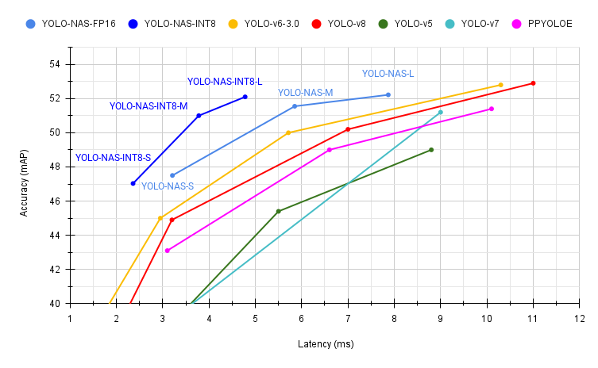
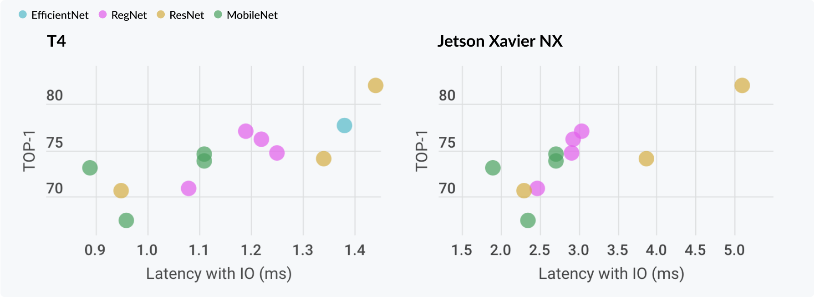

<div align="center" markdown="1">
  
 <br/><br/>
  
**Build, train, and fine-tune production-ready deep learning  SOTA vision models**
[](https://twitter.com/intent/tweet?text=Easily%20train%20or%20fine-tune%20SOTA%20computer%20vision%20models%20from%20one%20training%20repository&url=https://github.com/Deci-AI/super-gradients&via=deci_ai&hashtags=AI,deeplearning,computervision,training,opensource)

#### Version 3 is out! Notebooks have been updated!
______________________________________________________________________
</div>  
<div align="center">
<p align="center">
  <a href="https://www.supergradients.com/">Website</a> •
  <a href="https://docs.deci.ai/super-gradients/documentation/source/welcome.html">Docs</a> •
  <a href="#getting-started">Getting Started</a> •
  <a href="#implemented-model-architectures">Pretrained Models</a> •
  <a href="#community">Community</a> •
  <a href="#license">License</a> •
  <a href="#deci-platform">Deci Platform</a>
</p>
<p align="center">
  <a href="https://github.com/Deci-AI/super-gradients#prerequisites">
  <a href="https://github.com/Deci-AI/super-gradients#prerequisites">
  <a href="https://pypi.org/project/super-gradients/">
  <a href="https://github.com/Deci-AI/super-gradients#computer-vision-models-pretrained-checkpoints" >
  <a href="https://github.com/Deci-AI/super-gradients/releases">
  <a href="https://join.slack.com/t/supergradients-comm52/shared_invite/zt-10vz6o1ia-b_0W5jEPEnuHXm087K~t8Q">
  <a href="https://github.com/Deci-AI/super-gradients/blob/master/LICENSE.md">
  <a href="https://docs.deci.ai/super-gradients/documentation/source/welcome.html"></a>
</p>    
</div>

______________________________________________________________________

## Build with SuperGradients
__________________________________________________________________________________________________________

### Support various computer vision tasks
<div align="center">


</div>


### Ready to deploy pre-trained SOTA models

YOLO-NAS architecture is out! The new YOLO-NAS delivers state-of-the-art performance with the unparalleled accuracy-speed performance, outperforming other models such as YOLOv5, YOLOv6, YOLOv7 and YOLOv8.
Check it out here: [YOLO-NAS](YOLONAS.md).

<div align="center">

</div>

```python
# Load model with pretrained weights
from super_gradients.training import models
from super_gradients.common.object_names import Models

model = models.get(Models.YOLO_NAS_M, pretrained_weights="coco")
```
#### All Computer Vision Models - Pretrained Checkpoints can be found in the [Model Zoo](http://bit.ly/41dkt89)

#### Classification
<div align="center">

</div>

#### Semantic Segmentation
<div align="center">

</div>

#### Object Detection 
<div align="center">

</div>


### Easy to train SOTA Models

Easily load and fine-tune production-ready, pre-trained SOTA models that incorporate best practices and validated hyper-parameters for achieving best-in-class accuracy. 
For more information on how to do it go to [Getting Started](#getting-started)
    

#### Plug and play recipes
```bash
python -m super_gradients.train_from_recipe architecture=regnetY800 dataset_interface.data_dir=<YOUR_Imagenet_LOCAL_PATH> ckpt_root_dir=<CHEKPOINT_DIRECTORY>
```
More example on how and why to use recipes can be found in [Recipes](#recipes)


### Production readiness
All SuperGradients models’ are production ready in the sense that they are compatible with deployment tools such as TensorRT (Nvidia) and OpenVINO (Intel) and can be easily taken into production. With a few lines of code you can easily integrate the models into your codebase.
```python
# Load model with pretrained weights
from super_gradients.training import models
from super_gradients.common.object_names import Models

model = models.get(Models.YOLO_NAS_M, pretrained_weights="coco")

# Prepare model for conversion
# Input size is in format of [Batch x Channels x Width x Height] where 640 is the standard COCO dataset dimensions
model.eval()
model.prep_model_for_conversion(input_size=[1, 3, 640, 640])
    
# Create dummy_input

# Convert model to onnx
torch.onnx.export(model, dummy_input,  "yolo_nas_m.onnx")
```
More information on how to take your model to production can be found in [Getting Started](#getting-started) notebooks

## Quick Installation

__________________________________________________________________________________________________________

 
```bash
pip install super-gradients
```

## What's New
__________________________________________________________________________________________________________
30th of May
* [Quantization Aware Training YoloNAS on Custom Dataset](https://bit.ly/3MIKdTy)

Version 3.1.1 (May 3rd)
* [YOLO-NAS](https://bit.ly/41WeNPZ)
* New [predict function](https://bit.ly/3oZfaea) (predict on any image, video, url, path, stream)
* [RoboFlow100](https://bit.ly/40YOJ5z) datasets integration 
* A new [Documentation Hub](https://docs.deci.ai/super-gradients/documentation/source/welcome.html)
* Integration with [DagsHub for experiment monitoring](https://bit.ly/3ALFUkQ)
* Support [Darknet/Yolo format detection dataset](https://bit.ly/41VX6Qu) (used by Yolo v5, v6, v7, v8) 
* [Segformer](https://bit.ly/3oYu6Jp) model and recipe 
* Post Training Quantization and Quantization Aware Training - [notebooks](http://bit.ly/3KrN6an)

Check out SG full [release notes](https://github.com/Deci-AI/super-gradients/releases).

## Coming soon
__________________________________________________________________________________________________________
- [ ] Pre-trained pose estimation model
- [ ] Test Time Augmentations (TTA)
- [ ] Recipe to train DEKR model(convertable to TRT) 
- [ ] Key-points Rescoring for Pose estimation 
- [ ] LR finder
- [ ] Data analysis tools


## Table of Content
__________________________________________________________________________________________________________
<!-- toc -->

- [Getting Started](#getting-started)
- [Advanced Features](#advanced-features)
- [Installation Methods](#installation-methods)
    - [Prerequisites](#prerequisites)
    - [Quick Installation](#quick-installation)
- [Implemented Model Architectures](#implemented-model-architectures)
- [Contributing](#contributing)
- [Citation](#citation)
- [Community](#community)
- [License](#license)
- [Deci Platform](#deci-platform)

<!-- tocstop -->

## Getting Started
__________________________________________________________________________________________________________

### Start Training with Just 1 Command Line
The most simple and straightforward way to start training SOTA performance models with SuperGradients reproducible recipes. Just define your dataset path and where you want your checkpoints to be saved and you are good to go from your terminal!

Just make sure that you [setup your dataset](https://github.com/Deci-AI/super-gradients/blob/master/src/super_gradients/training/datasets/Dataset_Setup_Instructions.md) according to the data dir specified in the recipe.

```bash
python -m super_gradients.train_from_recipe --config-name=imagenet_regnetY architecture=regnetY800 dataset_interface.data_dir=<YOUR_Imagenet_LOCAL_PATH> ckpt_root_dir=<CHEKPOINT_DIRECTORY>
```
### Quickly Load Pre-Trained Weights for Your Desired Model with SOTA Performance
Want to try our pre-trained models on your machine? Import SuperGradients, initialize your Trainer, and load your desired architecture and pre-trained weights from our [SOTA model zoo](http://bit.ly/41dkt89)

```python
# The pretrained_weights argument will load a pre-trained architecture on the provided dataset
    
import super_gradients

model = models.get("model-name", pretrained_weights="pretrained-model-name")

```   
###  Classification

#### Transfer Learning 
  <table class="tfo-notebook-buttons" align="left">
 <td width="500">  
  <a target="_blank" href="https://bit.ly/3xzIutb"> Classification Transfer Learning</a>
  </td>
 <td width="200">    
 <a target="_blank" href="https://bit.ly/3xwYEn1"> GitHub source</a>
 </td>
</table>
 </br></br>


###  Semantic Segmentation

####  Quick Start 
<table class="tfo-notebook-buttons" align="left">
 <td width="500">
<a target="_blank" href="https://bit.ly/3qKx9m8"> Segmentation Quick Start</a>
 </td>
</table>
 </br></br>


 
 ####  Transfer Learning 
<table class="tfo-notebook-buttons" align="left">
 <td width="500">
<a target="_blank" href="https://bit.ly/3qKwMbe"> Segmentation Transfer Learning</a>
 </td>
</table>
 </br></br>


####  How to Connect Custom Dataset 
  <table class="tfo-notebook-buttons" align="left">
 <td width="500"> 
<a target="_blank" href="https://bit.ly/3QQBVJp"> Segmentation How to Connect Custom Dataset</a>
   </td>
</table>
 </br></br>


###  Object Detection


#### Transfer Learning
  <table class="tfo-notebook-buttons" align="left">
 <td width="500">   
<a target="_blank" href="https://bit.ly/3SkMohx"> Detection Transfer Learning</a>
   </td>
</table>
 </br></br>

#### How to Connect Custom Dataset 
  <table class="tfo-notebook-buttons" align="left">
 <td width="500">  
  <a target="_blank" href="https://bit.ly/3dqDlg3"> Detection How to Connect Custom Dataset</a>
  </td>
</table>
 </br></br>


### How to Predict Using Pre-trained Model

#### Segmentation, Detection and Classification Prediction 
  <table class="tfo-notebook-buttons" align="left">
 <td width="500">    
<a target="_blank" href="https://bit.ly/3f4mssd"> How to Predict Using Pre-trained Model</a>
  </td>
</table>
 </br></br>


## Advanced Features
__________________________________________________________________________________________________________
### Post Training Quantization and Quantization Aware Training
Quantization involves representing weights and biases in lower precision, resulting in reduced memory and computational requirements, making it useful for deploying models on devices with limited resources. The process can be done during training, called Quantization aware training, or after training, called post-training quantization. A full tutorial can be found [here](http://bit.ly/41hC8uI).
  <table class=“tfo-notebook-buttons” align=“left”>
 <td width=“500”>
   <a target="_blank" href="http://bit.ly/3KrN6an"> Post Training Quantization and Quantization Aware Training</a>
  </td>
</table>

### Quantization Aware Training YoloNAS on Custom Dataset
This tutorial provides a comprehensive guide on how to fine-tune a YoloNAS model using a custom dataset. It also demonstrates how to utilize SG's QAT (Quantization-Aware Training) support. Additionally, it offers step-by-step instructions on deploying the model and performing benchmarking.
  <table class=“tfo-notebook-buttons” align=“left”>
 <td width=“500”>
   <a target="_blank" href="https://bit.ly/3MIKdTy"> Quantization Aware Training YoloNAS on Custom Dataset</a>
  </td>
</table>

### Knowledge Distillation Training
Knowledge Distillation is a training technique that uses a large model, teacher model, to improve the performance of a smaller model, the student model.
Learn more about SuperGradients knowledge distillation training with our pre-trained BEiT base teacher model and Resnet18 student model on CIFAR10 example notebook on Google Colab for an easy to use tutorial using free GPU hardware
  <table class="tfo-notebook-buttons" align="left">
 <td width="500">   
   <a target="_blank" href="https://bit.ly/3BLA5oR"> Knowledge Distillation Training</a>
  </td>
</table>
 </br></br>

### Recipes
To train a model, it is necessary to configure 4 main components. These components are aggregated into a single "main" recipe `.yaml` file that inherits the aforementioned dataset, architecture, raining and checkpoint params. It is also possible (and recomended for flexibility) to override default settings with custom ones.
All recipes can be found [here](http://bit.ly/3gfLw07)
</br>
Recipes support out of the box every model, metric or loss that is implemented in SuperGradients, but you can easily extend this to any custom object that you need by "registering it". Check out [this](http://bit.ly/3TQ4iZB) tutorial for more information.

  <table class="tfo-notebook-buttons" align="left">
 <td width="500">   
   <a target="_blank" href="https://bit.ly/3UiY5ab"> How to Use Recipes</a>
  </td>
</table>
 </br></br>

 </br>
<details markdown="1">
  <summary><h3>Using Distributed Data Parallel (DDP) </h3></summary>

#### Why use DDP ?

Recent Deep Learning models are growing larger and larger to an extent that training on a single GPU can take weeks.
In order to train models in a timely fashion, it is necessary to train them with multiple GPUs.
Using 100s GPUs can reduce training time of a model from a week to less than an hour.

#### How does it work ?
Each GPU has its own process, which controls a copy of the model and which loads its own mini-batch from disk and sends
it to its GPU during training. After the forward pass is completed on every GPU, the gradient is reduced across all
GPUs, yielding to all the GPUs having the same gradient locally. This leads to the model weights to stay synchronized
across all GPUs after the backward pass.

#### How to use it ?
You can use SuperGradients to train your model with DDP in just a few lines.


*main.py*
```python
from super_gradients import init_trainer, Trainer
from super_gradients.common import MultiGPUMode
from super_gradients.training.utils.distributed_training_utils import setup_device

# Initialize the environment
init_trainer()

# Launch DDP on 4 GPUs'
setup_device(multi_gpu=MultiGPUMode.DISTRIBUTED_DATA_PARALLEL, num_gpus=4)

# Call the trainer
Trainer(expriment_name=...)

# Everything you do below will run on 4 gpus

...

Trainer.train(...)

```

Finally, you can launch your distributed training with a simple python call.
```bash
python main.py
```


Please note that if you work with `torch<1.9.0` (deprecated), you will have to launch your training with either 
`torch.distributed.launch` or `torchrun`, in which case `nproc_per_node` will overwrite the value  set with `gpu_mode`:
```bash
python -m torch.distributed.launch --nproc_per_node=4 main.py
```

```bash
torchrun --nproc_per_node=4 main.py
```

#### Calling functions on a single node

It is often in DDP training that we want to execute code on the master rank (i.e rank 0).
In SG, users usually execute their own code by triggering "Phase Callbacks" (see "Using phase callbacks" section below).
One can make sure the desired code will only be ran on rank 0, using ddp_silent_mode or the multi_process_safe decorator.
For example, consider the simple phase callback below, that uploads the first 3 images of every batch during training to
the Tensorboard:

```python
from super_gradients.training.utils.callbacks import PhaseCallback, PhaseContext, Phase
from super_gradients.common.environment.env_helpers import multi_process_safe

class Upload3TrainImagesCalbback(PhaseCallback):
    def __init__(
        self,
    ):
        super().__init__(phase=Phase.TRAIN_BATCH_END)
    
    @multi_process_safe
    def __call__(self, context: PhaseContext):
        batch_imgs = context.inputs.cpu().detach().numpy()
        tag = "batch_" + str(context.batch_idx) + "_images"
        context.sg_logger.add_images(tag=tag, images=batch_imgs[: 3], global_step=context.epoch)

```
The @multi_process_safe decorator ensures that the callback will only be triggered by rank 0. Alternatively, this can also
be done by the SG trainer boolean attribute (which the phase context has access to), ddp_silent_mode, which is set to False
iff the current process rank is zero (even after the process group has been killed):
```python
from super_gradients.training.utils.callbacks import PhaseCallback, PhaseContext, Phase

class Upload3TrainImagesCalbback(PhaseCallback):
    def __init__(
        self,
    ):
        super().__init__(phase=Phase.TRAIN_BATCH_END)

    def __call__(self, context: PhaseContext):
        if not context.ddp_silent_mode:
            batch_imgs = context.inputs.cpu().detach().numpy()
            tag = "batch_" + str(context.batch_idx) + "_images"
            context.sg_logger.add_images(tag=tag, images=batch_imgs[: 3], global_step=context.epoch)

```

Note that ddp_silent_mode can be accessed through SgTrainer.ddp_silent_mode. Hence, it can be used in scripts after calling
SgTrainer.train() when some part of it should be ran on rank 0 only.

#### Good to know
Your total batch size will be (number of gpus x batch size), so you might want to increase your learning rate.
There is no clear rule, but a rule of thumb seems to be to [linearly increase the learning rate with the number of gpus](https://arxiv.org/pdf/1706.02677.pdf) 

</details>

<details markdown="1">
<summary><h3> Easily change architectures parameters </h3></summary>

```python
from super_gradients.training import models

# instantiate default pretrained resnet18
default_resnet18 = models.get(model_name="resnet18", num_classes=100, pretrained_weights="imagenet")

# instantiate pretrained resnet18, turning DropPath on with probability 0.5
droppath_resnet18 = models.get(model_name="resnet18", arch_params={"droppath_prob": 0.5}, num_classes=100, pretrained_weights="imagenet")

# instantiate pretrained resnet18, without classifier head. Output will be from the last stage before global pooling
backbone_resnet18 = models.get(model_name="resnet18", arch_params={"backbone_mode": True}, pretrained_weights="imagenet")
```

</details>

<details markdown="1">

<summary><h3> Using phase callbacks </h3></summary>  
  
```python
from super_gradients import Trainer
from torch.optim.lr_scheduler import ReduceLROnPlateau
from super_gradients.training.utils.callbacks import Phase, LRSchedulerCallback
from super_gradients.training.metrics.classification_metrics import Accuracy

# define PyTorch train and validation loaders and optimizer

# define what to be called in the callback
rop_lr_scheduler = ReduceLROnPlateau(optimizer, mode="max", patience=10, verbose=True)

# define phase callbacks, they will fire as defined in Phase
phase_callbacks = [LRSchedulerCallback(scheduler=rop_lr_scheduler,
                                       phase=Phase.VALIDATION_EPOCH_END,
                                       metric_name="Accuracy")]

# create a trainer object, look the declaration for more parameters
trainer = Trainer("experiment_name")

# define phase_callbacks as part of the training parameters
train_params = {"phase_callbacks": phase_callbacks}
```

</details>

<details markdown="1">

<summary><h3> Integration to DagsHub </h3></summary>    

[](https://colab.research.google.com/drive/11fW56pMpwOMHQSbQW6xxMRYvw1mEC-t-?usp=sharing) 

```python
from super_gradients import Trainer

trainer = Trainer("experiment_name")
model = ...

training_params = { ...  # Your training params
                   "sg_logger": "dagshub_sg_logger",  # DagsHub Logger, see class super_gradients.common.sg_loggers.dagshub_sg_logger.DagsHubSGLogger for details
                   "sg_logger_params":  # Params that will be passes to __init__ of the logger super_gradients.common.sg_loggers.dagshub_sg_logger.DagsHubSGLogger
                     {
                       "dagshub_repository": "<REPO_OWNER>/<REPO_NAME>", # Optional: Your DagsHub project name, consisting of the owner name, followed by '/', and the repo name. If this is left empty, you'll be prompted in your run to fill it in manually.
                       "log_mlflow_only": False, # Optional: Change to true to bypass logging to DVC, and log all artifacts only to MLflow  
                       "save_checkpoints_remote": True,
                       "save_tensorboard_remote": True,
                       "save_logs_remote": True,
                     }
                   }
```

</details>

<details>

<summary><h3> Integration to Weights and Biases </h3></summary>    
  

```python
from super_gradients import Trainer

# create a trainer object, look the declaration for more parameters
trainer = Trainer("experiment_name")

train_params = { ... # training parameters
                "sg_logger": "wandb_sg_logger", # Weights&Biases Logger, see class WandBSGLogger for details
                "sg_logger_params": # paramenters that will be passes to __init__ of the logger 
                  {
                    "project_name": "project_name", # W&B project name
                    "save_checkpoints_remote": True
                    "save_tensorboard_remote": True
                    "save_logs_remote": True
                  } 
               }
```

</details>

<details markdown="1">

<summary><h3> Integration to ClearML </h3></summary>    
    
```python
from super_gradients import Trainer

# create a trainer object, look the declaration for more parameters
trainer = Trainer("experiment_name")

train_params = { ... # training parameters
                "sg_logger": "clearml_sg_logger", # ClearML Logger, see class ClearMLSGLogger for details
                "sg_logger_params": # paramenters that will be passes to __init__ of the logger 
                  {
                    "project_name": "project_name", # ClearML project name
                    "save_checkpoints_remote": True,
                    "save_tensorboard_remote": True,
                    "save_logs_remote": True,
                  } 
               }
```

  </details>


## Installation Methods
__________________________________________________________________________________________________________
### Prerequisites
<details markdown="1">
  
<summary>General requirements</summary>
  
- Python 3.7, 3.8 or 3.9 installed.
- 1.9.0 <= torch < 1.14 
  - https://pytorch.org/get-started/locally/
- The python packages that are specified in requirements.txt;

</details>
    
<details markdown="1">
  
<summary>To train on nvidia GPUs</summary>
  
- [Nvidia CUDA Toolkit >= 11.2](https://developer.nvidia.com/cuda-11.2.0-download-archive?target_os=Linux&target_arch=x86_64&target_distro=Ubuntu)
- CuDNN >= 8.1.x
- Nvidia Driver with CUDA >= 11.2 support (≥460.x)
  
</details>
    
### Quick Installation

<details markdown="1">
  
<summary>Install stable version using PyPi</summary>

See in [PyPi](https://pypi.org/project/super-gradients/)
```bash
pip install super-gradients
```

That's it !

</details>
    
<details markdown="1">
  
<summary>Install using GitHub</summary>


```bash
pip install git+https://github.com/Deci-AI/super-gradients.git@stable
```

</details> 


## Implemented Model Architectures 
__________________________________________________________________________________________________________

All Computer Vision Models - Pretrained Checkpoints can be found in the [Model Zoo](http://bit.ly/41dkt89)

Detailed list can be found [here](http://bit.ly/3GnJwgZ) 

### Image Classification
  
- [DensNet (Densely Connected Convolutional Networks)](https://github.com/Deci-AI/super-gradients/blob/master/src/super_gradients/training/models/classification_models/densenet.py) 
- [DPN](https://github.com/Deci-AI/super-gradients/blob/master/src/super_gradients/training/models/classification_models/dpn.py) 
- [EfficientNet](https://github.com/Deci-AI/super-gradients/blob/master/src/super_gradients/training/models/classification_models/efficientnet.py)
- [LeNet](https://github.com/Deci-AI/super-gradients/blob/master/src/super_gradients/training/models/classification_models/lenet.py) 
- [MobileNet](https://github.com/Deci-AI/super-gradients/blob/master/src/super_gradients/training/models/classification_models/mobilenet.py)
- [MobileNet v2](https://github.com/Deci-AI/super-gradients/blob/master/src/super_gradients/training/models/classification_models/mobilenetv2.py)  
- [MobileNet v3](https://github.com/Deci-AI/super-gradients/blob/master/src/super_gradients/training/models/classification_models/mobilenetv3.py) 
- [PNASNet](https://github.com/Deci-AI/super-gradients/blob/master/src/super_gradients/training/models/classification_models/pnasnet.py) 
- [Pre-activation ResNet](https://github.com/Deci-AI/super-gradients/blob/master/src/super_gradients/training/models/classification_models/preact_resnet.py)  
- [RegNet](https://github.com/Deci-AI/super-gradients/blob/master/src/super_gradients/training/models/classification_models/regnet.py)
- [RepVGG](https://github.com/Deci-AI/super-gradients/blob/master/src/super_gradients/training/models/classification_models/repvgg.py)  
- [ResNet](https://github.com/Deci-AI/super-gradients/blob/master/src/super_gradients/training/models/classification_models/resnet.py)
- [ResNeXt](https://github.com/Deci-AI/super-gradients/blob/master/src/super_gradients/training/models/classification_models/resnext.py) 
- [SENet ](https://github.com/Deci-AI/super-gradients/blob/master/src/super_gradients/training/models/classification_models/senet.py)
- [ShuffleNet](https://github.com/Deci-AI/super-gradients/blob/master/src/super_gradients/training/models/classification_models/shufflenet.py)
- [ShuffleNet v2](https://github.com/Deci-AI/super-gradients/blob/master/src/super_gradients/training/models/classification_models/shufflenetv2.py)
- [VGG](https://github.com/Deci-AI/super-gradients/blob/master/src/super_gradients/training/models/classification_models/vgg.py)
  
### Semantic Segmentation 

- [PP-LiteSeg](https://bit.ly/3RrtMMO)
- [DDRNet (Deep Dual-resolution Networks)](https://github.com/Deci-AI/super-gradients/blob/master/src/super_gradients/training/models/segmentation_models/ddrnet.py) 
- [LadderNet](https://github.com/Deci-AI/super-gradients/blob/master/src/super_gradients/training/models/segmentation_models/laddernet.py)
- [RegSeg](https://github.com/Deci-AI/super-gradients/blob/master/src/super_gradients/training/models/segmentation_models/regseg.py)
- [ShelfNet](https://github.com/Deci-AI/super-gradients/blob/master/src/super_gradients/training/models/segmentation_models/shelfnet.py) 
- [STDC](https://github.com/Deci-AI/super-gradients/blob/master/src/super_gradients/training/models/segmentation_models/stdc.py)
  

### Object Detection
  
- [CSP DarkNet](https://github.com/Deci-AI/super-gradients/blob/master/src/super_gradients/training/models/detection_models/csp_darknet53.py)
- [DarkNet-53](https://github.com/Deci-AI/super-gradients/blob/master/src/super_gradients/training/models/detection_models/darknet53.py)
- [SSD (Single Shot Detector)](https://github.com/Deci-AI/super-gradients/blob/master/src/super_gradients/training/models/detection_models/ssd.py) 
- [YOLOX](https://github.com/Deci-AI/super-gradients/blob/master/src/super_gradients/training/models/detection_models/yolox.py)
  
  

__________________________________________________________________________________________________________

## Implemented Datasets 
__________________________________________________________________________________________________________

Deci provides implementation for various datasets. If you need to download any of the dataset, you can 
[find instructions](https://github.com/Deci-AI/super-gradients/blob/master/src/super_gradients/training/datasets/Dataset_Setup_Instructions.md). 

### Image Classification
  
- [Cifar10](https://github.com/Deci-AI/super-gradients/blob/master/src/super_gradients/training/datasets/classification_datasets/cifar.py) 
- [ImageNet](https://github.com/Deci-AI/super-gradients/blob/master/src/super_gradients/training/datasets/classification_datasets/imagenet_dataset.py) 
  
### Semantic Segmentation 

- [Cityscapes](https://github.com/Deci-AI/super-gradients/blob/master/src/super_gradients/training/datasets/segmentation_datasets/cityscape_segmentation.py)
- [Coco](https://github.com/Deci-AI/super-gradients/blob/master/src/super_gradients/training/datasets/segmentation_datasets/coco_segmentation.py) 
- [PascalVOC 2012 / PascalAUG 2012](https://github.com/Deci-AI/super-gradients/blob/master/src/super_gradients/training/datasets/segmentation_datasets/pascal_voc_segmentation.py)
- [SuperviselyPersons](https://github.com/Deci-AI/super-gradients/blob/master/src/super_gradients/training/datasets/segmentation_datasets/supervisely_persons_segmentation.py)
- [Mapillary Vistas Dataset](https://github.com/Deci-AI/super-gradients/blob/master/src/super_gradients/training/datasets/segmentation_datasets/mapillary_dataset.py)


### Object Detection
  
- [Coco](https://github.com/Deci-AI/super-gradients/blob/master/src/super_gradients/training/datasets/detection_datasets/coco_detection.py)
- [PascalVOC 2007 & 2012](https://github.com/Deci-AI/super-gradients/blob/master/src/super_gradients/training/datasets/detection_datasets/pascal_voc_detection.py)
  
  

__________________________________________________________________________________________________________


## Documentation

Check SuperGradients [Docs](https://docs.deci.ai/super-gradients/documentation/source/welcome.html) for full documentation, user guide, and examples.
  
## Contributing

To learn about making a contribution to SuperGradients, please see our [Contribution page](CONTRIBUTING.md).

Our awesome contributors:
    
<a href="https://github.com/Deci-AI/super-gradients/graphs/contributors">
  
</a>


<br/>Made with [contrib.rocks](https://contrib.rocks).

## Citation

If you are using SuperGradients library or benchmarks in your research, please cite SuperGradients deep learning training library.

## Community

If you want to be a part of SuperGradients growing community, hear about all the exciting news and updates, need help, request for advanced features,
    or want to file a bug or issue report, we would love to welcome you aboard!

* Discord is the place to be and ask questions about SuperGradients and get support. [Click here to join our Discord Community](
  https://discord.gg/2v6cEGMREN)
    
* To report a bug, [file an issue](https://github.com/Deci-AI/super-gradients/issues) on GitHub.

* Join the [SG Newsletter](https://www.supergradients.com/#Newsletter)
  for staying up to date with new features and models, important announcements, and upcoming events.

* For a short meeting with us, use this [link](https://calendly.com/ofer-baratz-deci/15min) and choose your preferred time.

## License

This project is released under the [Apache 2.0 license](LICENSE).
    
## Citing

### BibTeX

```bibtex

@misc{supergradients,
  doi = {10.5281/ZENODO.7789328},
  url = {https://zenodo.org/record/7789328},
  author = {Aharon,  Shay and {Louis-Dupont} and {Ofri Masad} and Yurkova,  Kate and {Lotem Fridman} and {Lkdci} and Khvedchenya,  Eugene and Rubin,  Ran and Bagrov,  Natan and Tymchenko,  Borys and Keren,  Tomer and Zhilko,  Alexander and {Eran-Deci}},
  title = {Super-Gradients},
  publisher = {GitHub},
  journal = {GitHub repository},
  year = {2021},
}
```

### Latest DOI

[](https://doi.org/10.5281/zenodo.7789328)

    
__________________________________________________________________________________________________________


## Deci Platform

Deci Platform is our end to end platform for building, optimizing and deploying deep learning models to production.

[Request free trial](https://bit.ly/3qO3icq) to enjoy immediate improvement in throughput, latency, memory footprint and model size.

Features

- Automatically compile and quantize your models with just a few clicks (TensorRT, OpenVINO).
- Gain up to 10X improvement in throughput, latency, memory and model size. 
- Easily benchmark your models’ performance on different hardware and batch sizes.
- Invite co-workers to collaborate on models and communicate your progress.
- Deci supports all common frameworks and Hardware, from Intel CPUs to Nvidia's GPUs and Jetsons.
ֿ

Request free trial [here](https://bit.ly/3qO3icq) 
