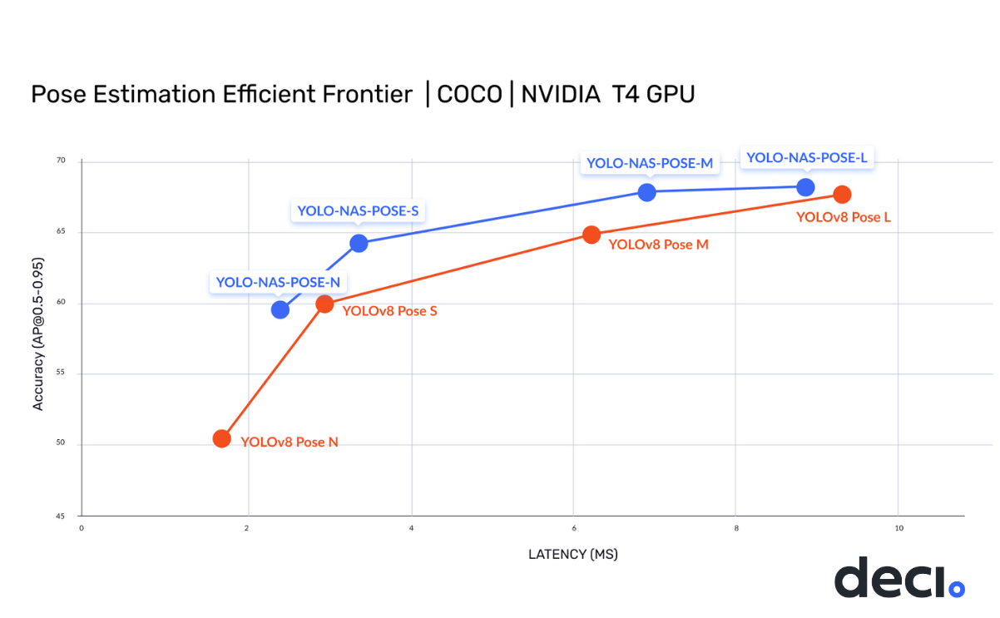

# YOLO-NAS-POSE
### A Next-Generation, Pose Estimation Foundational Model generated by Deci’s Neural Architecture Search Technology

Deci is thrilled to announce the release of a new object detection model, YOLO-NAS-POSE - a derivative of [YOLO-NAS](YOLONAS.md), 
pose estimation architecture, providing superior real-time object detection capabilities and production-ready performance. 
Deci's mission is to provide AI teams with tools to remove development barriers and attain efficient inference performance more quickly.



The new YOLO-NAS-POSE delivers state-of-the-art (SOTA) performance with the unparalleled accuracy-speed performance, outperforming other models such as YOLOv8-Pose, DEKR and others.

Deci's proprietary Neural Architecture Search technology, [AutoNAC™](https://deci.ai/technology/), generated the architecture of YOLO-NAS-POSE model. 
The AutoNAC™ engine lets you input any task, data characteristics (access to data is not required), inference environment and performance targets, 
and then guides you to find the optimal architecture that delivers the best balance between accuracy and inference speed for your specific application. 
In addition to being data and hardware aware, the AutoNAC engine considers other components in the inference stack, including compilers and quantization.

| Model            | AP    | Latency (ms) |
|------------------|-------|--------------|
| YOLO-NAS N       | 59.68 | 2.35 ms      |
| YOLO-NAS S       | 64.15 | 3.29 ms      |
| YOLO-NAS M       | 67.87 | 6.87 ms      |
| YOLO-NAS L       | 68.24 | 8.86 ms      |

AP numbers in table reported for COCO 2017 Val dataset and latency benchmarked for 640x640 images on Nvidia T4 GPU.
No flip-TTA was used.

Similarly to YOLO-NAS, YOLO-NAS-POSE architecture employs quantization-aware blocks and selective quantization for optimized performance. 
In fact YOLO-NAS-POSE is a derivative of YOLO-NAS and uses same backbone and neck as YOLO-NAS. 
Only the head is different and is optimized by AutoNAC for pose estimation task. 
That enables us to use transfer learning and fine-tune YOLO-NAS-POSE starting from YOLO-NAS weights.


## Quickstart

### Extract predicted poses 

```python
import super_gradients

yolo_nas = super_gradients.training.models.get("yolo_nas_pose_l", pretrained_weights="coco_pose").cuda()
model_predictions  = yolo_nas.predict("https://deci-pretrained-models.s3.amazonaws.com/sample_images/beatles-abbeyroad.jpg", conf=0.5).show()

prediction = model_predictions[0].prediction # One prediction per image - Here we work with 1 image, so we get the first.

bboxes = prediction.bboxes_xyxy # [Num Instances, 4] List of predicted bounding boxes for each object 
poses  = prediction.poses       # [Num Instances, Num Joints, 3] list of predicted joints for each detected object (x,y, confidence)
scores = prediction.scores      # [Num Instances] - Confidence value for each predicted instance
```


### Recipes

We provide training recipies for training YOLO-NAS-POSE on COCO, CrowdPose and AnimalPose datasets. 

#### COCO 2017

* [super_gradients/recipes/coco2017_yolo_nas_pose_n.yaml](src/super_gradients/recipes/coco2017_yolo_nas_pose_n.yaml)
* [super_gradients/recipes/coco2017_yolo_nas_pose_s.yaml](src/super_gradients/recipes/coco2017_yolo_nas_pose_s.yaml)
* [super_gradients/recipes/coco2017_yolo_nas_pose_m.yaml](src/super_gradients/recipes/coco2017_yolo_nas_pose_m.yaml)
* [super_gradients/recipes/coco2017_yolo_nas_pose_l.yaml](src/super_gradients/recipes/coco2017_yolo_nas_pose_l.yaml)


## Additional resources

<table>
<tr>
    <td>   
        <a target="_blank" href="https://colab.research.google.com/drive/1O4N5Vbzv0rfkT81LQidPktX8RtoS5A40">
             Predict poses with YoloNAS Pose Model
        </a>
    </td>
</tr>
<tr>
    <td>
        <a href="https://colab.research.google.com/github/Deci-AI/super-gradients/blob/master/notebooks/YoloNAS_Pose_Fine_Tuning_Animals_Pose_Dataset.ipynb">
            
        </a>
        <a href="https://github.com/Deci-AI/super-gradients/blob/master/notebooks/YoloNAS_Pose_Fine_Tuning_Animals_Pose_Dataset.ipynb">
            Fine Tuning YoloNAS-Pose on AnimalPose dataset
        </a>
    </td>
</tr>
<tr>
    <td>   
        <a target="_blank" href="documentation/source/YoloNASPoseQuickstart.md"> 
            Documentation: YOLO-NAS-POSE Quickstart 
        </a>
    </td>
</tr>
<tr>
    <td>   
        <a target="_blank" href="documentation/source/Recipes_Training.md"> 
            Documentation: Recipies
        </a>
    </td>
</tr>
<tr>
    <td>   
        <a target="_blank" href="documentation/source/models_export_pose.md"> 
            Documentation: YOLO-NAS-POSE Export 
        </a>
    </td>
</tr>


<tr>
    <td>   
        Join our <a target="_blank" href="https://discord.gg/2v6cEGMREN">
             Discord Community
        </a>
    </td>
</tr>
</table>


## LICENSE

The YOLO-NAS-POSE model is available under an open-source license with pre-trained weights available for non-commercial use on SuperGradients, Deci's PyTorch-based, open-source, computer vision training library. 
With SuperGradients, users can train models from scratch or fine-tune existing ones, leveraging advanced built-in training techniques like Distributed Data Parallel, Exponential Moving Average, Automatic mixed precision, and Quantization Aware Training.

License file is available here: [YOLO-NAS-POSE WEIGHTS LICENSE](LICENSE.YOLONAS-POSE.md)
