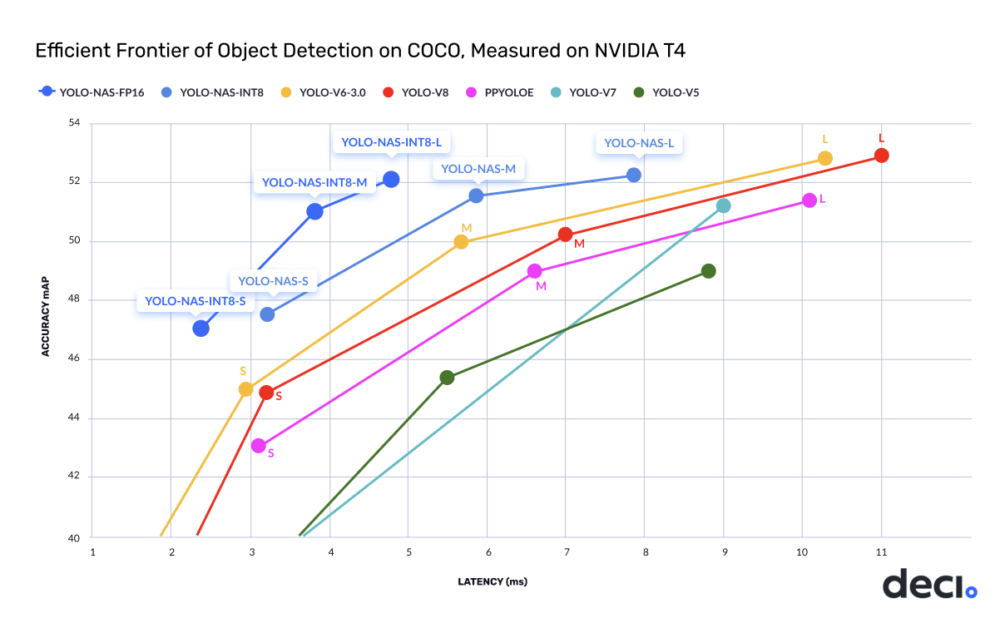
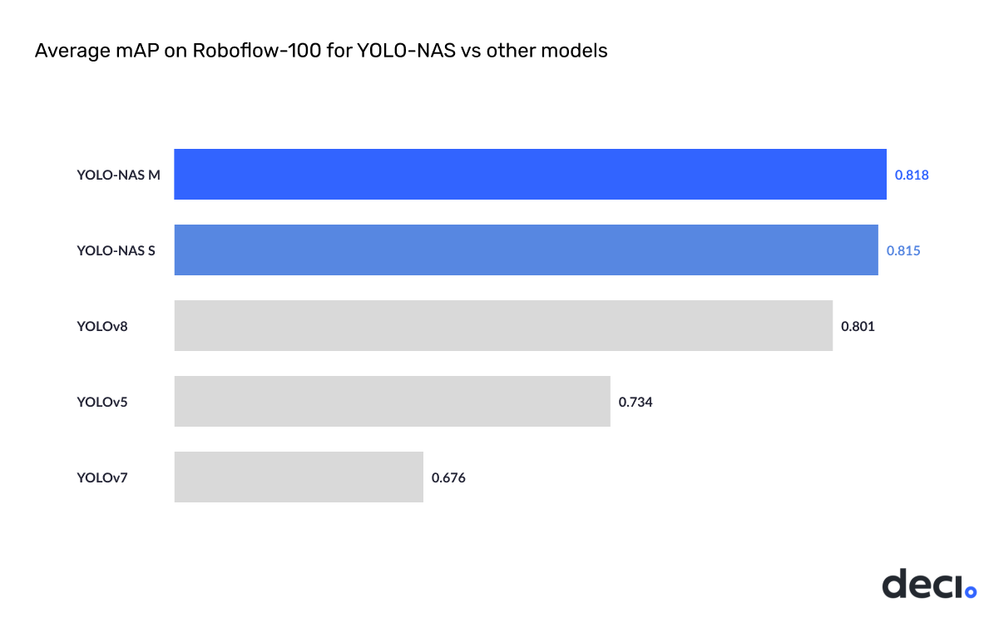

# YOLO-NAS
### A Next-Generation, Object Detection Foundational Model generated by Deci’s Neural Architecture Search Technology

Deci is thrilled to announce the release of a new object detection model, YOLO-NAS - a game-changer in the world of object detection, providing superior real-time object detection capabilities and production-ready performance. Deci's mission is to provide AI teams with tools to remove development barriers and attain efficient inference performance more quickly.



The new YOLO-NAS delivers state-of-the-art (SOTA) performance with the unparalleled accuracy-speed performance, outperforming other models such as YOLOv5, YOLOv6, YOLOv7 and YOLOv8.

Deci's proprietary Neural Architecture Search technology, [AutoNAC™](https://deci.ai/technology/), generated the YOLO-NAS model. The AutoNAC™ engine lets you input any task, data characteristics (access to data is not required), inference environment and performance targets, and then guides you to find the optimal architecture that delivers the best balance between accuracy and inference speed for your specific application. In addition to being data and hardware aware, the AutoNAC engine considers other components in the inference stack, including compilers and quantization.

In terms of pure numbers, YOLO-NAS is ~0.5 mAP point more accurate and 10-20% faster than equivalent variants of YOLOv8 and YOLOv7.

| Model            | mAP   | Latency (ms) |
|------------------|-------|--------------|
| YOLO-NAS S       | 47.5  | 3.21         |
| YOLO-NAS M       | 51.55 | 5.85         |
| YOLO-NAS L       | 52.22 | 7.87         |
| YOLO-NAS S INT-8 | 47.03 | 2.36         |
| YOLO-NAS M INT-8 | 51.0  | 3.78         |
| YOLO-NAS L INT-8 | 52.1  | 4.78         |

mAP numbers in table reported for Coco 2017 Val dataset and latency benchmarked for 640x640 images on Nvidia T4 GPU.

YOLO-NAS's architecture employs quantization-aware blocks and selective quantization for optimized performance. When converted to its INT8 quantized version, YOLO-NAS experiences a smaller precision drop (0.51, 0.65, and 0.45 points of mAP for S, M, and L variants) compared to other models that lose 1-2 mAP points during quantization. These techniques culminate in innovative architecture with superior object detection capabilities and top-notch performance.


## Quickstart

```python
import super_gradients

yolo_nas = super_gradients.training.models.get("yolo_nas_l", pretrained_weights="coco").cuda()
yolo_nas.predict("https://deci-pretrained-models.s3.amazonaws.com/sample_images/beatles-abbeyroad.jpg").show()
```


### Recipes

We provide fine-tuning recipies for Roboflow-100 datasets. 

* [super_gradients/recipes/roboflow_yolo_nas_m.yaml](src/super_gradients/recipes/roboflow_yolo_nas_m.yaml)
* [super_gradients/recipes/roboflow_yolo_nas_s.yaml](src/super_gradients/recipes/roboflow_yolo_nas_s.yaml)
* [super_gradients/recipes/roboflow_yolo_nas_s_qat.yaml](src/super_gradients/recipes/roboflow_yolo_nas_s_qat.yaml)


## Great fine-tuning potential

We demonstrate great performance of YOLO-NAS on downstream tasks. When fine-tuning on Roboflow-100 our YOLO-NAS model achieves higher mAP than our nearest competitors:




## Additional resources
<table>
<tr>
    <td>   
        <a target="_blank" href="https://bit.ly/yolo-nas-starter-notebook">
             Fine-Tuning Notebook 
        </a>
    </td>
</tr><tr>
    <td>   
        <a target="_blank" href="https://bit.ly/3MIKdTy">
             Quantization Aware Training YoloNAS on Custom Dataset Notebook
        </a>
    </td>
</tr>
<tr>
    <td>   
        <a target="_blank" href="documentation/source/YoloNASQuickstart.md"> 
            Documentation: YOLO-NAS Quickstart 
        </a>
    </td>
</tr>
<tr>
    <td>
        <a target="_blank" href="documentation/source/qat_ptq_yolo_nas.md"> 
            Documentation: YOLO-NAS Quantization-Aware training and post-training Quantization 
        </a>
    </td>
</tr>

<tr>
    <td>   
        Join our <a target="_blank" href="https://discord.gg/2v6cEGMREN">
             Discord Community
        </a>
    </td>
</tr>
</table>


## LICENSE

The YOLO-NAS model is available under an open-source license with pre-trained weights available for non-commercial use on SuperGradients, Deci's PyTorch-based, open-source, computer vision training library. 
With SuperGradients, users can train models from scratch or fine-tune existing ones, leveraging advanced built-in training techniques like Distributed Data Parallel, Exponential Moving Average, Automatic mixed precision, and Quantization Aware Training.

License file is available here: [YOLO-NAS WEIGHTS LICENSE](LICENSE.YOLONAS.md)
