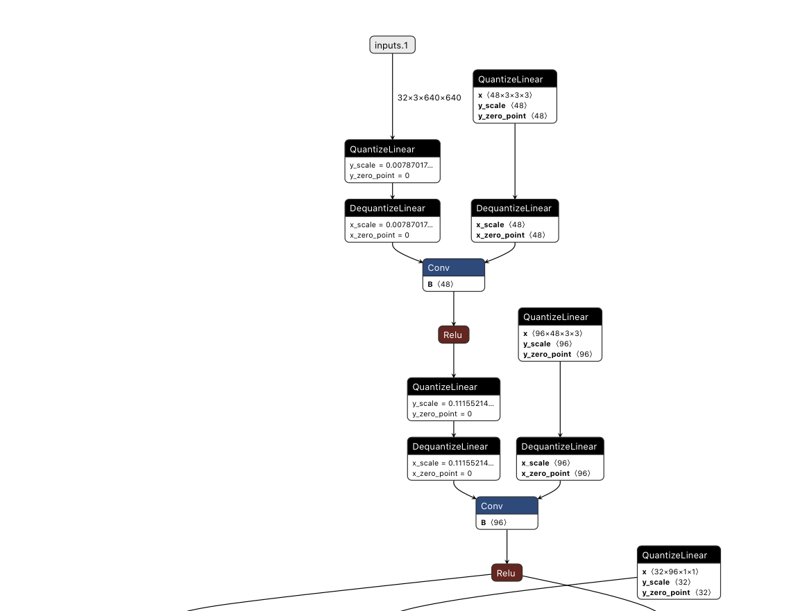
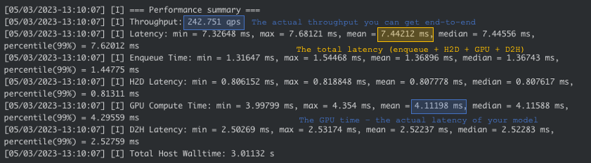

# Benchmarking YoloNAS
TLDR: Getting 10FPS for YoloNAS on your 4090 and feeling cheated? Read this carefully!
## Introduction:

YoloNAS is a leading object detection architecture that combines accuracy and efficiency. Using [post training quantization (PTQ) and quantization-aware training (QAT)](ptq_qat.md) YoloNAS models can be optimized for resource-constrained devices.
However, to fully tap into its potential, it is crucial to know how to export the quantized model to the INT8 TensorRT (TRT) engine.

In this tutorial, we emphasize the significance of this step and provide a concise guide to efficiently exporting a quantized YoloNAS model to the INT8 TRT engine.
Doing so teaches us how to properly benchmark YoloNAS and understand its full potential.

## Step 1: Export YoloNAS to ONNX

The first step is to export our YoloNAS model to ONNX correctly. Two actions must be taken before we export our model to onnx:
1. We must call `model.prep_model_for_conversion` - this is essential as YoloNAS incorporates QARepVGG blocks. Without this call, the RepVGG branches will not be fused, and our model's speed will decrease significantly! This is true for the Pytorch model as well as the compiled TRT Engine!
Nothing to worry about if you have quantized your model with PTQ/QAT with SG, as this is done under the hood before exporting the ONNX checkpoints.
  

2. We need to replace our layers with "fake quantized" ones - this happens when we perform post-training quantization or quantization-aware training with SG.
Again, nothing to worry about if you performed PTQ/QAT with SG and hold your newly exported ONNX checkpoint. Beware that inference time in Pytorch is slower with such blocks - but will be faster once converted to the TRT Engine.
 
There are plenty of guides on how to perform PTQ/QAT with SG:
- [Quantization-aware fine-tuning YoloNAS on custom dataset notebook](https://colab.research.google.com/drive/1yHrHkUR1X2u2FjjvNMfUbSXTkUul6o1P?usp=sharing)
- [QA/PTQ YoloNAS with configuration files](qat_ptq_yolo_nas.md)
- [QA/PTQ](ptq_qat.md)

Suppose we ran PTQ/QAT, then our PTQ/QAT checkpoints have been exported to our checkpoints directory.
If we plug them into [netron](https://netron.app), we can see that new blocks that were not a part of the original network were introduced: the **Quantize/Dequantize** layers - 

<div>

</div>

This is expected and an excellent way to verify that our model is ready to be converted to Int8 using Nvidia's TesnorRT.
As stated earlier - inference time in Pytorch is slower with such blocks - but will be faster once converted to the TRT Engine.

## Step 2: Create TRT Engine
First, please make sure to [install Nvidia's TensorRT](https://developer.nvidia.com/tensorrt-getting-started).
TensorRT version `>= 8.4` is required.
We can now use these ONNX files to deploy our newly trained YoloNAS models to production. When building the TRT engine, it is essential to specify that we convert to Int8 (the fake quantized layers in our models will be adapted accordingly); this can be done by running:
```commandline
trtexec --fp16 --int8 --avgRuns=100 --onnx=your_yolonas_qat_model.onnx
```
## Step 3: View Model Benchmark Results

After running:
```commandline
trtexec --fp16 --int8 --avgRuns=100 --onnx=your_yolonas_qat_model.onnx
```
your screen will look somewhat similar to the screenshot below: 
<div>

</div>

Command notes:
- Note that this process might take some time, depending on the GPU, the model, and the size of the input (up to 40 minutes is reasonable on smaller devices).
- Also notice the `--avgRuns=100` which means that this command runs the model 100 times, so that we get more "robust" results that are less affected by noise.
- Note that since we ran PTQ/QAT we need the --int8 flag flag. But if we did not do so, then the --int8 flag will dramatically degrade the accuracy of our compiled model.
- By passing --fp16 and --int together, we allow the hybrid quantization (that is, some layers are quantized while others are not).

Benchmark breakdown:
- The actual throughput and latency of your model are in blue. This tells you how your model is actually performing.
- Note that trtexec shows the minimum, maximum, mean, and median values. Significant differences between these values can indicate that your measurements are noisy. It might be that some other process uses the GPU while benchmarking or that the GPU needs to be adequately cooled.
- The end-to-end latency is marked in yellow. This includes the time it takes to prepare the input and pass it to the GPU, the GPU compute time, and the time it takes to move the output from the GPU back to the host (for the full batch size). If you plan on running batches one by one synchronously, this is the time that affects you. But if you use an async inference engine, you will be affected by the numbers in blue.
- High H2D (H=Host=CPU; D=Device=GPU) values indicate your input size has a crucial effect on the performance. Consider resizing the input in advance (not on the GPU), or test with different batch sizes to find the optimal setting.
- High D2H values indicate your output might be too big. You can consider a task-specific method to reduce it. i.e., use top-k at the end of your detection model to limit the number of boxes coming out. Alternatively, use a softmax layer at the end of your segmentation model to change the output representation to one with smaller dimensions.
