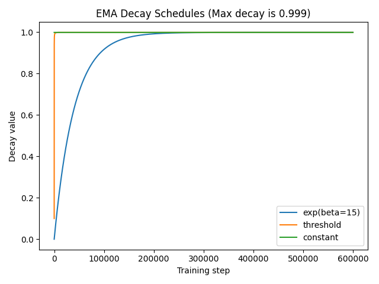

# Exponential Moving Average (EMA)

Exponential Moving Average or EMA is a technique used during training to smooth the noise in the training process and improve the generalization of the model.
It is a simple technique that can be used with any model and optimizer. Here's a recap how EMA works: 

- At the start of training, the model parameters are copied to the EMA parameters.
- At each gradient update step, the EMA parameters are updated using the following formula:
  ```python
  ema_param = ema_param * decay + param * (1 - decay)
  ```
- On start of validation epoch the model parameters are replaced by the EMA parameters and reverted back on the end of validation epoch.  
- At the end of training, the model parameters are replaced by the EMA parameters.


To enable use of EMA is SuperGradients one should add following parameters to the `training_params`:

```py
from super_gradients import Trainer
trainer = Trainer(...)
trainer.train(
    training_params={"ema": True, "ema_params": {"decay": 0.9999, "decay_type": "constant"}, ...}, 
    ...
)
```

The `decay` is a hyperparameter that controls the speed of the EMA update. It's value must be in `(0,1)` range.
Larger values of `decay` will result in slower EMA model update.

It is usually beneficial to have smaller decay values at the start of training and increase it as the training progresses. 
In SuperGradients we support several types of changing decay value over time:

- `constant`:  `"ema_params": {"decay": 0.9999, "decay_type": "constant"}`
- `threshold`: `"ema_params": {"decay": 0.9999, "decay_type": "threshold"}`
- `exp`:       `"ema_params": {"decay": 0.9999, "decay_type": "exp", "beta": 15}`



## Adding your own decay schedule

It is possible to bring your own decay schedule in SuperGradients. By subclassing from `IDecayFunction` one can implement a custom 
function:

```py
from super_gradients.training.utils.ema_decay_schedules import IDecayFunction, EMA_DECAY_FUNCTIONS

class LinearDecay(IDecayFunction):
    def __init__(self, **kwargs):
        pass

    def __call__(self, decay: float, step: int, total_steps: int) -> float:
      """
      Compute EMA for specific training step following linear scaling rule [0..decay)
        :param decay: The maximum decay value.
        :param step: Current training step. The unit-range training percentage can be obtained by `step / total_steps`.
        :param total_steps:  Total number of training steps.
        :return: Computed decay value for a given step.
      """
      training_progress = step / total_steps
      return decay * training_progress

EMA_DECAY_FUNCTIONS["linear"] = LinearDecay
```


## How EMA weights are saved

When EMA is enabled, saved checkpoints will contain additional `ema_net` attribute.
Weights for EMA model are saved under `ema_net`.
A regular (non-averaged) model weights are saved as `net` key in checkpoint as usual.

When instantiating a model via `models.get`, a function will check whether `ema_net` is present in the checkpoint.
In case `ema_net` is in checkpoint, the model will be initialized using EMA weights; otherwise a model will load initialized from regular weights saved in `net`.


## Knowledge Distillation

EMA is also supported in knowledge distillation. To enable it one should add following parameters to the `training_params` similar to the above example:

```py
from super_gradients import KDTrainer
trainer = KDTrainer(...)
trainer.train(
    training_params={"ema": True, "ema_params": {"decay": 0.9999, "decay_type": "constant"}, ...}, 
    ...
)
```
