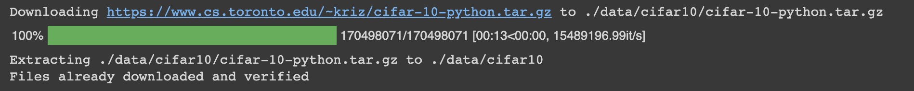
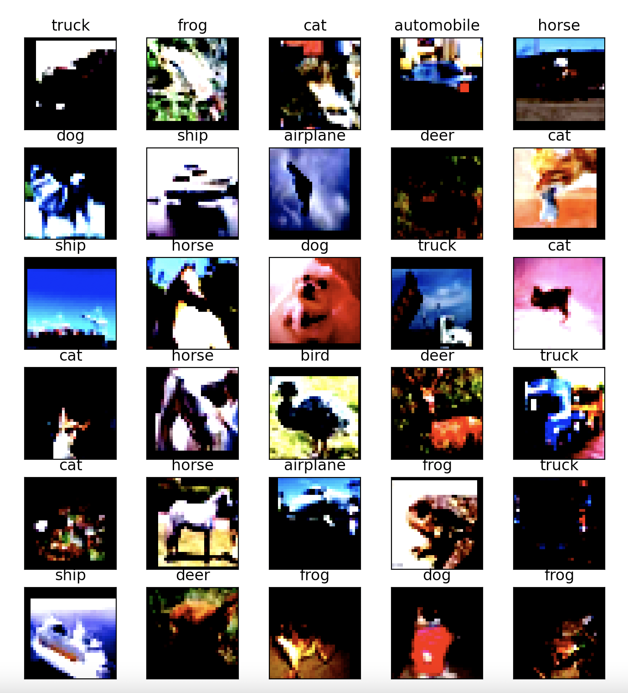
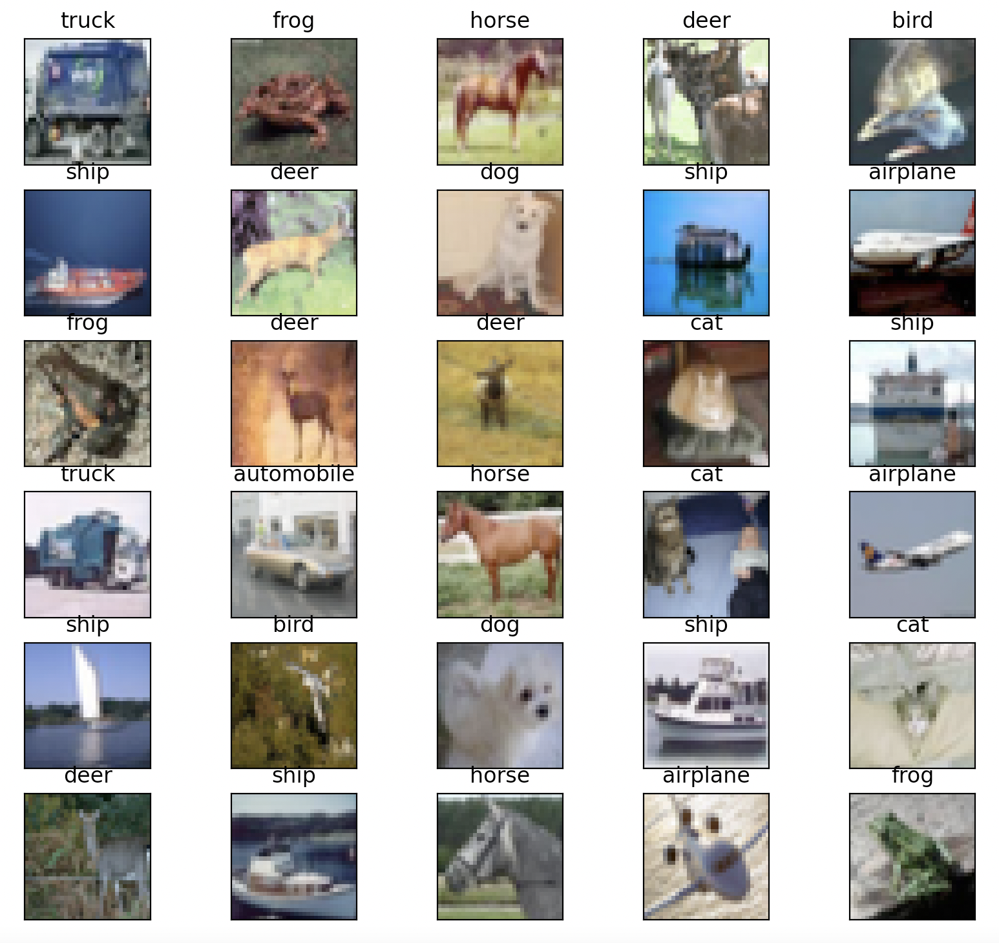
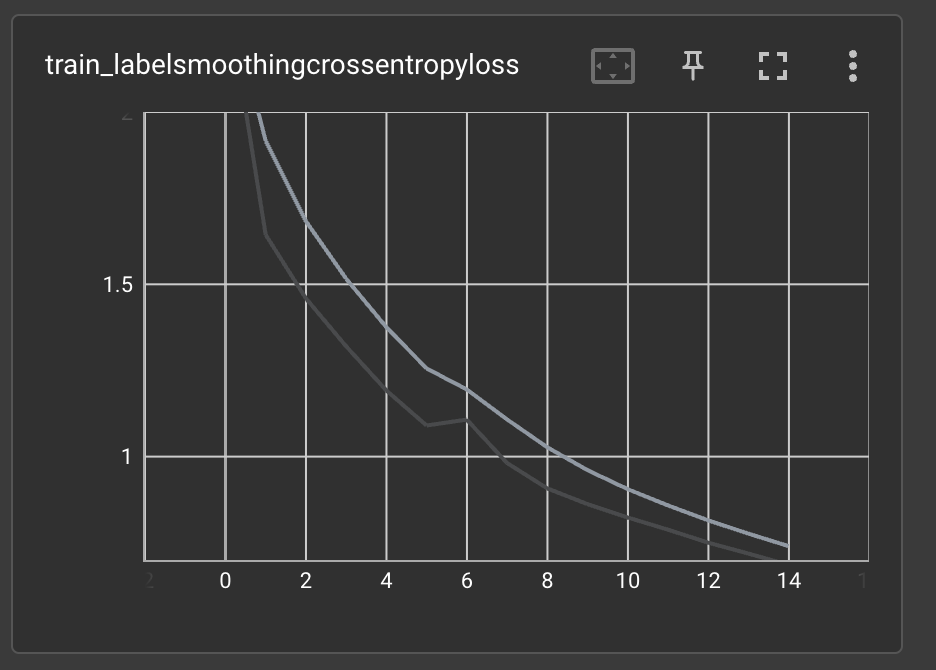
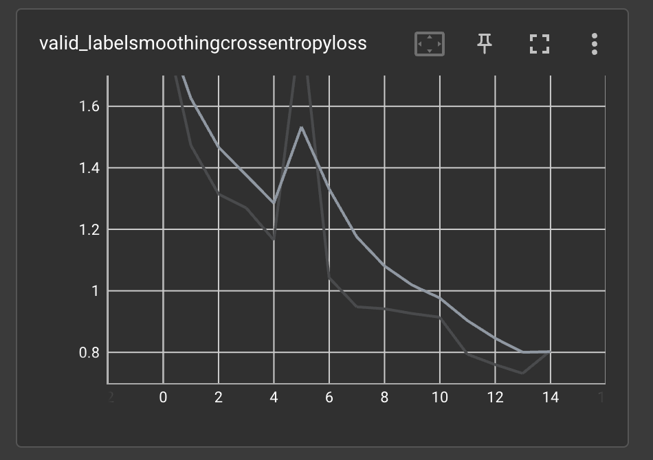
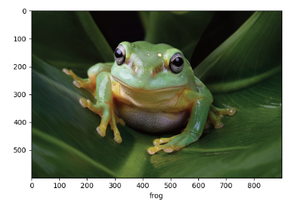

# Training a classification model and transfer learning

In this example we will use SuperGradients to train from scratch a ResNet18 model on the CIFAR10 image classification 
dataset. We will also fine-tune the same model via transfer learning with weights pre-trained on the ImageNet dataset.

## Quick installation

For this example, the only necessary package is super-gradients. Installing super-gradients will also
install all dependencies required to run the code in this example.

```
pip install super-gradients
```

## 1. Experiment setup

First, we will initialize our trainer, which is a SuperGradients Trainer object.

```
from super_gradients import Trainer
```

The trainer is in charge of training the model, evaluating test data, making predictions, and saving checkpoints.

To initialize the trainer, an experiment name must be provided. We will also provide a checkpoints root directory via
the `ckpt_root_dir` parameter. In this directory, all the experiment's logs, tensorboards, and checkpoints directories 
will reside. This parameter is optional, and if not provided, it is assumed that a 'checkpoints' directory exists in 
the project's path.

A directory with the experiment's name will be created as a subdirectory of `ckpt_root_dir` as follows:

```
ckpt_root_dir
|─── experiment_name_1
│       ckpt_best.pth                     # Model checkpoint on best epoch
│       ckpt_latest.pth                   # Model checkpoint on last epoch
│       average_model.pth                 # Model checkpoint averaged over epochs
│       events.out.tfevents.1659878383... # Tensorflow artifacts of a specific run
│       log_Aug07_11_52_48.txt            # Trainer logs of a specific run
└─── experiment_name_2
        ...
```

We initialize the trainer as follows:

```
experiment_name = "resnet18_cifar10_example"
CHECKPOINT_DIR = '/path/to/checkpoints/root/dir'

trainer = Trainer(experiment_name=experiment_name, ckpt_root_dir=CHECKPOINT_DIR)
```

## 2. Dataset and dataloaders

The dataset used in this example is the [CIFAR10 image classification dataset](https://www.cs.toronto.edu/~kriz/cifar.html).

SuperGradients provides a pool of standard datasets and dataloaders readily available for quick and easy usage.
SuperGradients also downloads the datasets when necessary, and gracefully handles the creation of the dataloaders, 
with a pre-made training recipe specifically tailored for the dataset and model architecture.

**<ins>Note:</ins>** The SuperGradients trainer is compatible with PyTorch dataloaders and dataset objects. While it
is outside the scope of this example, it is worth remembering that custom dataloaders and datasets
can be employed when necessary. 

### 2.A. Default dataloader from SuperGradients

As can be seen in the code snippet below, creating the training and validation dataloaders using SuperGradients'
default implementation is as easy as writing two lines of code:

```
from super_gradients.training import dataloaders

train_dataloader = dataloaders.get(name="cifar10_train", dataset_params={}, dataloader_params={"num_workers": 2})
valid_dataloader = dataloaders.get(name="cifar10_val", dataset_params={}, dataloader_params={"num_workers": 2})
```

Here, we call the `get()` function twice, for the training and validation dataloaders. The function's parameters are:

* `name` - a string representing the name of the desired dataloader, out of a variety of different pre-made dataloaders
           provided by SuperGradients. In this example, we use the pre-made CIFAR10 training and validation dataloaders.
* `dataset_params` - a dictionary of dataset-related parameters. Used to override the default parameters defined in the
                     training recipe. Later in this example we will show how this can be used to change the transforms
                     applied to the images.
* `dataloader_params` - a dictionary of dataloader-related parameters. Used to override the default parameters defined 
                        in the training recipe. Here, as an example, we set the number of workers to 2.
* `dataset` - a `torch.utils.data.Dataset` object. Used when employing a custom dataset implementation. This parameter 
              cannot be passed together with the `name` or `dataset_params` parameters.

We can always print the parameter values of the dataloader and its related dataset:

```
import pprint

print("Dataloader parameters:")
pprint.pprint(train_dataloader.dataloader_params)

print("Dataset parameters:")
pprint.pprint(train_dataloader.dataset.dataset_params)
```

Expected output:

```
Dataloader parameters:
{
    "batch_size": 256,
    "drop_last": False,
    "num_workers": 2,
    "pin_memory": True,
    "shuffle": True
}

Dataset parameters:
{
    "download": True,
    "root": "./data/cifar10",
    "target_transform": None,
    "train": True,
    "transforms": [
        {"RandomCrop": {"size": 32, "padding": 4}},
        "RandomHorizontalFlip",
        "ToTensor",
        {"Normalize": {"mean": [0.4914, 0.4822, 0.4465], "std": [0.2023, 0.1994, 0.201]}},
    ]
}
```

When the `get()` function is called as above, SuperGradients will attempt to download the CIFAR10 dataset for us. We 
can expect to see an output as follows:



After the dataloaders are defined, we can iterate them to extract batches of images and their corresponding labels.
This is useful for several purposes, such as visualization, verifying tensor shapes, and more. For example, visualization:

```python
from matplotlib import pyplot as plt

def show(images, labels, classes, rows=6, columns=5):
  fig = plt.figure(figsize=(10, 10))

  for i in range(1, columns * rows + 1):
      fig.add_subplot(rows, columns, i)
      plt.imshow(images[i-1].permute(1, 2, 0).clamp(0, 1))
      plt.xticks([])
      plt.yticks([])
      plt.title(f"{classes[labels[i-1]]}")
      
  plt.show()
      
images_train, labels_train = next(iter(train_dataloader))
show(images_train, labels_train, classes=train_dataloader.dataset.classes)
```

Output:



As can be seen, the images are normalized. The normalization process is defined, among other things, as part of the 
default training recipe SuperGradients uses for the CIFAR10 dataset. As we will see in the following section,
SuperGradients makes it a trivial task to override all, or part, of the different dataset and dataloader 
parameters, allowing for control over the flexibility vs. ease-of-use tradeoff.

For completion of this section, let's print the tensors' shapes:

```python
print(f'Training image tensor shape: {images_train.shape}')
print(f'Training labels tensor shape: {labels_train.shape}')
```

output:

```
Training image tensor shape: torch.Size([256, 3, 32, 32])
Training labels tensor shape: torch.Size([256])
```

As we can see, the default batch size for the training dataloader is 256.

### 2.B. Override parameters in dataset and dataloaders creation

To showcase the flexibility SuperGradients allows in customizing the different trainer
components, we will override the list of transforms that are used in the dataset. To define a list of 
transformations to apply, we will use `torchvision`'s transforms. This also serves to show 
the seamless integration SuperGradients allows with different PyTorch components. For the sake of
visualization, the only transform we apply is `ToTensor()`, which simply converts the input
images into PyTorch tensors.

```python
from torchvision import transforms as T

transforms_list = [T.ToTensor()]

vis_dataloader = dataloaders.get("cifar10_train",
                                 dataset_params={"transforms": transforms_list},
                                 dataloader_params={"num_workers": 2})

images, labels = next(iter(vis_dataloader))
show(images, labels, classes=train_dataloader.dataset.classes)
```

Notice that the only difference in the dataloader's definition is that here, the `dataset_params` parameter
is passed as a dictionary defining the parameters to override. The result of running the above code:



The effect of changing the transforms can be seen in the images - now, without normalization, the objects are more
observable in the images. 

## 3. Architecture definition

In this example, we train the model with the [ResNet18](https://arxiv.org/abs/1512.03385) architecture.

SuperGradients provides out-of-the-box implementations of many architectures for classification tasks. With just one 
line of code we can define a model with the chosen architecture. A list of all available architectures can be found
[here](https://github.com/Deci-AI/super-gradients).

```python
from super_gradients.training import models
from super_gradients.common.object_names import Models

model = models.get(model_name=Models.RESNET18, num_classes=10)
```

Notice that, similar to obtaining a pre-defined dataloader, here we use `super_gradients.training.models`'s `get()` 
function. In the above code, two parameters are passed to the function:

* `model_name` - A string defining the model's architecture name, out of the list of architectures SuperGradients 
                 provides.
* `num_classes` - An integer representing the number of classes the model should learn to predict. Affects the 
                  architecture's structure.

Some additional parameters the `get()` function supports:

* `arch_params` - A dictionary used to override the default architecture parameters, such as the number of residual 
                  blocks.
* `checkpoint_path` - A string defining the path to an external checkpoint to be loaded. Can be absolute or relative.
                      If provided, will automatically attempt to load the checkpoint.
* `pretrained_weights` - A string defining the name of a dataset on which the model was pre-trained on, for 
                         fine-tuning and transfer learning. The `pretrained_weights` and `checkpoint_path`  parameters 
                         are mutually exclusive.

For more available parameters, refer to the function's docstring.

In this example, we have defined the model with one of SuperGradient's readily available architectures. As was 
already noted in previous sections, SuperGradients is highly compatible with PyTorch. Defining the model's architecture
is not an exception - we can seamlessly use a custom architecture, i.e. a `torch.nn.Module` object, for maximum 
flexibility, although it is out of the scope of this example.

## 4. Training setup

We have defined the trainer, datasets, dataloaders, and model architecture. Before we can start training, we need to
define the training parameters. As with the other parameters, SuperGradients provides training parameters optimized for 
this use-case. For more recommended training parameters you can have a look at our recipes 
[here](https://github.com/Deci-AI/super-gradients/tree/master/src/super_gradients/recipes).

Obtaining the training parameters is as easy as writing a single line of code:

```python
from super_gradients.training import training_hyperparams

training_params =  training_hyperparams.get(config_name="training_hyperparams/cifar10_resnet_train_params")
```

We notice the repeatability in the code usage - to obtain the training parameters, we again call
the `get()` function. This function accepts two parameters:

* `config_name` - A string defining the .yaml config filename in the recipes' directory.
* `overriding_params` - An optional parameter, a dictionary used to override the loaded training parameters.

We can print the training parameters to see the different options:

```python
pprint.pprint("Training parameters:") 
pprint.pprint(training_params)
```

Output (Training parameters):

```python
{
    '_convert_': 'all',
    'average_best_models': True,
    'batch_accumulate': 1,
    'ckpt_best_name': 'ckpt_best.pth',
    'ckpt_name': 'ckpt_latest.pth',
    'clip_grad_norm': None,
    'cosine_final_lr_ratio': 0.01,
    'criterion_params': {},
    'dataset_statistics': False,
    'ema': False,
    'ema_params': {'decay': 0.9999, 'decay_type': 'exp', 'beta': 15},
    'enable_qat': False,
    'greater_metric_to_watch_is_better': True,
    'initial_lr': 0.1,
    'launch_tensorboard': False,
    'load_opt_params': True,
    'log_installed_packages': True,
    'loss': 'cross_entropy',
    'lr_cooldown_epochs': 0,
    'lr_decay_factor': 0.1,
    'lr_mode': 'step',
    'lr_schedule_function': None,
    'lr_updates': array([100, 150, 200]),
    'lr_warmup_epochs': 0,
    'lr_warmup_steps': 0,
    'max_epochs': 250,
    'max_train_batches': None,
    'max_valid_batches': None,
    'metric_to_watch': 'Accuracy',
    'mixed_precision': False,
    'optimizer': 'SGD',
    'optimizer_params': {'weight_decay': 0.0001, 'momentum': 0.9},
    'phase_callbacks': [],
    'pre_prediction_callback': None,
    'precise_bn': False,
    'precise_bn_batch_size': None,
    'qat_params': {'start_epoch': 0, 'quant_modules_calib_method': 'percentile', 'per_channel_quant_modules': False, 'calibrate': True, 'calibrated_model_path': None, 'calib_data_loader': None, 'num_calib_batches': 2, 'percentile': 99.99},
    'resume': False,
    'resume_path': None,
    'run_validation_freq': 1,
    'save_ckpt_epoch_list': [],
    'save_model': True,
    'save_tensorboard_to_s3': False,
    'seed': 42,
    'sg_logger': 'base_sg_logger',
    'sg_logger_params': {'tb_files_user_prompt': False, 'launch_tensorboard': False, 'tensorboard_port': None, 'save_checkpoints_remote': False, 'save_tensorboard_remote': False, 'save_logs_remote': False, 'monitor_system': True},
    'silent_mode': False,
    'step_lr_update_freq': None,
    'sync_bn': False,
    'tb_files_user_prompt': False,
    'tensorboard_port': None,
    'train_metrics_list': ['Accuracy', 'Top5'],
    'valid_metrics_list': ['Accuracy', 'Top5'],
    'warmup_initial_lr': None,
    'warmup_mode': 'linear_epoch_step',
    'zero_weight_decay_on_bias_and_bn': False
}
```

As can be seen in the above output, there are numerous options to modify the training parameters
to affect the training process. 

It is also possible to change training parameters after obtaining them, for example:

```python
training_params["max_epochs"] = 15
training_params["sg_logger_params"]["launch_tensorboard"] = True
```

## 5. Training, checkpointing, and transfer learning

### 5.A. Training the model

We are all set to start training our model. Simply plug in the model, training and validation dataloaders,
and training parameters into the trainer's `train()` function:

```python
trainer.train(model=model, 
              training_params=training_params, 
              train_loader=train_dataloader,
              valid_loader=valid_dataloader)
```

The training progress will be printed to the screen:

```
[2023-02-01 20:57:27] INFO - sg_trainer_utils.py - TRAINING PARAMETERS:
    - Mode:                         Single GPU
    - Number of GPUs:               1          (4 available on the machine)
    - Dataset size:                 50000      (len(train_set))
    - Batch size per GPU:           256        (batch_size)
    - Batch Accumulate:             1          (batch_accumulate)
    - Total batch size:             256        (num_gpus * batch_size)
    - Effective Batch size:         256        (num_gpus * batch_size * batch_accumulate)
    - Iterations per epoch:         195        (len(train_set) / total_batch_size)
    - Gradient updates per epoch:   195        (len(train_set) / effective_batch_size)

[2023-02-01 20:57:27] INFO - sg_trainer.py - Started training for 15 epochs (0/14)

Train epoch 0: 100%|██████████| 196/196 [00:18<00:00, 10.51it/s, Accuracy=0.262, LabelSmoothingCrossEntropyLoss=2.37, Top5=0.787, gpu_mem=0.371]
Validation epoch 0: 100%|██████████| 20/20 [00:03<00:00,  6.12it/s]
===========================================================
SUMMARY OF EPOCH 0
├── Training
│   ├── Accuracy = 0.262
│   ├── Labelsmoothingcrossentropyloss = 2.3702
│   └── Top5 = 0.787
└── Validation
    ├── Accuracy = 0.3459
    ├── Labelsmoothingcrossentropyloss = 1.8811
    └── Top5 = 0.871

===========================================================
```

At the beginning of the training, a summary of the training parameters is printed, where we can see
the training mode (CPU/single GPU/distributed training), the number of GPUs used, the training dataset
size, and more. The progress of each epoch's training and validation is displayed, along with the tracked metrics 
(defined as part of the training recipe): accuracy, loss value, top5 error, and GPU memory consumption.
At the end of each epoch, a summary of the training and validation metrics is displayed, and in later epochs, 
a comparison with the previous epochs is provided:

```
===========================================================
SUMMARY OF EPOCH 15
├── Training
│   ├── Accuracy = 0.7594
│   │   ├── Best until now = 0.7458 (↗ 0.0136)
│   │   └── Epoch N-1      = 0.7458 (↗ 0.0136)
│   ├── Labelsmoothingcrossentropyloss = 0.686
│   │   ├── Best until now = 0.7187 (↘ -0.0327)
│   │   └── Epoch N-1      = 0.7187 (↘ -0.0327)
│   └── Top5 = 0.9867
│       ├── Best until now = 0.9849 (↗ 0.0019)
│       └── Epoch N-1      = 0.9849 (↗ 0.0019)
└── Validation
    ├── Accuracy = 0.7425
    │   ├── Best until now = 0.746  (↘ -0.0035)
    │   └── Epoch N-1      = 0.7306 (↗ 0.0119)
    ├── Labelsmoothingcrossentropyloss = 0.7331
    │   ├── Best until now = 0.7315 (↗ 0.0016)
    │   └── Epoch N-1      = 0.8048 (↘ -0.0717)
    └── Top5 = 0.9831
        ├── Best until now = 0.9838 (↘ -0.0007)
        └── Epoch N-1      = 0.9818 (↗ 0.0013)

===========================================================
```

At the end of each epoch, the different logs and checkpoints are saved in the path defined by `ckpt_root_dir` and
`experiment_name`.

In the epoch summary shown above, we can see that the validation accuracy is 73%, which is 
not very high. To get better insights as to what is happening, we turn to the tensorboard logs.

### 5.B. Tensorboard logs

To view the experiment's tensorboard logs, type the following command in the terminal from the
experiment's path:

```bash
tensorboard --logdir='.'
```

(Alternatively, run the command from anywhere with the experiment's full path).

SuperGradients logs many useful metrics to tensorboard, including CPU and GPU usage, learning rate
scheduling, training and validation losses and other metrics, and many more. For the purpose of this example,
let us examine the training and validation loss:





As can be seen in the graphs, the training (and validation) loss did not converge before training ended. This means
that training the model for additional epochs will probably improve its performance. Earlier, when modifying the 
training parameters, we set `max_epochs = 15`. Let us continue training the model for an additional 10 epochs.

### 5.C. Continue training from a checkpoint

To continue training from a checkpoint, we utilize the `models.get()` function's `checkpoint_path` parameter.
The provided checkpoint path includes the checkpoint file we wish to load. In this example, since we want
to continue from the last checkpoint, we will load the `ckpt_latest.pth` checkpoint. Additionally, we want to let
the trainer know that we are continuing training and not starting from the first epoch. This is done
by setting the `resume` training parameter to `True`. Finally, we set the new `max_epochs` training
parameter, and train the model once more.

```python
import os

model = models.get(model_name=Models.RESNET18, 
                   num_classes=10,
                   checkpoint_path=os.path.join(CHECKPOINT_DIR, experiment_name, 'ckpt_latest.pth'))

training_params["resume"] = True
training_params["max_epochs"] = 25

trainer.train(model=model,
              training_params=training_params,
              train_loader=train_dataloader,
              valid_loader=valid_dataloader)
```

We can see that the training continues for 10 epochs, resuming from epoch 15:

```
[2023-02-01 21:21:16] INFO - sg_trainer_utils.py - TRAINING PARAMETERS:
    - Mode:                         Single GPU
    - Number of GPUs:               1          (4 available on the machine)
    - Dataset size:                 50000      (len(train_set))
    - Batch size per GPU:           256        (batch_size)
    - Batch Accumulate:             1          (batch_accumulate)
    - Total batch size:             256        (num_gpus * batch_size)
    - Effective Batch size:         256        (num_gpus * batch_size * batch_accumulate)
    - Iterations per epoch:         195        (len(train_set) / total_batch_size)
    - Gradient updates per epoch:   195        (len(train_set) / effective_batch_size)

[2023-02-01 21:21:16] INFO - sg_trainer.py - Started training for 10 epochs (15/24)

Train epoch 15: 100%|██████████| 196/196 [00:18<00:00, 10.52it/s, Accuracy=0.764, LabelSmoothingCrossEntropyLoss=0.668, Top5=0.987, gpu_mem=0.422]
Validation epoch 15: 100%|██████████| 20/20 [00:03<00:00,  6.10it/s]
===========================================================
SUMMARY OF EPOCH 15
├── Training
│   ├── Accuracy = 0.7644
│   ├── Labelsmoothingcrossentropyloss = 0.6684
│   └── Top5 = 0.9865
└── Validation
    ├── Accuracy = 0.7539
    ├── Labelsmoothingcrossentropyloss = 0.7271
    └── Top5 = 0.9841

===========================================================
```

Finally, the model stops training after completing 25 epochs:

```
===========================================================
SUMMARY OF EPOCH 25
├── Training
│   ├── Accuracy = 0.8177
│   │   ├── Best until now = 0.8147 (↗ 0.003)
│   │   └── Epoch N-1      = 0.8147 (↗ 0.003)
│   ├── Labelsmoothingcrossentropyloss = 0.5211
│   │   ├── Best until now = 0.5281 (↘ -0.007)
│   │   └── Epoch N-1      = 0.5281 (↘ -0.007)
│   └── Top5 = 0.9921
│       ├── Best until now = 0.9919 (↗ 0.0002)
│       └── Epoch N-1      = 0.9919 (↗ 0.0002)
└── Validation
    ├── Accuracy = 0.8201
    │   ├── Best until now = 0.7873 (↗ 0.0328)
    │   └── Epoch N-1      = 0.7534 (↗ 0.0667)
    ├── Labelsmoothingcrossentropyloss = 0.525
    │   ├── Best until now = 0.6145 (↘ -0.0895)
    │   └── Epoch N-1      = 0.7517 (↘ -0.2266)
    └── Top5 = 0.9907
        ├── Best until now = 0.9883 (↗ 0.0024)
        └── Epoch N-1      = 0.983  (↗ 0.0077)

===========================================================
```

We can see that the validation accuracy is now 82%. Much better.

### 5.C. Transfer learning

So far, we trained a model from scratch. More formally, the model's weights were randomly initialized. For easy tasks
and large datasets this is usually sufficient. In other cases, especially when not a lot of data is available for
training, we would like to take advantage of knowledge gained from other sources. This is called transfer learning, 
and it has many forms and variations. In this example we will take a look at the simplest form of transfer learning: 
fine-tuning a model initialized with pre-trained weights. Specifically, we will initialize our model
with weights pre-trained on the [ImageNet dataset](https://www.image-net.org/).

SuperGradients provides a variety of pre-trained weights readily available for fine-tuning different models. To 
initialize our model with pre-trained weights provided by SuperGradients, only a small change to the existing code
is needed:

```
model = models.get(model_name=Models.RESNET18, num_classes=10, pretrained_weights="imagenet")
```

In the above code, we provided the `pretrained_weights` parameter to the `models.get()` function. This parameter accepts 
a string representing the name of the dataset that the weights were pre-trained on. Note that this
parameter is mutually exclusive with the `checkpoint_path` parameter.

The rest of the training pipeline is the same as above. For comparison with the previous model, we will train this model
for 25 epochs also. Let us look how the model performed:

```
===========================================================
SUMMARY OF EPOCH 25
├── Training
│   ├── Accuracy = 0.8242
│   │   ├── Best until now = 0.8267 (↘ -0.0025)
│   │   └── Epoch N-1      = 0.8267 (↘ -0.0025)
│   ├── Labelsmoothingcrossentropyloss = 0.5035
│   │   ├── Best until now = 0.4998 (↗ 0.0037)
│   │   └── Epoch N-1      = 0.4998 (↗ 0.0037)
│   └── Top5 = 0.9924
│       ├── Best until now = 0.9917 (↗ 0.0007)
│       └── Epoch N-1      = 0.9917 (↗ 0.0007)
└── Validation
    ├── Accuracy = 0.8377
    │   ├── Best until now = 0.8062 (↗ 0.0315)
    │   └── Epoch N-1      = 0.806  (↗ 0.0317)
    ├── Labelsmoothingcrossentropyloss = 0.4834
    │   ├── Best until now = 0.5731 (↘ -0.0897)
    │   └── Epoch N-1      = 0.5785 (↘ -0.0952)
    └── Top5 = 0.9924
        ├── Best until now = 0.9903 (↗ 0.0021)
        └── Epoch N-1      = 0.9903 (↗ 0.0021)

===========================================================
```

As we can see, the validation accuracy improved by 1.7% compared to the randomly initialized model. 
To achieve a greater improvement with pre-trained weights, sometimes careful tuning of the training hyperparameters
is required. 

## 6. Predictions with the trained model

Now that we have a trained model with reasonable performance, we can use it to make predictions on new data.
First, let's import some packages:

```python
from PIL import Image
import torch
import numpy as np
import requests
```

Next, we load the model with the trained weights, and put it into evaluation mode. Notice that now we load the 
`ckpt_best.pth` checkpoint.

```python
model = models.get(model_name=Models.RESNET18, 
                   num_classes=10,
                   checkpoint_path=os.path.join(CHECKPOINT_DIR, experiment_name, 'ckpt_best.pth'))
model.eval()
```

We want to test the model on an image of one the classes the model was trained on. As an example, let us test how the
model handles an image of a frog, taken from the [Aquarium of the Pacific website](https://www.aquariumofpacific.org/).
The loaded image must undergo the same transformations as the training images for the model to work well:

```python
url = "https://www.aquariumofpacific.org/images/exhibits/Magnificent_Tree_Frog_900.jpg"
image = np.array(Image.open(requests.get(url, stream=True).raw))

transforms = T.Compose([
    T.ToTensor(),
    T.Normalize(mean=(0.4914, 0.4822, 0.4465), std=(0.2023, 0.1994, 0.2010)),
    T.Resize((32, 32))
])

input_tensor = transforms(image).unsqueeze(0).to(next(model.parameters()).device)
```

Next, to obtain the model's predictions we simply run the following line of code:

```python
predictions = model(input_tensor)
```

Let's see what the model predicted:

```python
plt.xlabel(train_dataloader.dataset.classes[torch.argmax(predictions)])
plt.imshow(image)
plt.show()
```



As we can see, the model correctly predicted that the input image is an image of a frog.

## 7. Complete code

For completion of this example, we provide a complete working code for training, continuing training from
a saved checkpoint, and predicting with the trained model. Simply change the `CHECKPOINT_DIR` variable and run the 
script:

```python
from super_gradients import Trainer
from super_gradients.training import dataloaders
from super_gradients.training import models
from super_gradients.common.object_names import Models
from super_gradients.training import training_hyperparams
import os
from torchvision import transforms as T
from PIL import Image
import torch
import numpy as np
import requests
import matplotlib.pyplot as plt


def run(experiment_name, CHECKPOINT_DIR):

    # INITIALIZE TRAINER
    trainer = Trainer(experiment_name=experiment_name, ckpt_root_dir=CHECKPOINT_DIR)

    # INITIALIZE DATALOADERS
    train_dataloader = dataloaders.get(name="cifar10_train", dataset_params={}, dataloader_params={"num_workers": 2})
    valid_dataloader = dataloaders.get(name="cifar10_val", dataset_params={}, dataloader_params={"num_workers": 2})

    # DEFINE MODEL
    model = models.get(model_name=Models.RESNET18, num_classes=10)

    # DEFINE TRAINING PARAMETERS
    training_params = training_hyperparams.get(config_name="training_hyperparams/cifar10_resnet_train_params")
    training_params["max_epochs"] = 15

    # TRAIN
    trainer.train(model=model,
                  training_params=training_params,
                  train_loader=train_dataloader,
                  valid_loader=valid_dataloader)

    # LOAD MODEL FROM CHECKPOINT
    model = models.get(model_name=Models.RESNET18,
                       num_classes=10,
                       checkpoint_path=os.path.join(CHECKPOINT_DIR, experiment_name, 'ckpt_latest.pth'))

    # RESUME TRAINING
    training_params["resume"] = True
    training_params["max_epochs"] = 25

    trainer.train(model=model,
                  training_params=training_params,
                  train_loader=train_dataloader,
                  valid_loader=valid_dataloader)

    # LOAD BEST CHECKPOINT
    model = models.get(model_name=Models.RESNET18,
                       num_classes=10,
                       checkpoint_path=os.path.join(CHECKPOINT_DIR, experiment_name, 'ckpt_best.pth'))
    model.eval()

    # PREDICT CLASS FOR TEST IMAGE
    url = "https://www.aquariumofpacific.org/images/exhibits/Magnificent_Tree_Frog_900.jpg"
    image = np.array(Image.open(requests.get(url, stream=True).raw))

    transforms = T.Compose([
        T.ToTensor(),
        T.Normalize(mean=(0.4914, 0.4822, 0.4465), std=(0.2023, 0.1994, 0.2010)),
        T.Resize((32, 32))
    ])

    input_tensor = transforms(image).unsqueeze(0).to(next(model.parameters()).device)

    predictions = model(input_tensor)

    plt.xlabel(train_dataloader.dataset.classes[torch.argmax(predictions)])
    plt.imshow(image)
    plt.show()


if __name__ == '__main__':
    
    experiment_name = "resnet18_cifar10_example"
    CHECKPOINT_DIR = '/path/to/checkpoints/root/dir'

    run(experiment_name, CHECKPOINT_DIR)
```
