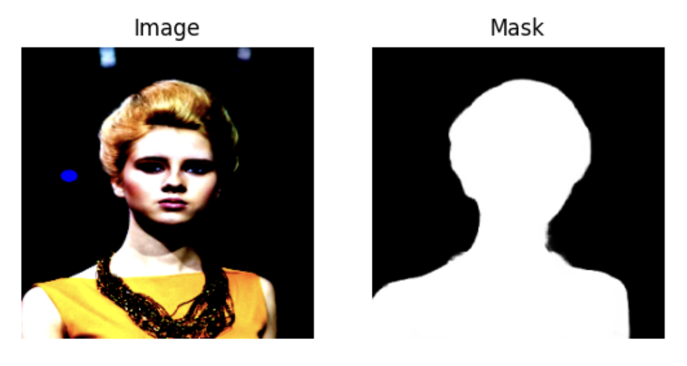
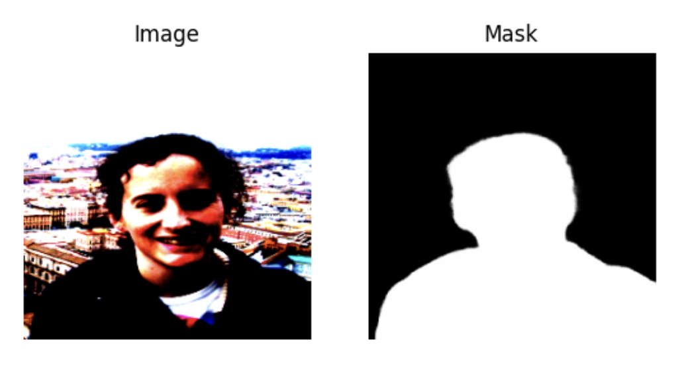
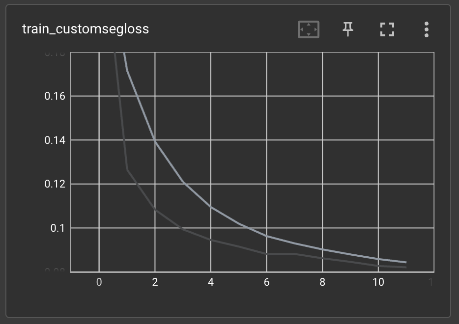
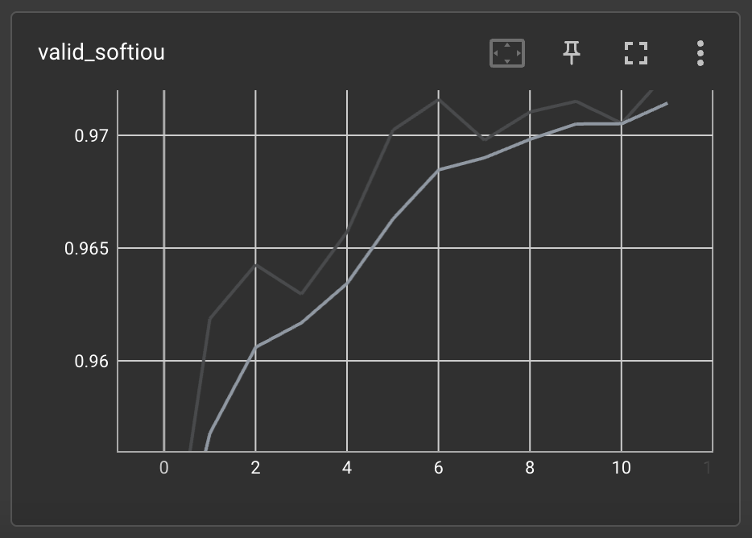
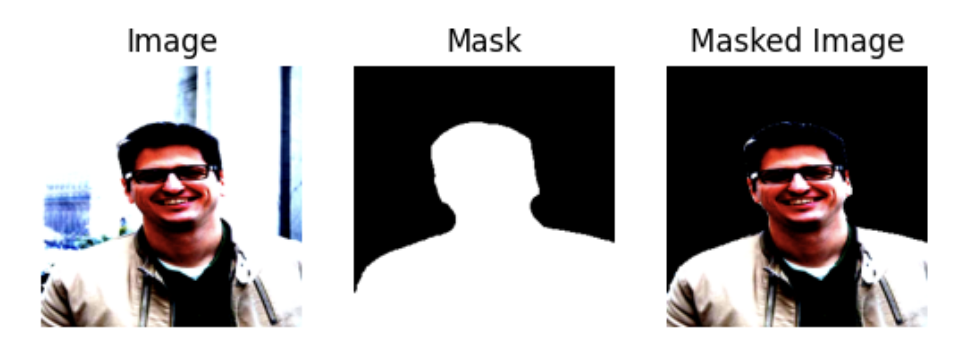

# Training an external model

In this example we will use SuperGradients to train a deep learning segmentation model to extract human portraits from  
images, i.e., to remove the background from the image. We will show how SuperGradients allows seamless integration of 
an external model, dataset, loss function, and metric into the training pipeline. 

## Quick installation

For this example, the only necessary package is super-gradients. Installing super-gradients will also
install all dependencies required to run the code in this example.

```bash
pip install super-gradients
```

## 1. Dataset

The dataset we will use in this example is the 
[AISegment dataset](https://github.com/aisegmentcn/matting_human_datasets), available to download for free from 
[Kaggle](https://www.kaggle.com/datasets/laurentmih/aisegmentcom-matting-human-datasets).
The dataset contains 34,427 RGB images of human portraits and their corresponding **soft masks**.
The provided images are center-cropped to a unified shape of 600x800.

### 1.A. Data preparation

The original structure of the data on the disk is as follows:

```
data
└───aisegment-matting
│   └───matting
│       │   └───1803290511
│       │   │       └───matting_00000000
│       │   │       │         1803290511-00000459.png
│       │   │       │         1803290511-00000458.png
│       │   │       │         ..
│       │   └───1803290444
│       │       ..
│   └───clip_img
│       │   └───1803290511
│       │   │       └───clip_00000000
│       │   │       │         1803290511-00000459.jpg
│       │   │       │         1803290511-00000458.jpg
│       │   │       │         ..
│       │   └───1803290444
│       │       ..
```

In the structure shown above, the `clip_img` directory contains the portrait images, divided into many
sub-directories. The `matting` directory is structured similar to the `clip_img` directory, containing
the corresponding masks. This structure is not particularly convenient for data loading, therefore 
we will first rearrange the data with the following script, which only requires changing the `data_path` and
`out_path` variables:

```python
import random
import shutil
from pathlib import Path


data_path = Path('/path/to/original/data/directory')
out_path = Path('/path/to/output/data/directory')

# Create output directories
out_path.mkdir(exist_ok=True)

train_out_path = out_path / "train"
val_out_path = out_path / "val"
test_out_path = out_path / "test"

train_out_path.mkdir(exist_ok=True)
val_out_path.mkdir(exist_ok=True)
test_out_path.mkdir(exist_ok=True)

# Get all image and mask path
all_image_paths = data_path.rglob('*.jpg')
all_mask_paths = data_path.rglob('*.png')

# Map filenames (without extensions) to image paths
filename_map = {}
for img_path in all_image_paths:
    filename_map[img_path.stem] = img_path

# Get all matching image-mask path pairs
path_pairs = []
for mask_path in all_mask_paths:
    filename = mask_path.stem
    if filename in filename_map:
        path_pairs.append((filename_map[filename], mask_path))
        del filename_map[filename]

# Split to train, validation, and test sets
random.seed(1)
val_samples = random.sample(path_pairs, k=int(0.1*len(path_pairs)))
test_samples = random.sample(list(set(path_pairs)-set(val_samples)), k=int(0.1*len(path_pairs)))
train_samples = list(set(path_pairs)-set(val_samples)-set(test_samples))

# Copy data to new location
for img_path, mask_path in train_samples:
    shutil.copy(img_path, train_out_path)
    shutil.copy(mask_path, train_out_path)

for img_path, mask_path in val_samples:
    shutil.copy(img_path, val_out_path)
    shutil.copy(mask_path, val_out_path)

for img_path, mask_path in test_samples:
    shutil.copy(img_path, test_out_path)
    shutil.copy(mask_path, test_out_path)
```

The original data may have images without their corresponding masks. Therefore, the above code first finds all existing
image-mask pairs. It then splits the data into train/validation/test sets, where the size of each of the validation and
test sets is 10% of the total number of samples. The samples in each of the sets are then copied to the output path,
structured as follows:

```
data
    └───train
    │       1803290511-00000029.jpg
    │       1803290511-00000029.png
    │       ..
    └───val
    │       1803290444-00000292.jpg
    │       1803290444-00000292.png
    │       ..
    └───test
    │       1803290443-00000294.jpg
    │       1803290443-00000294.png
    │       ..
```

Each of the train/val/test directories contain all image (*.jpg) files and their corresponding mask (*.png) files.

### 1.B. PyTorch Dataset

In some cases, we may want to have full control over the process of loading and pre-processing the training data.
SuperGradients is fully compatible with PyTorch data loaders, which allows for seamless integration of custom dataset 
implementations for maximum flexibility. 

We will first present the complete Dataset class implementation, and then break it down to fully understand what is
going on.

```python
import os
from PIL import Image
import torch
from torchvision.transforms import transforms as torch_transforms
from super_gradients.training.transforms.transforms import SegColorJitter, SegRandomFlip, SegResize


class AISegmentDataset(torch.utils.data.Dataset):
    NORMALIZATION_MEANS = [.485, .456, .406]
    NORMALIZATION_STDS = [.229, .224, .225]

    def __init__(self, data_path: str, split: str, input_height: int = 256, input_width: int = 256):
        if split not in ['train', 'val', 'test']:
            raise ValueError("The 'split' parameter must be either 'train', 'val', or 'test'")

        self.split = split
        self.input_height = input_height
        self.input_width = input_width

        data_path = os.path.join(data_path, split)

        self.path_pairs = []
        for filename in os.listdir(data_path):
            if filename.endswith('.jpg'):
                self.path_pairs.append((os.path.join(data_path, filename),
                                        os.path.join(data_path, filename.replace('.jpg', '.png'))))

    def __len__(self):
        return len(self.path_pairs)

    def __getitem__(self, idx):

        image = Image.open(self.path_pairs[idx][0]).convert('RGB')
        mask = Image.open(self.path_pairs[idx][1]).split()[-1]

        if self.split == 'train':
            seg_transforms = torch_transforms.Compose([
                SegRandomFlip(prob=0.5),
                SegColorJitter(brightness=0.5, contrast=0.5, saturation=0.5),
                SegResize(h=self.input_height, w=self.input_width)
            ])
        else:
            seg_transforms = SegResize(h=self.input_height, w=self.input_width)

        transformed_pair = seg_transforms({"image": image, "mask": mask})
        image, mask = transformed_pair['image'], transformed_pair['mask']

        image_transform = torch_transforms.Compose([
            torch_transforms.ToTensor(),
            torch_transforms.Normalize(self.NORMALIZATION_MEANS, self.NORMALIZATION_STDS)
        ])
        mask_transform = torch_transforms.ToTensor()

        image_tensor, mask_tensor = image_transform(image), mask_transform(mask)

        return image_tensor, mask_tensor
```

First, we can see that our dataset class inherits from the `torch.utils.data.Dataset` class. To initialize the dataset
object, two parameters must be provided:

* `data_path` - the full path to the data's root directory
* `split` - a string indicating whether this is the 'train', 'val', or 'test' split of the data

Additional parameters include `input_height` and `input_width`, the fixed height and width, respectively, for resizing
the input images and masks. These are set to 256 by default. At the end of the initialization function, the image and 
mask path pairs are determined according to the split.

Next, let's see what happens when we retrieve an item from the dataset via the `__getitem__()` function.
First, an image and its corresponding mask are loaded according to the `idx` parameter:

```python
image = Image.open(self.path_pairs[idx][0]).convert('RGB')
mask = Image.open(self.path_pairs[idx][1]).split()[-1]
```

Notice that we take only the mask's last channel. The mask's original color format is RGBA, and the alpha channel should be 
used as the soft mask for segmentation according to the 
[dataset's description](https://www.kaggle.com/datasets/laurentmih/aisegmentcom-matting-human-datasets?resource=download).

Next, we apply transformations to the image and mask according to the split:

```python
if self.split == 'train':
    seg_transforms = torch_transforms.Compose([
        SegRandomFlip(prob=0.5),
        SegColorJitter(brightness=0.5, contrast=0.5, saturation=0.5),
        SegResize(h=self.input_height, w=self.input_width)
    ])
else:
    seg_transforms = SegResize(h=self.input_height, w=self.input_width)

transformed_pair = seg_transforms({"image": image, "mask": mask})
image, mask = transformed_pair['image'], transformed_pair['mask']
```

On training images and masks we apply data augmentation: a random horizontal flip with probability 0.5, and
random color jitter which randomly changes the image's brightness, contrast, and saturation. Both the training and the
other splits' images and masks undergo resizing according to `input_height` and `input_width`.

The transforms in the above code are all SuperGradients transforms, which are built upon PyTorch's 
`torchvision.transforms`. This allows for maximum compatibility with PyTorch components. For example, we can see that 
the transforms are sequentially composed using torchvision's `Compose` class. Notice also that the transform names are 
all prefixed with `Seg` - meaning that they are specifically designed for segmentation data. These transforms take care
to apply the same transformation to the image and the mask when required, or only apply the transformation to the image
otherwise. For example, if `SegRandomFlip()` flips the image, the mask will be flipped as well. `SegColorJitter()` only
transforms the image. `SegResize()` resizes both the image and the mask.

Next, we convert the image and the mask to PyTorch Tensors, and normalize the image using the `NORMALIZATION_MEANS` and 
`NORMALIZATION_STDS`:

```python
image_transform = torch_transforms.Compose([
    torch_transforms.ToTensor(),
    torch_transforms.Normalize(self.NORMALIZATION_MEANS, self.NORMALIZATION_STDS)
])
mask_transform = torch_transforms.ToTensor()

image_tensor, mask_tensor = image_transform(image), mask_transform(mask)
```

These transforms are applied regardless of the current dataset split. Notice that here we use torchvision transforms.
This serves to show the high degree of flexibility SuperGradients allows, as its transforms are based on PyTorch's 
torchvision transforms which may be used interchangeably.

### 1.C. Data visualization

To conclude this section, let's visualize some images and their masks to test our AISegmentDataset implementation.
First, we instantiate two dataset objects, for the training and validation splits, and extract the first sample from 
each:

```python
import matplotlib.pyplot as plt

data_path = '/path/to/arranged/data/dir'

train_dataset = AISegmentDataset(data_path=data_path, split='train')
val_dataset = AISegmentDataset(data_path=data_path, split='val')

train_image, train_mask = train_dataset[0]
val_image, val_mask = val_dataset[0]
```

Let's first visualize the validation image and mask:

```python
figure = plt.figure()
figure.add_subplot(1, 2, 1)
plt.title("Image")
plt.axis("off")
plt.imshow(val_image.permute(1, 2, 0))
figure.add_subplot(1, 2, 2)
plt.title("Mask")
plt.axis("off")
plt.imshow(val_mask.squeeze(), cmap='gray')

plt.show()
```



And the training image and mask:

```python
figure = plt.figure()
figure.add_subplot(1, 2, 1)
plt.title("Image")
plt.axis("off")
plt.imshow(train_image.permute(1, 2, 0))
figure.add_subplot(1, 2, 2)
plt.title("Mask")
plt.axis("off")
plt.imshow(train_mask.squeeze(), cmap='gray')

plt.show()
```



We can see the effect of the color jitter transform on the image.

## 2. Model architecture

For this example we will employ the [U-Net](https://arxiv.org/abs/1505.04597) architecture. U-Net and its variants are a 
popular choice for many image segmentation tasks. It is a fully-convolutional architecture,
consisting of an expanding and a contracting path with skip connections between the encoder
and decoder blocks. In this example we will demonstrate how we can easily integrate an external PyTorch model 
as part of SuperGradients' training pipeline. To this end, we will use a 
[U-Net implementation](https://github.com/mateuszbuda/brain-segmentation-pytorch) loaded directly from
[PyTorch Hub](https://pytorch.org/hub/mateuszbuda_brain-segmentation-pytorch_unet/):

```python
model = torch.hub.load('mateuszbuda/brain-segmentation-pytorch', 'unet', in_channels=3, out_channels=1, 
                       init_features=32, pretrained=False)
```

Since our model's inputs are RGB images, we set `in_channels=3`. This is a binary segmentation task, therefore
`out_channels=1`. The `init_features` parameter determines the number of kernels in the first block's convolution
layers. The number of kernels is doubled in each consecutive encoder block. We also set `pretrained=False` since 
in this case we do not want to use pre-trained weights.

Let's check our model's type:

```python
print(type(model))
```

```
<class 'unet.UNet'>
```

SuperGradients is compatible with models of type `torch.nn.Module`. Just to be sure, let's verify that our
model is of the correct type:

```python
print(type(model).__bases__)
```

```
(<class 'torch.nn.modules.module.Module'>,)
```

Finally, let's print the model to see its components:

```python
print(model)
```

```
UNet(
  (encoder1): Sequential(
    (enc1conv1): Conv2d(3, 32, kernel_size=(3, 3), stride=(1, 1), padding=(1, 1), bias=False)
    (enc1norm1): BatchNorm2d(32, eps=1e-05, momentum=0.1, affine=True, track_running_stats=True)
    (enc1relu1): ReLU(inplace=True)
    (enc1conv2): Conv2d(32, 32, kernel_size=(3, 3), stride=(1, 1), padding=(1, 1), bias=False)
    (enc1norm2): BatchNorm2d(32, eps=1e-05, momentum=0.1, affine=True, track_running_stats=True)
    (enc1relu2): ReLU(inplace=True)
  )
  (pool1): MaxPool2d(kernel_size=2, stride=2, padding=0, dilation=1, ceil_mode=False)
  (encoder2): Sequential(
    (enc2conv1): Conv2d(32, 64, kernel_size=(3, 3), stride=(1, 1), padding=(1, 1), bias=False)
    (enc2norm1): BatchNorm2d(64, eps=1e-05, momentum=0.1, affine=True, track_running_stats=True)
    (enc2relu1): ReLU(inplace=True)
    (enc2conv2): Conv2d(64, 64, kernel_size=(3, 3), stride=(1, 1), padding=(1, 1), bias=False)
    (enc2norm2): BatchNorm2d(64, eps=1e-05, momentum=0.1, affine=True, track_running_stats=True)
    (enc2relu2): ReLU(inplace=True)
  )
  (pool2): MaxPool2d(kernel_size=2, stride=2, padding=0, dilation=1, ceil_mode=False)
  (encoder3): Sequential(
    (enc3conv1): Conv2d(64, 128, kernel_size=(3, 3), stride=(1, 1), padding=(1, 1), bias=False)
    (enc3norm1): BatchNorm2d(128, eps=1e-05, momentum=0.1, affine=True, track_running_stats=True)
    (enc3relu1): ReLU(inplace=True)
    (enc3conv2): Conv2d(128, 128, kernel_size=(3, 3), stride=(1, 1), padding=(1, 1), bias=False)
    (enc3norm2): BatchNorm2d(128, eps=1e-05, momentum=0.1, affine=True, track_running_stats=True)
    (enc3relu2): ReLU(inplace=True)
  )
  (pool3): MaxPool2d(kernel_size=2, stride=2, padding=0, dilation=1, ceil_mode=False)
  (encoder4): Sequential(
    (enc4conv1): Conv2d(128, 256, kernel_size=(3, 3), stride=(1, 1), padding=(1, 1), bias=False)
    (enc4norm1): BatchNorm2d(256, eps=1e-05, momentum=0.1, affine=True, track_running_stats=True)
    (enc4relu1): ReLU(inplace=True)
    (enc4conv2): Conv2d(256, 256, kernel_size=(3, 3), stride=(1, 1), padding=(1, 1), bias=False)
    (enc4norm2): BatchNorm2d(256, eps=1e-05, momentum=0.1, affine=True, track_running_stats=True)
    (enc4relu2): ReLU(inplace=True)
  )
  (pool4): MaxPool2d(kernel_size=2, stride=2, padding=0, dilation=1, ceil_mode=False)
  (bottleneck): Sequential(
    (bottleneckconv1): Conv2d(256, 512, kernel_size=(3, 3), stride=(1, 1), padding=(1, 1), bias=False)
    (bottlenecknorm1): BatchNorm2d(512, eps=1e-05, momentum=0.1, affine=True, track_running_stats=True)
    (bottleneckrelu1): ReLU(inplace=True)
    (bottleneckconv2): Conv2d(512, 512, kernel_size=(3, 3), stride=(1, 1), padding=(1, 1), bias=False)
    (bottlenecknorm2): BatchNorm2d(512, eps=1e-05, momentum=0.1, affine=True, track_running_stats=True)
    (bottleneckrelu2): ReLU(inplace=True)
  )
  (upconv4): ConvTranspose2d(512, 256, kernel_size=(2, 2), stride=(2, 2))
  (decoder4): Sequential(
    (dec4conv1): Conv2d(512, 256, kernel_size=(3, 3), stride=(1, 1), padding=(1, 1), bias=False)
    (dec4norm1): BatchNorm2d(256, eps=1e-05, momentum=0.1, affine=True, track_running_stats=True)
    (dec4relu1): ReLU(inplace=True)
    (dec4conv2): Conv2d(256, 256, kernel_size=(3, 3), stride=(1, 1), padding=(1, 1), bias=False)
    (dec4norm2): BatchNorm2d(256, eps=1e-05, momentum=0.1, affine=True, track_running_stats=True)
    (dec4relu2): ReLU(inplace=True)
  )
  (upconv3): ConvTranspose2d(256, 128, kernel_size=(2, 2), stride=(2, 2))
  (decoder3): Sequential(
    (dec3conv1): Conv2d(256, 128, kernel_size=(3, 3), stride=(1, 1), padding=(1, 1), bias=False)
    (dec3norm1): BatchNorm2d(128, eps=1e-05, momentum=0.1, affine=True, track_running_stats=True)
    (dec3relu1): ReLU(inplace=True)
    (dec3conv2): Conv2d(128, 128, kernel_size=(3, 3), stride=(1, 1), padding=(1, 1), bias=False)
    (dec3norm2): BatchNorm2d(128, eps=1e-05, momentum=0.1, affine=True, track_running_stats=True)
    (dec3relu2): ReLU(inplace=True)
  )
  (upconv2): ConvTranspose2d(128, 64, kernel_size=(2, 2), stride=(2, 2))
  (decoder2): Sequential(
    (dec2conv1): Conv2d(128, 64, kernel_size=(3, 3), stride=(1, 1), padding=(1, 1), bias=False)
    (dec2norm1): BatchNorm2d(64, eps=1e-05, momentum=0.1, affine=True, track_running_stats=True)
    (dec2relu1): ReLU(inplace=True)
    (dec2conv2): Conv2d(64, 64, kernel_size=(3, 3), stride=(1, 1), padding=(1, 1), bias=False)
    (dec2norm2): BatchNorm2d(64, eps=1e-05, momentum=0.1, affine=True, track_running_stats=True)
    (dec2relu2): ReLU(inplace=True)
  )
  (upconv1): ConvTranspose2d(64, 32, kernel_size=(2, 2), stride=(2, 2))
  (decoder1): Sequential(
    (dec1conv1): Conv2d(64, 32, kernel_size=(3, 3), stride=(1, 1), padding=(1, 1), bias=False)
    (dec1norm1): BatchNorm2d(32, eps=1e-05, momentum=0.1, affine=True, track_running_stats=True)
    (dec1relu1): ReLU(inplace=True)
    (dec1conv2): Conv2d(32, 32, kernel_size=(3, 3), stride=(1, 1), padding=(1, 1), bias=False)
    (dec1norm2): BatchNorm2d(32, eps=1e-05, momentum=0.1, affine=True, track_running_stats=True)
    (dec1relu2): ReLU(inplace=True)
  )
  (conv): Conv2d(32, 1, kernel_size=(1, 1), stride=(1, 1))
)
```

## 3. Loss function

While a popular choice for binary segmentation loss function is the binary cross-entropy (BCE) loss, often it is
the intersection-over-union (IoU), or the [Jaccard Index](https://en.wikipedia.org/wiki/Jaccard_index), that serves
as a measure of success. In this example, we will use a combination of the BCE and IoU as the loss function. While
SuperGradients provides, among many other losses, an implementation of the combined BCE and Dice loss, which could be 
used for our purposes as well, we will show how we can define our own user-defined loss function and train our model 
with it using SuperGradients.

Similar to using an external model, the custom loss function's class must inherit from `torch.nn.Module`. The 
`forward()` function's first parameter needs to be the predictions tensor and the second parameter needs to be the
target tensor.

```python
import torch
import torch.nn as nn


class CustomIoU(torch.nn.Module):
    def __init__(self):
        super(CustomIoU, self).__init__()

    def forward(self, preds, target):
        intersection = torch.sum(target * preds)
        union = torch.sum(target) + torch.sum(preds) - intersection + 1e-5
        iou = intersection / union

        return iou


class CustomSegLoss(torch.nn.Module):
    def __init__(self, bce_weight=1, iou_weight=1):
        super(CustomSegLoss, self).__init__()

        self.bce_weight = bce_weight
        self.iou_weight = iou_weight

        self.bce_loss = nn.BCELoss()
        self.iou_func = CustomIoU()

    def forward(self, preds, target):

        bce_loss = self.bce_loss(preds, target)
        iou_loss = 1.0 - self.iou_func(torch.gt(preds, 0.5).long(), torch.gt(target, 0.5).long())

        return self.bce_weight*bce_loss + self.iou_weight*iou_loss
```

Notice that here the BCE loss term is obtained simply by using PyTorch's `BCELoss()`. To compute the IoU score, we 
have implemented an auxiliary class `CustomIoU`, which implements a naive, differentiable IoU function. Note that 
in binary segmentation tasks, we are usually interested only in the foreground IoU. Therefore, `CustomIoU` disregards
the background IoU. To compute the IoU, the pixel values in both images should be binary, i.e., 0's and 1's. 
Since in the model's forward function a sigmoid function is already applied to the output, we only need to binarize 
both the predictions and the target tensors with a threshold of 0.5 (remember, we are using **soft** masks). When 
measuring segmentation performance, higher IoU is better. Since IoU score is a number in [0, 1], we simply compute 
`IoU loss = 1 - IoU` to make it a valid loss function for gradient-descent optimization.

The overall loss is a weighted sum of the BCE and the IoU loss terms, with weights `bce_weight` and `iou_weight`,
respectively. 

With just a few lines of code we have defined our own custom loss function. Although here we could have used a similar 
loss function provided by SuperGradients, in many other cases a more complex and specific loss function is desired. 
This example serves to show how we may define any loss function to fit our needs and seamlessly integrate it with the
SuperGradients training pipeline.

## 4. Custom IoU metric

Since our measure of success is the IoU, we would like to tell SuperGradients to log and track this metric during
training. This metric would also be used to determine the best model at the end of every epoch for checkpointing.
We note that SuperGradients provides many built-in metrics, including variants of the IoU. However, in this example 
we aim to show the ease at which we can incorporate external metrics into our pipeline. SuperGradients supports any 
metric of type `torchmetrics.Metric`.

The metric we will use is torchmetrics' `JaccardIndex`. However, recall that we use soft masks. 
[JaccardIndex](https://torchmetrics.readthedocs.io/en/stable/classification/jaccard_index.html) requires the target
tensor's elements to be integers. Also, as noted in the previous section, since this is a binary segmentation 
task, we are interested in the foreground IoU. Therefore, we will need to modify the metric a bit. For more details 
about implementing a custom metric using torchmetrics, see 
[here](https://torchmetrics.readthedocs.io/en/stable/pages/implement.html).

```python
class SoftIoU(JaccardIndex):
    def __init__(self, **kwargs):
        super().__init__(reduction='none', **kwargs)

    def update(self, preds: torch.Tensor, target: torch.Tensor):
        target = torch.gt(target, 0.5).long()
        super().update(preds, target)

    def compute(self):
        return super().compute()[1]
```

We have defined our `SoftIoU` class which inherits from `JaccardIndex`. The only modifications we introduced to 
`JaccardIndex` are:

1. The target tensor is binarized with a threshold of 0.5: `target = torch.gt(target, 0.5).long()`
2. To get the IoU of the foreground alone, we set `reduction='none'` in the `__init__` function. This means that
instead of computing the mean of the background and foreground IoUs, both values are returned, and in the `compute()`
function we only take the second element, which corresponds to the foreground.

Our custom metric is now ready to use with our training pipeline.

## 5. Experiment configuration

We now have the implementation of all external components we wish to incorporate into our training
pipeline. Let's put it all together.

First, we will initialize our trainer, which is in charge of training the model, evaluating test data, making 
predictions, and saving checkpoints. To initialize the trainer, we provide an experiment name, and a checkpoints root 
directory via the `ckpt_root_dir` parameter. In this directory, all of the experiment's logs, tensorboards, and 
checkpoint directories will reside. A directory with the experiment's name will be created as a subdirectory of 
`ckpt_root_dir` as follows:

```
ckpt_root_dir
|─── experiment_name_1
│       ckpt_best.pth                     # Model checkpoint on best epoch
│       ckpt_latest.pth                   # Model checkpoint on last epoch
│       average_model.pth                 # Model checkpoint averaged over epochs
│       events.out.tfevents.1659878383... # Tensorflow artifacts of a specific run
│       log_Aug07_11_52_48.txt            # Trainer logs of a specific run
└─── experiment_name_2
        ...
```

We initialize the trainer as follows:

```python
from super_gradients import Trainer

experiment_name = "aisegment_example"
CHECKPOINT_DIR = '/path/to/checkpoints/root/dir'

trainer = Trainer(experiment_name=experiment_name, ckpt_root_dir=CHECKPOINT_DIR)
```

Next, we initialize the PyTorch dataloaders for our datasets:

```python
from torch.utils.data import DataLoader

train_dataloader = DataLoader(train_dataset, batch_size=16, shuffle=True, num_workers=2)
val_dataloader = DataLoader(val_dataset, batch_size=16, shuffle=False, num_workers=2)
```

And lastly, we need to define the training hyperparameters:

```python
train_params = {
    "max_epochs": 100,
    "lr_mode": "cosine",
    "initial_lr": 0.001,
    "optimizer": "Adam",
    "loss": CustomSegLoss(),
    "metric_to_watch": "SoftIoU",
    "greater_metric_to_watch_is_better": True,
    "train_metrics_list": [SoftIoU(num_classes=2)],
    "valid_metrics_list": [SoftIoU(num_classes=2)]
}
```

Notice that the training hyperparameters must be defined as a dictionary with the hyperparameter names as keys.
The dictionary defines the hyperparameters that we want to override. All other hyperparameters retain their default
values defined by SuperGradients. The list of all training hyperparameters and their default value
can be found [here](https://github.com/Deci-AI/super-gradients/blob/master/src/super_gradients/recipes/training_hyperparams/default_train_params.yaml).

The `metric_to_watch` hyperparameter defines the metric used to determine the best model at the end of every epoch.
We simply set it as a string representing the name of our custom metric `SoftIoU`. Greater IoU is better, therefore we 
set `greater_metric_to_watch_is_better=True`. The IoU metric will also be logged and tracked during training and 
validation, as determined by `train_metrics_list` and `valid_metrics_list`. The `loss` hyperparameter tells 
SuperGradients which loss function to use during training. To use one of the many loss functions provided by 
SuperGradients, we set this hyperparameter as a string representing the loss function's name. However, here we want 
to use our custom loss function. Therefore, we simply set the hyperparameter as a `CustomSegLoss()` object. 

The above code shows the simplicity of integrating external, user-defined components into the SuperGradients training
pipeline. We simply plugged instantiations of our custom loss and metric into the hyperparameters dictionary,
and we are ready to go.

## 5. Training

### 5.A. Training the model

We are all set to start training our model. Simply plug in the model, training and validation dataloaders,
and training parameters into the trainer's `train()` function:

```python
trainer.train(model=model, 
              training_params=train_params, 
              train_loader=train_dataloader,
              valid_loader=val_dataloader)
```

The training progress will be printed to the screen:

```
[2023-02-06 11:44:35] INFO - sg_trainer.py - Started training for 100 epochs (0/99)

Train epoch 0: 100%|██████████| 3443/3443 [19:16<00:00,  2.98it/s, CustomSegLoss=0.24, SoftIoU=0.9, gpu_mem=1.81]
Validation epoch 0: 100%|██████████| 431/431 [00:42<00:00, 10.23it/s]
===========================================================
SUMMARY OF EPOCH 0
├── Training
│   ├── Customsegloss = 0.2466
│   └── Softiou = 0.9
└── Validation
    ├── Customsegloss = 0.1367
    └── Softiou = 0.9483

===========================================================
```

The progress of each epoch's training and validation is displayed, along with the values of our custom metric and
loss function, and GPU memory consumption. At the end of each epoch, a summary of the training and validation metrics 
is displayed, and in later epochs, a comparison with the previous epochs is provided:

```
===========================================================
SUMMARY OF EPOCH 5
├── Training
│   ├── Customsegloss = 0.0915
│   │   ├── Best until now = 0.0945 (^[[32m↘ -0.003^[[0m)
│   │   └── Epoch N-1      = 0.0945 (^[[32m↘ -0.003^[[0m)
│   └── Softiou = 0.9651
│       ├── Best until now = 0.9    (↗ 0.0651^[[0m)
│       └── Epoch N-1      = 0.9639 (↗ 0.0011^[[0m)
└── Validation
    ├── Customsegloss = 0.0789
    │   ├── Best until now = 0.0924 (^[[32m↘ -0.0135^[[0m)
    │   └── Epoch N-1      = 0.0924 (^[[32m↘ -0.0135^[[0m)
    └── Softiou = 0.9702
        ├── Best until now = 0.9483 (↗ 0.0219^[[0m)
        └── Epoch N-1      = 0.9657 (↗ 0.0045^[[0m)

===========================================================
```

At the end of each epoch, the different logs and checkpoints are saved in the path defined by `ckpt_root_dir` and
`experiment_name`. Let's see how we can use Tensorboard to track training process.

### 5.B. Tensorboard logs

To view the experiment's tensorboard logs, type the following command in the terminal from the
experiment's path:

```bash
tensorboard --logdir='.'
```

(Alternatively, run the command from anywhere with the experiment's full path).

SuperGradients logs many useful metrics to tensorboard, including CPU and GPU usage, learning rate
scheduling, training and validation losses and other metrics, and many more. For example, let's check how the training
process goes by looking at the training's custom loss value:



We can also check the validation set's IoU metric's value:




## 6. Predictions with the trained model

Now that we have a trained model we can use it to make predictions on the test set. First, let's instantiate a test
dataset:

```python
test_dataset = AISegmentDataset(data_path=data_path, split='test')
```

By instantiating the test dataset, all required pre-processing is already handled for us. Let's choose a single sample
from the dataset:

```python
image, mask = test_dataset[0]
image, mask = image.unsqueeze(0), mask.unsqueeze(0)
```

Notice that we have added the batch dimension to the tensors. Next, we set the model to evaluation mode, and obtain
the predicted mask. Since our model learned to predict soft masks, we apply a threshold of 0.5 to binarize the mask:

```python
model.eval()

pred = model(image)
pred = torch.gt(pred, 0.5).long()
```

Finally, let's apply the predicted mask to the image:

```python
masked_image = image*pred
```

Now let's visualize the image, mask, and masked image to see how our model performed:

```python
figure = plt.figure()
figure.add_subplot(1, 3, 1)
plt.title("Image")
plt.axis("off")
plt.imshow(image.detach().squeeze(0).permute(1, 2, 0))
figure.add_subplot(1, 3, 2)
plt.title("Mask")
plt.axis("off")
plt.imshow(pred.detach().squeeze(0).permute(1, 2, 0), cmap='gray')
figure.add_subplot(1, 3, 3)
plt.title("Masked Image")
plt.axis("off")
plt.imshow(masked_image.detach().squeeze(0).permute(1, 2, 0))
plt.show()
```


