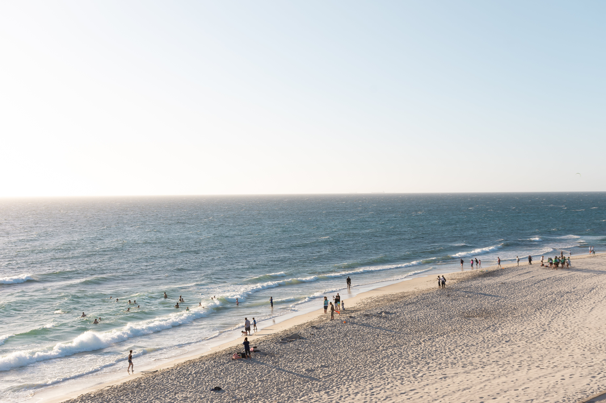
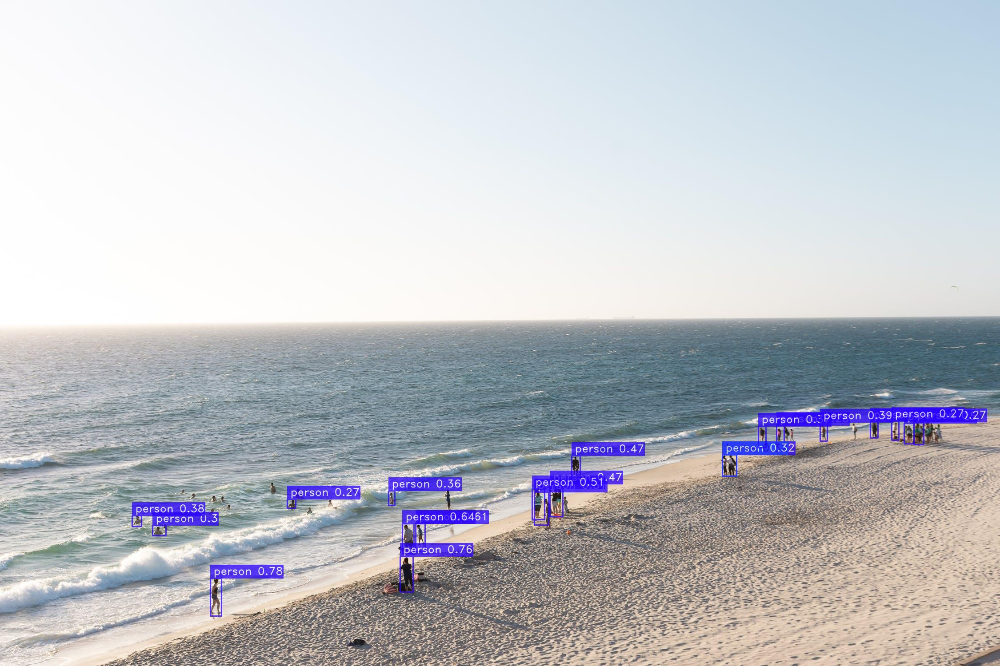
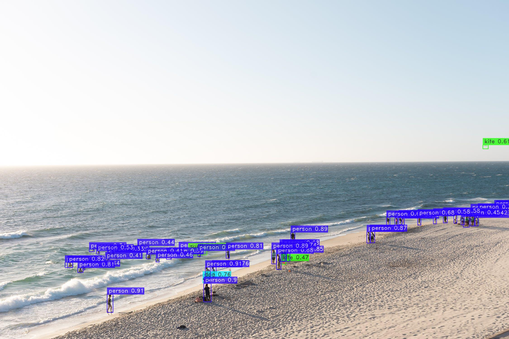

# Using Pretrained Models for Predictions

In this tutorial, we will demonstrate how to use the `model.predict()` method for object detection tasks.

The model used in this tutorial is [YOLO-NAS](YoloNASQuickstart.md), pre-trained on the [COCO dataset](https://cocodataset.org/#home), which contains 80 object categories.

**Warning**: If you trained your model on a dataset that does not inherit from any of the SuperGradients dataset, you will need to follow some additional steps before running the model. You can find these steps in the [following tutorial](PredictionSetup.md).

*Note that the  `model.predict()` method is currently only available for detection tasks.*

## Supported Media Formats

A `mode.predict()` method is built to handle multiple data formats and types.
Here is the full list of what `predict()` method can handle:

| Argument Semantics                 | Argument Type      | Supported layout                  | Example                                                                                        | Notes                                                                                            |
|------------------------------------|--------------------|-----------------------------------|------------------------------------------------------------------------------------------------|--------------------------------------------------------------------------------------------------|
| Path to local image                | `str`              | -                                 | `predict("path/to/image.jpg")`                                                                 | All common image extensions are supported.                                                       |
| Path to images directory           | `str`              | -                                 | `predict("path/to/images/directory")`                                                          |                                                                                                  |
| Path to local video                | `str`              | -                                 | `predict("path/to/video.mp4")`                                                                 | All common video extensions are supported.                                                       |
| URL to remote image                | `str`              | -                                 | `predict("https://example.com/image.jpg")`                                                     |                                                                                                  |
| 3-dimensional Numpy image          | `np.ndarray`       | `[H, W, C]`                       | `predict(np.zeros((480, 640, 3), dtype=np.uint8))`                                             | Channels last, RGB channel order for 3-channel images                                            |
| 4-dimensional Numpy image          | `np.ndarray`       | `[N, H, W, C]` or `[N, C, H, W]`  | `predict(np.zeros((480, 640, 3), dtype=np.uint8))`                                             | Tensor layout (NHWC or NCHW) is inferred w.r.t to number of input channels of underlying model   |
| List of 3-dimensional numpy arrays | `List[np.ndarray]` | `[H1, W1, C]`, `[H2, W2, C]`, ... | `predict([np.zeros((480, 640, 3), dtype=np.uint8), np.zeros((384, 512, 3), dtype=np.uint8) ])` | Images may vary in size, but should have same number of channels                                 |
| 3-dimensional Torch Tensor         | `torch.Tensor`     | `[H, W, C]` or `[C, H, W]`        | `predict(torch.zeros((480, 640, 3), dtype=torch.uint8))`                                       | Tensor layout (HWC or CHW) is inferred w.r.t to number of input channels of underlying model     |
| 4-dimensional Torch Tensor         | `torch.Tensor`     | `[N, H, W, C]` or `[N, C, H, W]`  | `predict(torch.zeros((4, 480, 640, 3), dtype=torch.uint8))`                                    | Tensor layout (NHWC or NCHW) is inferred w.r.t to number of input channels of underlying model   |

**Important note** - When using batched input (4-dimensional `np.ndarray` or `torch.Tensor`) formats, **normalization and size preprocessing will be applied to these inputs**.
This means that the input tensors **should not** be normalized beforehand.
Here is the example of **incorrect** code of using `model.predict()`:

```python
# Incorrect code example. Do not use it.
from super_gradients.training import dataloaders
from super_gradients.common.object_names import Models
from super_gradients.training import models

val_loader = dataloaders.get("coco2017_val_yolo_nas")

model = models.get(Models.YOLO_NAS_L, pretrained_weights="coco")

for (inputs, *_) in val_loader:  # Error here: inputs as already normalized by dataset class
    model.predict(inputs).show() # This will not work as expected
```

Since `model.predict()` encapsulates normalization and size preprocessing, it is not designed to handle pre-normalized images as input.
Please keep this in mind when using `model.predict()` with batched inputs.


## Detect Objects in Multiple Images

#### Load the Model and Prepare the Images
First, let's load the pre-trained `Yolo-NAS` model using the `models.get()` function and define a list of image paths or URLs that we want to process:

```python
from super_gradients.common.object_names import Models
from super_gradients.training import models

model = models.get(Models.YOLO_NAS_L, pretrained_weights="coco")
```

### Detect Objects in the Images
The `model.predict()` method returns an `ImagesDetectionPrediction` object, which contains the detection results for each image.

```python
IMAGES = [
    "path/to/local/image1.jpg",
    "path/to/local/image2.jpg",
    "https://example.com/image3.jpg",
]

images_predictions = model.predict(IMAGES)
```
You can use the default IoU and Confidence threshold or override them like this:

```python
images_predictions = model.predict(IMAGES, iou=0.5, conf=0.7)
```
- `iou`: IoU threshold for the non-maximum suppression (NMS) algorithm. If None, the default value associated with the model used.
- `conf`: Confidence threshold. Predictions below this threshold are discarded. If None, the default value associated with the model used.

### Display the Detected Objects
To display the detected objects and their bounding boxes on the images, call `images_predictions.show()`.

```python
images_predictions.show()
```

You can customize the following optional parameters:
```python
images_predictions.show(box_thickness=2, show_confidence=True)
```
- `box_thickness`: Thickness of bounding boxes.
- `show_confidence`: Whether to show confidence scores on the image.
- `color_mapping`: List of tuples representing the colors for each class.
- `class_names`: List of class names to display. Only classes that the model was trained on are supported. By default, show all these classes.

### Save the Images with Detected Objects
To save the images with detected objects as separate files, call the `images_predictions.save()` method and specify the output folder.
```python
images_predictions.save(output_folder="output_folder/")
```

You can also customize the same parameters as in the `images_predictions.show()` method:
```python
images_predictions.save(output_folder="output_folder/", box_thickness=2, show_confidence=True)
```
### Access Detection Results
To access the detection results for each image, you can iterate over the `images_predictions` object. For each detected object, you can retrieve various attributes such as the label ID, label name, confidence score, and bounding box coordinates. These attributes can be used for further processing or analysis.

```python
for image_prediction in images_predictions:
    class_names = image_prediction.class_names
    labels = image_prediction.prediction.labels
    confidence = image_prediction.prediction.confidence
    bboxes = image_prediction.prediction.bboxes_xyxy

    for i, (label, conf, bbox) in enumerate(zip(labels, confidence, bboxes)):
        print("prediction: ", i)
        print("label_id: ", label)
        print("label_name: ", class_names[int(label)])
        print("confidence: ", conf)
        print("bbox: ", bbox)
        print("--" * 10)

        # You can use the detection results for various tasks, such as:
        # - Filtering objects based on confidence scores or labels
        # - Analyzing object distributions within the images
        # - Calculating object dimensions or areas
        # - Implementing custom visualization techniques
        # - ...
```
You can use these detection results to implement any feature not implemented by SuperGradients to fit your specific needs.


You can also directly access a specific image prediction by referencing its index. `images_predictions[1]` will give you the prediction of the second image.


## Detect Objects in Animated GIFs and Videos
The processing for both gif and videos is similar, as they are treated as videos internally. You can use the same `model.predict()` method as before, but pass the path to a GIF or video file instead. The results can be saved as either a `.gif` or `.mp4`.

To mitigate Out-of-Memory (OOM) errors, the `model.predict()` method for video returns a generator object. This allows the video frames to be processed sequentially, minimizing memory usage. It's important to be aware that model inference in this mode will be slower since batching is not supported.

Consequently, you need to invoke `model.predict()` before each `show()` and `save()` call.

### Load an Animated GIF or Video File
Let's load an animated GIF or a video file and pass it to the `model.predict()` method:

```python
MEDIA_PATH = "path/to/animated_gif_or_video.gif_or_mp4"
media_predictions = model.predict(MEDIA_PATH)
```

### Display the Detected Objects
To display the detected objects and their bounding boxes in the animated GIF or video, call `media_predictions.show()`:
```python
media_predictions.show()
```

### Save the Results with Detected Objects
To save the results with detected objects as a separate file, call the `media_predictions.save()` method, and simply specify the desired output extension in the output name: `.gif` or `.mp4`

**Save as a `.gif`**
```python
media_predictions.save("output_video.gif") # Save as .gif
```

**Save as a `.mp4`**
```python
media_predictions.save("output_video.mp4") # Save as .mp4
```

### Frames Per Second (FPS)
The number of Frames Per Second (FPS) at which the model processes the gif/video can be seen directly next to the loading bar when running `model.predict('my_video.mp4')`.

In the following example, the FPS is 39.49it/s (i.e. fps)
`Processing Video: 100%|███████████████████████| 306/306 [00:07<00:00, 39.49it/s]`

Note that the video/gif will be saved with original FPS (i.e. `media_predictions.fps`).

### Access Frame-by-Frame Detection Results for GIFs and Videos
Iterating over the `media_predictions` object allows you to access the detection results for each frame. This provides an opportunity to perform frame-specific operations, like applying custom filters or visualizations.

```python
for frame_index, frame_prediction in enumerate(media_predictions):
    labels = frame_prediction.prediction.labels
    confidence = frame_prediction.prediction.confidence
    bboxes = frame_prediction.prediction.bboxes_xyxy

    # You can do any frame-specific operations
    # ...

    # Example: Save individual frames with detected objects
    frame_name = f"output/frame_{frame_index}.jpg"
    frame_prediction.save(frame_name) # save frame as an image
```


## Detect Objects Using a Webcam
Call the `model.predict_webcam()` method to start detecting objects using your webcam:

```python
model.predict_webcam()
```

The detected objects and their bounding boxes will be displayed on the webcam feed in real-time. Press 'q' to quit the webcam feed.
Note that `model.predict_webcam()` and `model.predict()` share the same parameters.

### Frames Per Second (FPS)
In the case of a Webcam, contrary to when processing a video by batch, the number of Frames Per Seconds (FPS) directly affects the display FPS since we show each frame right after it is processed.

You can find this information directly written in a corner of the video.


## Using GPU for Object Detection
If your system has a GPU available, you can use it for faster object detection by moving the model to the GPU:

```python
model = model.to("cuda" if torch.cuda.is_available() else "cpu")
model.predict(...)
```

This allows the model to run on the GPU, significantly speeding up the object detection process. Note that using a GPU requires having the necessary drivers and compatible hardware installed.

## Skipping Image Resizing
Skipping image resizing in object detection can have a significant impact on the results. Typically, models are trained on images of a certain size, with (640, 640) being a common dimension.

By default, the `model.predict(...)` method resizes input images to the training size. However, there's an option to bypass this resizing step, which offers several benefits:

- **Speed Improvement for Smaller Images**: If your original image is smaller than the typical training size, avoiding resizing can speed up the prediction process.
- **Enhanced Detection of Small Objects in High-Resolution Images**: For high-resolution images containing numerous small objects, processing the images in their original size can improve the model's ability to recall these objects. This comes at the expense of speed but can be beneficial for detailed analysis.

To apply this approach, simply use the `skip_image_resizing` parameter in the `model.predict(...)` method as shown below:

```python
predictions = model.predict(image, skip_image_resizing=True)
```

#### Example

The following images illustrate the difference in detection results with and without resizing.

#### Original Image

*This is the raw image before any processing.*

#### Image Processed with Standard Resizing (640x640)

*This image shows the detection results after resizing the image to the model's trained size of 640x640.*

#### Image Processed in Original Size

*Here, the image is processed in its original size, demonstrating how the model performs without resizing. Notice the differences in object detection and details compared to the resized version.*
