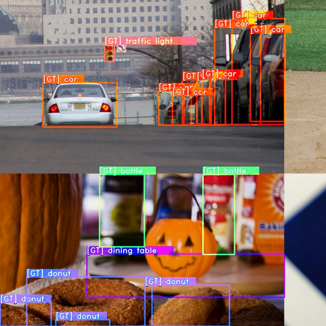

# Object Detection

Object detection is a core task in computer vision that allows to detect and classify bounding boxes in images. 
It's been gaining popularity and ubiquity extremely fast since the first breakthroughs in Deep Learning and advanced a wide range of companies, including the medical domain, surveillance, smart shopping, etc.
It comes as no surprise considering that it covers two basic needs in an end-to-end manner: to find all present objects and to assign a class to each one of them, 
while cleverly dealing with the background and its dominance over all other classes. 

Due to this, most recent research publications dedicated to object detection focus on a good trade-off between accuracy and speed.
In SuperGradients, we aim to collect such models and make them very convenient and accessible to you, so that you can try any one of them interchangeably.

## Implemented models

| Model                                        | Yaml                                                                                                                                                                     | Model class                                                                                                                              | Loss Class                                                                                                                                  | NMS Callback                                                                                                                                                                                       |
|----------------------------------------------|--------------------------------------------------------------------------------------------------------------------------------------------------------------------------|------------------------------------------------------------------------------------------------------------------------------------------|---------------------------------------------------------------------------------------------------------------------------------------------|----------------------------------------------------------------------------------------------------------------------------------------------------------------------------------------------------| 
| [SSD](https://arxiv.org/abs/1512.02325)      | [ssd_lite_mobilenetv2_arch_params](https://github.com/Deci-AI/super-gradients/blob/master/src/super_gradients/recipes/arch_params/ssd_lite_mobilenetv2_arch_params.yaml) | [SSDLiteMobileNetV2](https://github.com/Deci-AI/super-gradients/blob/master/src/super_gradients/training/models/detection_models/ssd.py) | [SSDLoss](https://docs.deci.ai/super-gradients/docstring/training/losses.html#training.losses.ssd_loss.SSDLoss)                                 | [SSDPostPredictCallback](https://docs.deci.ai/super-gradients/docstring/training/utils.html#training.utils.ssd_utils.SSDPostPredictCallback)                                                           |
| [YOLOX](https://arxiv.org/abs/2107.08430)    | [yolox_s_arch_params](https://github.com/Deci-AI/super-gradients/blob/master/src/super_gradients/recipes/arch_params/yolox_s_arch_params.yaml)                           | [YoloX_S](https://github.com/Deci-AI/super-gradients/blob/master/src/super_gradients/training/models/detection_models/yolox.py)          | [YoloXFastDetectionLoss](https://docs.deci.ai/super-gradients/docstring/training/losses.html#training.losses.yolox_loss.YoloXFastDetectionLoss) | [YoloXPostPredictionCallback](https://docs.deci.ai/super-gradients/docstring/training/models.html#training.models.detection_models.yolo_base.YoloXPostPredictionCallback)                              |
| [PPYolo](https://arxiv.org/abs/2007.12099)   | [ppyoloe_arch_params](https://github.com/Deci-AI/super-gradients/blob/master/src/super_gradients/recipes/arch_params/ppyoloe_arch_params.yaml)                           | [PPYoloE](https://docs.deci.ai/super-gradients/docstring/training/models.html#training.models.detection_models.pp_yolo_e.pp_yolo_e.PPYoloE)  | [PPYoloELoss](https://docs.deci.ai/super-gradients/docstring/training/losses.html#training.losses.ppyolo_loss.PPYoloELoss)                      | [PPYoloEPostPredictionCallback](https://docs.deci.ai/super-gradients/docstring/training/models.html#training.models.detection_models.pp_yolo_e.post_prediction_callback.PPYoloEPostPredictionCallback) |
| YoloNAS                                      | [yolo_nas_s_arch_params](https://github.com/Deci-AI/super-gradients/blob/e1db4d99492a25f8e65b5d3e17a6ff2672c5467b/src/super_gradients/recipes/arch_params/yolo_nas_s_arch_params.yaml) | [Yolo NAS S](https://github.com/Deci-AI/super-gradients/blob/e1db4d99492a25f8e65b5d3e17a6ff2672c5467b/src/super_gradients/training/models/detection_models/yolo_nas/yolo_nas_variants.py#L16) | [PPYoloELoss](https://docs.deci.ai/super-gradients/docstring/training/losses.html#training.losses.ppyolo_loss.PPYoloELoss)                      | [PPYoloEPostPredictionCallback](https://docs.deci.ai/super-gradients/docstring/training/models.html#training.models.detection_models.pp_yolo_e.post_prediction_callback.PPYoloEPostPredictionCallback) |


### Datasets

There are several well-known datasets for object detection: COCO, Pascal, etc. 
SuperGradients provides ready-to-use dataloaders for the COCO dataset [COCODetectionDataset](https://docs.deci.ai/super-gradients/docstring/training/datasets.html#training.datasets.detection_datasets.coco_detection.COCODetectionDataset) 
and more general `DetectionDataset` implementation that you can subclass from for your specific dataset format.

If you want to load the dataset outside of a yaml training, do:
```python
from super_gradients.training import dataloaders


data_dir = "/path/to/coco_dataset_dir"
train_dataloader = dataloaders.get(name='coco2017_train',
                                   dataset_params={"data_dir": data_dir},
                                   dataloader_params={'num_workers': 2}
                                   )
val_dataloader = dataloaders.get(name='coco2017_val',
                                 dataset_params={"data_dir": data_dir},
                                 dataloader_params={'num_workers': 2}
                                 )
```

### Loss functions

Generally speaking, in object detection task the loss function is tightly coupled with the model and cannot be used interchangeably. E.g. you cannot use YoloX loss with YoloNAS model and vice versa.
This is different from classification or segmentation task where model output is "standard" and usually does not change. 
In Object Detection task, the model output format may vary greatly and also training objective is often tailored for a specific model architecture.

To indicate compatibility between a model and a loss function, we use the convention of model name and loss function starting from the same prefix name. For example: `SSDLiteMobileNetV2` model & `SSDLoss`, `YoloX_S` and `YoloXFastDetectionLoss`, etc.

Of course, you are free to adjust hyperparameters of the loss function to your liking. Let's check a `PPYoloELoss` loss class as an example:
It has the following constructor:

```python
@register_loss(Losses.PPYOLOE_LOSS)
class PPYoloELoss(nn.Module):
    def __init__(
        self,
        num_classes: int,
        use_varifocal_loss: bool = True,
        use_static_assigner: bool = True,
        reg_max: int = 16,
        classification_loss_weight: float = 1.0,
        iou_loss_weight: float = 2.5,
        dfl_loss_weight: float = 0.5,
    ):
        ...
```

In your recipe you can pass the desired values for each parameter. 
For example show below, we increase the classification component weight to 10 and set the DFL & IOU components of the loss to 1.0:

```yaml
training_hyperparams:
    loss:
      ppyoloe_loss:
        num_classes: ${arch_params.num_classes}
        classification_loss_weight: 10
        iou_loss_weight: 1.0
        dfl_loss_weight: 1.0
```

This is how you can modify the loss hyperparameters. If you need to modify the loss itself, you can subclass it and override the `forward` method to fit your needs.

```python
@register_loss()
class MyCustomPPYoloELoss(nn.Module):
       def forward(self, outputs, target):
             ...
```

```yaml
training_hyperparams:
    loss: MyCustomPPYoloELoss 
    criterion_params:
        num_classes: ${arch_params.num_classes}
        classification_loss_weight: 10
        iou_loss_weight: 1.0
        dfl_loss_weight: 1.0
```

### Metrics

A typical metric for object detection is mean average precision, mAP for short. 
It is calculated for a specific IoU level which defines how tightly a predicted box must intersect with a ground truth box to be considered a true positive.
Both one value and a range can be used as IoU, where a range refers to an average of mAPs for each IoU level.
The most popular metric for mAP on COCO is mAP@0.5:0.95, SuperGradients provides its implementation [DetectionMetrics](https://docs.deci.ai/super-gradients/docstring/training/metrics.html#training.metrics.detection_metrics.DetectionMetrics).
It is written to be as close as possible to the  official metric implementation from [COCO API](https://pypi.org/project/pycocotools/), while being much faster and DDP-friendly.

We provide a few metrics for object detection with pre-defined IoU levels to fit the most frequent use cases:

* DetectionMetrics_050_095 - computes mAP at IoU range [0.5; 0.95] with a step of 0.05 (Default COCO metric)
* DetectionMetrics_050 - computes mAP at IoU level 0.5
* DetectionMetrics_075 - computes mAP at IoU level 0.75
* DetectionMetrics - computes mAP at user-specified IoU level (Defaults to [0.5; 0.95])

You can also specify a custom IoU range or a single IoU level for the metric. 
In addition to computing mAP, `DetectionMetrics` also computes other metrics such as:

* Recall score at a given score threshold
* Precision score at a given score threshold
* F-1 detection score at a given score threshold
* Average precision score for each class

DetectionMetrics can even find the optimal confidence threshold that maximizes mean F1 score. 
Here is how to enable computing all these metrics:

```yaml
training_hyperparams:
  valid_metrics_list:
    - DetectionMetrics:
        num_cls: ${num_classes}
        normalize_targets: True          
        score_thres: 0.1                 # A lower bound rejection threshold for predictions
        top_k_predictions: 300           # At most 300 predictions per image will be considered with confidence above score_thres
        iou_thres: [0.6, 0.8]            # <--- IoU range [0.6; 0.8] with 0.05 step
        include_classwise_ap: True       # Enables computing AP for each class (helps to find problematic classes)
        calc_best_score_thresholds: True # Enables computing optimal confidence threshold that maximizes mean F1 score
        post_prediction_callback:
          _target_: super_gradients.training.models.detection_models.pp_yolo_e.PPYoloEPostPredictionCallback
          score_threshold: 0.01
          nms_top_k: 1000
          max_predictions: 300
          nms_threshold: 0.7

  metric_to_watch: 'mAP@0.60:0.80'
```


In order to use `DetectionMetrics` you have to pass a so-called `post_prediction_callback` to the metric, which is responsible for the postprocessing of the model's raw output into final predictions and is explained below. 

### Postprocessing

Postprocessing refers to a process of transforming the model's raw output into final predictions. Postprocessing is also model-specific and depends on the model's output format.
For `YOLOX` model, the postprocessing step is implemented in [YoloXPostPredictionCallback](https://docs.deci.ai/super-gradients/docstring/training/models.html#training.models.detection_models.yolo_base.YoloXPostPredictionCallback) class.
It can be passed into a `DetectionMetrics` as a `post_prediction_callback`. 
The postprocessing of all detection models involves non-maximum suppression (NMS) which filters dense model's predictions and leaves only boxes with the highest confidence and suppresses boxes with very high overlap 
based on the assumption that they likely belong to the same object. Thus, a confidence threshold and an IoU threshold must be passed into the postprocessing object.

```python
from super_gradients.training.models.detection_models.yolo_base import YoloXPostPredictionCallback


post_prediction_callback = YoloXPostPredictionCallback(conf=0.001, iou=0.6)
```

All post prediction callbacks returns a list of lists with decoded boxes after NMS: `List[torch.Tensor]`.
The first list wraps all images in the batch, and each tensor holds all predictions for each image in the batch.
The shape of predictions tensor is `[N, 6]` where N is the number of predictions for the image and each row is holds values of `[X1, Y1, X2, Y2, confidence, class_id]`.

Box coordinates are in absolute (pixel) units.

### Visualization

Visualization of the model predictions is a very important part of the training process for any computer vision task. 
By visualizing the predicted boxes, developers and researchers can identify errors or inaccuracies in the model's output and adjust the model's architecture or training data accordingly.

#### Extreme Batch Visualization during training

SuperGradients provides an implementation of [ExtremeBatchDetectionVisualizationCallback](https://docs.deci.ai/super-gradients/docstring/training/utils.html#src.super_gradients.training.utils.callbacks.callbacks.ExtremeBatchDetectionVisualizationCallback). 
You can use this callback in your training pipeline to visualize best or worst batch during training. 
This callback observes a specific metric during training epoch and logs the most extreme batch to configured logger (Default is Tensorboard). 
The logging includes visualization of ground truth boxes and model's predictions.

To use this callback you would need to add it to `training_hyperparams.phase_callbacks` in your yaml:

```yaml
training_hyperparams:
  phase_callbacks:
    - ExtremeBatchDetectionVisualizationCallback:
        metric: # Defines which metric to observe
          DetectionMetrics_050:
            score_thres: 0.1
            top_k_predictions: 300
            num_cls: ${num_classes}
            normalize_targets: True
            post_prediction_callback:
              _target_: super_gradients.training.models.detection_models.pp_yolo_e.PPYoloEPostPredictionCallback
              score_threshold: 0.01
              nms_top_k: 1000
              max_predictions: 300
              nms_threshold: 0.7
        max: False # Indicates that we want to log batch with the lowest metric value
        metric_component_name: 'mAP@0.50'
        post_prediction_callback:
          _target_: super_gradients.training.models.detection_models.pp_yolo_e.PPYoloEPostPredictionCallback
          score_threshold: 0.25
          nms_top_k: 1000
          max_predictions: 300
          nms_threshold: 0.7
        normalize_targets: True

```
Note in the example below the `ExtremeBatchDetectionVisualizationCallback` callback observes a user-provided Metric class that computes the score for **each batch**. 
You may also observe the entire loss or individual components of the loss as follows. 
In this case instead of passing `metric` argument to constructor of `ExtremeBatchDetectionVisualizationCallback` you would need to pass `loss_to_monitor` argument.
The fully qualified name of the loss includes the loss class name and component name separated by `/`:

```yaml
training_hyperparams:
  phase_callbacks:
    - ExtremeBatchDetectionVisualizationCallback:
        loss_to_monitor: "YoloNASPoseLoss/loss"
        max: True

```

#### Visualization of predictions after training

```python
import torch
import numpy as np

from super_gradients.training import models
from super_gradients.training.utils.detection_utils import DetectionVisualization
from super_gradients.training.datasets.datasets_conf import COCO_DETECTION_CLASSES_LIST


def my_undo_image_preprocessing(im_tensor: torch.Tensor) -> np.ndarray:
    im_np = im_tensor.cpu().numpy()
    im_np = im_np[:, ::-1, :, :].transpose(0, 2, 3, 1)
    im_np *= 255.0
    return np.ascontiguousarray(im_np, dtype=np.uint8)


model = models.get("yolox_s", pretrained_weights="coco", num_classes=80)
imgs, targets = next(iter(train_dataloader))
preds = model.get_post_prediction_callback(conf=0.1, iou=0.6)(model(imgs))
DetectionVisualization.visualize_batch(imgs, preds, targets, batch_name='train', class_names=COCO_DETECTION_CLASSES_LIST,
                                       checkpoint_dir='/path/for/saved_images/', gt_alpha=0.5,
                                       undo_preprocessing_func=my_undo_image_preprocessing)
```
The function you pass as `undo_preprocessing_func` will define how to undo dataset transforms and return the image back into its initial formal (BGR, uint8).
This also allows you to test the correctness of your dataset implementation, since it saves images after they go through transforms. This may be especially useful for a train set with heavy augmentation transforms. You can see both the predictions and the ground truth, and give the ground truth box the desired opacity. 

The saved train image for a dataset with a mosaic transform should look something like this:



#### Visualization of predictions after training using predict()

If you would like to do the visualization outside of training you can use `predict()` method that is implemented for most of our detection models.
```python
model = models.get("yolox_s", pretrained_weights="coco", num_classes=80)
model.predict("https://deci-pretrained-models.s3.amazonaws.com/sample_images/beatles-abbeyroad.jpg").show()
```

See for more details on using [Predict API](ModelPredictions.md).

### Let's train!

As stated above, training can be launched with just one command. For the curious ones, let's see how all the components we've just discussed fall into place in one yaml.
```yaml
# coco2017_yolox
defaults:
  - training_hyperparams: coco2017_yolox_train_params
  - dataset_params: coco_detection_dataset_params
  - arch_params: yolox_s_arch_params
  - checkpoint_params: default_checkpoint_params
  - _self_
```
These are the actual components of [coco2017_yolox.yaml](https://github.com/Deci-AI/super-gradients/blob/master/src/super_gradients/recipes/coco2017_yolox.yaml)
The dataset parameters are defined in `dataset_params:` and are eventually passed into coco2017_train/val dataset mentioned above in the [Datasets](ObjectDetection.md#datasets) section 

The metric is part of `training_hyperparams` and so it's stated in the [coco2017_yolox_train_params.yaml](https://github.com/Deci-AI/super-gradients/blob/master/src/super_gradients/recipes/training_hyperparams/coco2017_yolox_train_params.yaml) with:

```yaml
valid_metrics_list:
  - DetectionMetrics:
      normalize_targets: True
      post_prediction_callback:
        _target_: super_gradients.training.models.detection_models.yolo_base.YoloXPostPredictionCallback
        iou: 0.65
        conf: 0.01
      num_cls: 80
```

Notice how `YoloXPostPredictionCallback` is passed as a `post_prediction_callback`.

A visualization belongs to `training_hyperparams` as well, specifically to the `phase_callbacks` list, as follows:
```yaml
phase_callbacks:
  - DetectionVisualizationCallback:
      phase:
        _target_: super_gradients.training.utils.callbacks.callbacks.Phase
        value: VALIDATION_EPOCH_END
      freq: 1
      post_prediction_callback:
        _target_: super_gradients.training.models.detection_models.yolo_base.YoloXPostPredictionCallback
        iou: 0.65
        conf: 0.01
      classes: [
          "person", "bicycle", "car", "motorcycle", "airplane", "bus", "train", "truck", "boat", "traffic light",
          "fire hydrant", "stop sign", "parking meter", "bench", "bird", "cat", "dog", "horse", "sheep", "cow",
          "elephant", "bear", "zebra", "giraffe", "backpack", "umbrella", "handbag", "tie", "suitcase", "frisbee",
          "skis", "snowboard", "sports ball", "kite", "baseball bat", "baseball glove", "skateboard", "surfboard",
          "tennis racket", "bottle", "wine glass", "cup", "fork", "knife", "spoon", "bowl", "banana", "apple",
          "sandwich", "orange", "broccoli", "carrot", "hot dog", "pizza", "donut", "cake", "chair", "couch",
          "potted plant", "bed", "dining table", "toilet", "tv", "laptop", "mouse", "remote", "keyboard", "cell phone",
          "microwave", "oven", "toaster", "sink", "refrigerator", "book", "clock", "vase", "scissors", "teddy bear",
          "hair drier", "toothbrush"
      ]
```
By default, this callback is not part of the yaml, so you can add it yourself if you prefer.

Using the provided yaml, SuperGradients can instantiate all the components and launch training from config:
```python
trainer = Trainer(experiment_name=cfg.experiment_name, ckpt_root_dir=cfg.ckpt_root_dir)

# BUILD NETWORK
model = models.get(
    model_name=cfg.architecture,
    num_classes=cfg.arch_params.num_classes,
    arch_params=cfg.arch_params,
    strict_load=cfg.checkpoint_params.strict_load,
    pretrained_weights=cfg.checkpoint_params.pretrained_weights,
    checkpoint_path=cfg.checkpoint_params.checkpoint_path,
    load_backbone=cfg.checkpoint_params.load_backbone,
)

# INSTANTIATE DATA LOADERS

train_dataloader = dataloaders.get(
    name=get_param(cfg, "train_dataloader"),
    dataset_params=cfg.dataset_params.train_dataset_params,
    dataloader_params=cfg.dataset_params.train_dataloader_params,
)

val_dataloader = dataloaders.get(
    name=get_param(cfg, "val_dataloader"),
    dataset_params=cfg.dataset_params.val_dataset_params,
    dataloader_params=cfg.dataset_params.val_dataloader_params,
)

recipe_logged_cfg = {"recipe_config": OmegaConf.to_container(cfg, resolve=True)}
# TRAIN
res = trainer.train(
    model=model,
    train_loader=train_dataloader,
    valid_loader=val_dataloader,
    training_params=cfg.training_hyperparams,
    additional_configs_to_log=recipe_logged_cfg,
)
```
It is convenient to trigger it with [train_from_recipe.py](https://github.com/Deci-AI/super-gradients/blob/master/src/super_gradients/examples/train_from_recipe_example/train_from_recipe.py), but you can do the same in your project by constructing the desired objects directly.


## How to connect your own dataset

To add a new dataset to SuperGradients, you need to implement a few things:

- Implement a new dataset class
- Add a configuration file

Let's unwrap each of the steps

### Implement a new dataset class

To train an existing architecture on a new dataset one needs to implement the dataset class first.
It is generally a good idea to subclass from `DetectionDataset` as it comes with a few useful features, 
such as subclassing, caching, extra sample loading necessary for complex transform like mosaic or mixup, etc. It requires you to implement only a few methods for files loading. 
If you prefer, you can use `torch.utils.data.Dataset` as well.

A minimal implementation of a `DetectionDataset` subclass class should look similar to this:

```python
import os.path
from typing import Tuple, List, Dict, Union, Any, Optional

import numpy as np
from super_gradients.common.registry.registry import register_dataset
from super_gradients.training.datasets.detection_datasets.detection_dataset import DetectionDataset
from super_gradients.training.transforms.transforms import DetectionTransform
from super_gradients.training.utils.detection_utils import DetectionTargetsFormat


MY_CLASSES = ['cat', 'dog', 'donut']


@register_dataset("MyNewDetectionDataset")
class MyNewDetectionDataset(DetectionDataset):
    def __init__(self, data_dir: str, samples_dir: str, targets_dir: str, input_dim: Tuple[int, int],
                 transforms: List[DetectionTransform], max_num_samples: int = None, 
                 class_inclusion_list: Optional[List[str]] = None, **kwargs):
        self.sample_paths = None
        self.samples_sub_directory = samples_dir
        self.targets_sub_directory = targets_dir

        # setting cache as False to be able to load non-resized images and crop in one of transforms
        super().__init__(data_dir=data_dir, input_dim=input_dim,
                         original_target_format=DetectionTargetsFormat.LABEL_CXCYWH,
                         max_num_samples=max_num_samples,
                         class_inclusion_list=class_inclusion_list, transforms=transforms,
                         all_classes_list=MY_CLASSES, **kwargs)

    def _setup_data_source(self) -> int:
        """
        Set up the data source and store relevant objects as attributes.
        :return: Number of available samples (i.e. how many images we have)
        """

        samples_dir = os.path.join(self.data_dir, self.samples_sub_directory)
        labels_dir = os.path.join(self.data_dir, self.targets_sub_directory)
        sample_names = [n for n in sorted(os.listdir(samples_dir)) if n.endswith(".jpg")]
        label_names = [n for n in sorted(os.listdir(labels_dir)) if n.endswith(".txt")]
        assert len(sample_names) == len(label_names), f"Number of samples: {len(sample_names)}, " \
                                                      f"doesn't match the number of labels {len(label_names)}"
        self.samples_targets_tuples_list = []
        for sample_name in sample_names:
            sample_path = os.path.join(samples_dir, sample_name)
            label_path = os.path.join(labels_dir, sample_name.replace(".jpg", ".txt"))

            if os.path.exists(sample_path) and os.path.exists(label_path):
                self.samples_targets_tuples_list.append((sample_path, label_path))
            else:
                raise AssertionError(f"Sample and/or target file(s) not found "
                                     f"(sample path: {sample_path}, target path: {label_path})")

        return len(self.samples_targets_tuples_list)

    def _load_annotation(self, sample_id: int) -> Dict[str, Union[np.ndarray, Any]]:
        """Load annotations associated to a specific sample.
        Please note that the targets should be resized according to self.input_dim!
        :param sample_id:   Id of the sample to load annotations from.
        :return:            Annotation, a dict with any field. Has to include "image", "target", and "resized_img_shape"
        """
        sample_path, target_path = self.samples_targets_tuples_list[sample_id]

        with open(target_path, 'r') as targets_file:
            lines = targets_file.read().splitlines()
            target = np.array([x.strip().strip(',').split(',') for x in lines], dtype=np.float32)

        res_target = np.array(target) if len(target) != 0 else np.zeros((0, 5))  # cls, cx, cy, w, h
        annotation = {
            'img_path': os.path.join(self.data_dir, sample_path),
            'target': res_target,
            'resized_img_shape': None
        }

        return annotation
```
Note the addition of `@register_dataset` decorator. This makes SuperGradients recognize your dataset so that you can use its name directly in a yaml.
Since detection labels often contain different number of boxes per image, targets are padded with 0s, which allows to use them in a batch. 
They are later removed by a [DetectionCollateFN](https://docs.deci.ai/super-gradients/docstring/training/utils.html#training.utils.detection_utils.DetectionCollateFN) which prepends all targets with an index in a batch and stacks them together.


### Add a configuration file

Create new `my_new_dataset_params.yaml` file under `dataset_params` folder and add your dataset and dataloader parameters:

```yaml
# my_new_dataset_params.yaml
root_dir: /path/to/my_data/

train_dataset_params:
  data_dir: ${dataset_params.root_dir}
  samples_dir: my-data-train/images
  targets_dir: my-data-train/annotations
  input_dim: [640, 640]
  transforms:
    - DetectionHSV:
        prob: 1.0                       # probability to apply HSV transform
        hgain: 5                        # HSV transform hue gain (randomly sampled from [-hgain, hgain])
        sgain: 30                       # HSV transform saturation gain (randomly sampled from [-sgain, sgain])
        vgain: 30                       # HSV transform value gain (randomly sampled from [-vgain, vgain])
        bgr_channels: [ 0, 1, 2 ]
    - DetectionStandardize:
        max_value: 255.
    - DetectionTargetsFormatTransform:
        input_format: XYWH_LABEL
        output_format: LABEL_CXCYWH

train_dataloader_params:
  dataset: MyNewDetectionDataset
  batch_size: 64
  num_workers: 8
  drop_last: True
  shuffle: True
  pin_memory: True
  worker_init_fn:
    _target_: super_gradients.training.utils.utils.load_func
    dotpath: super_gradients.training.datasets.datasets_utils.worker_init_reset_seed
  collate_fn: DetectionCollateFN

val_dataset_params:
  data_dir: ${dataset_params.root_dir}
  samples_dir: my-data-val/images
  targets_dir: my-data-val/annotations
  input_dim: [640, 640]
  transforms:
    - DetectionStandardize:
        max_value: 255.
    - DetectionTargetsFormatTransform:
        input_format: XYWH_LABEL
        output_format: LABEL_CXCYWH

val_dataloader_params:
  dataset: MyNewDetectionDataset
  batch_size: 64
  num_workers: 8
  drop_last: True
  pin_memory: True
  collate_fn: DetectionCollateFN
```

In your training recipe add/change the following lines to:

```yaml
# my_train_recipe.yaml
defaults:
  - training_hyperparams: ...
  - dataset_params: my_new_dataset_params
  - arch_params: ...
  - checkpoint_params: ...
  - _self_
 
train_dataloader:
val_dataloader:
num_classes: 3
...
```

And you should be good to go!

## Understanding model's predictions

This section covers what is the output of each model class in train, eval and tracing modes. A tracing mode is enabled
when exporting model to ONNX or when using `torch.jit.trace()` call
Corresponding loss functions and post-prediction callbacks from the table above are written to match the output format of the models.
That being said, if you're using YoloX model, you should use YoloX loss and post-prediction callback for YoloX model. 
Mixing them with other models will result in an error.

It is important to understand the output of the model class in order to use it correctly in the training process and especially
if you are going to use the model's prediction in a custom callback or loss.


### YoloX
#### Training mode

In training mode, YoloX returns a list of 3 tensors that contains the intermediates required for the loss calculation.
They correspond to output feature maps of the prediction heads:
- Output feature map at index 0: `[B, 1, H/8, W/8, C + 5]`
- Output feature map at index 1: `[B, 1, H/16, W/16, C + 5]`
- Output feature map at index 2: `[B, 1, H/32, W/32, C + 5]`

Value `C` corresponds to the number of classes in the dataset. 
And remaining `5`elements are box coordinates and objectness score.
Layout of elements in the last dimension is as follows: `[cx, cy, w, h, obj_score, class_scores...]`
Box regression in these outputs are NOT in pixel coordinates.
X and Y coordinates are normalized coordinates.
Width and height values are the power factor for the base of `e`

`output_feature_map_at_index_0, output_feature_map_at_index_1, output_feature_map_at_index_2 = yolo_x_model(images)`

In this mode, predictions decoding is not performed.

#### Eval mode

In eval mode, YoloX returns a tuple of decoded predictions and raw intermediates.

`predictions, (raw_predictions_0, raw_predictions_1, raw_predictions_2) = yolo_x_model(images)`

`predictions` is a single tensor of shape `[B, num_predictions, C + 5]` where `num_predictions` is the total number of predictions across all 3 output feature maps.

The layout of the last dimension is the same as in training mode: `[cx, cy, w, h, obj_score, class_scores...]`.
Values of `cx`, `cy`, `w`, `h` are in absolute pixel coordinates and confidence scores are in range `[0, 1]`.

#### Tracing mode

Same as in Eval mode.


### PPYolo-E & Yolo-NAS
#### Training & Validation mode

PPYoloE & Yolo-NAS returns a tuple of 2 tensors: `decoded_predictions, raw_intermediates`. 

A `decoded_predictions` itself is a tuple of 2 tensors (`[B,Anchors,4]` and `[B,Anchors,C]`) with decoded bounding boxes and class scores.
A `raw_intermediates` contains 6 tensors of intermediates required for the loss calculation.

You can access individual components of the model's output using the following snippet:

`(pred_bboxes, pred_scores), (cls_score_list, reg_distri_list, anchors, anchor_points, num_anchors_list, stride_tensor) = model(images)`

Here `pred_bboxes` and `pred_scores` are decoded predictions of the model:

  * `pred_bboxes` - `[B, num_anchors, 4]` - decoded bounding boxes in the format `[x1, y1, x2, y2]` in absolute (pixel) coordinates
  * `pred_scores` - `[B, num_anchors, num_classes]` - class scores `(0..1)` for each bounding box

Please note that box predictions are not clipped and may extend beyond the image boundaries.
Additionally, the NMS is not performed yet at this stage. This is where the post-prediction callback comes into play.

Remaining tensors contains the intermediates required for the loss calculation. They are as follows:

  * `cls_score_list` - `[B, num_anchors, num_classes]`
  * `reg_distri_list` - `[B, num_anchors, num_regression_dims]`
  * `anchors` - `[num_anchors, 4]`
  * `anchor_points` - `[num_anchors, 2]`
  * `num_anchors_list` - `[num_anchors]`
  * `stride_tensor` - `[num_anchors]`


#### Tracing mode

In tracing mode, PPYoloE returns only decoded predictions:

`pred_bboxes, pred_scores = yolo_nas_model(images)`

Please note that box predictions are not clipped and may extend beyond the image boundaries.
Additionally, the NMS is not performed yet at this stage. This is where the post-prediction callback comes into play.

## Training

The easiest way to start training any mode in SuperGradients is to use a pre-defined recipe. In this tutorial, we will see how to train `YOLOX-S` model, other models can be trained by analogy.

### Prerequisites

1. You have to install SuperGradients first. Please refer to the [Installation](installation.md) section for more details.
2. Prepare the COCO dataset as described in the [Computer Vision Datasets Setup](https://docs.deci.ai/super-gradients/src/super_gradients/training/datasets/Dataset_Setup_Instructions/) under Detection Datasets section. 

After you meet the prerequisites, you can start training the model by running from the root of the repository:

### Training from recipe

```bash
python -m super_gradients.train_from_recipe --config-name=coco2017_yolox multi_gpu=Off num_gpus=1
```

Note, the default configuration for this recipe is to use 8 GPUs in DDP mode. This hardware configuration may not be for everyone, so in the example above we override GPU settings to use a single GPU.
It is highly recommended to read through the recipe file [coco2017_yolox](https://github.com/Deci-AI/super-gradients/blob/master/src/super_gradients/recipes/coco2017_yolox.yaml) to get better understanding of the hyperparameters we use here.
If you're unfamiliar with config files, we recommend you to read the [Configuration Files](configuration_files.md) part first.


## How to add a new model

To implement a new model, you need to add the following parts:

- Model architecture itself
- Postprocessing Callback

For a custom model, a good starting point would be a 
[CustomizableDetector](https://docs.deci.ai/super-gradients/docstring/training/models.html#training.models.detection_models.customizable_detector.CustomizableDetector) 
class since it allows to configure a backbone, a neck and a head separately. See an example yaml of 
a model that uses it: [ssd_lite_mobilenetv2_arch_params](https://github.com/Deci-AI/super-gradients/blob/master/src/super_gradients/recipes/arch_params/ssd_lite_mobilenetv2_arch_params.yaml)

It is strongly advised to use the existing callbacks and to define your model's head such that it returns the same outputs. 
