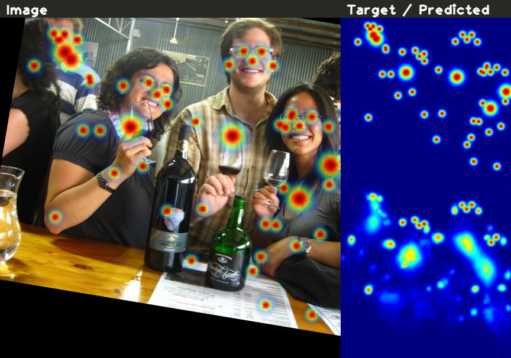

# Pose Estimation

Pose estimation is a computer vision task that involves estimating the position and orientation of objects or people in images or videos. 
It typically involves identifying specific keypoints or body parts, such as joints, and determining their relative positions and orientations. 
Pose estimation has numerous applications, including robotics, augmented reality, human-computer interaction, and sports analytics.

Top-down and bottom-up are two commonly used approaches in pose estimation. The main difference between top-down and bottom-up pose estimation approaches is the order in which the pose is estimated.

In a **top-down approach**, an object detection model is used to identify the object of interest, such as a person or a car, and a separate pose estimation model is used to estimate the keypoints of the object.

In contrast, a **bottom-up** approach first identifies individual body parts or joints and then connects them to form a complete pose.

In summary, top-down approach starts with detecting an object and then estimates its pose, while bottom-up approach first identifies the body parts and then forms a complete pose.

## Implemented models

| Model                                    | Model class                                                                                                                                                          | Target Generator                                                                                                                                                      | Loss Class                                                                                                     | Decoding Callback                                                                                                                                                                        | Visualization Callback                                                                                                                                                            |
|------------------------------------------|----------------------------------------------------------------------------------------------------------------------------------------------------------------------|-----------------------------------------------------------------------------------------------------------------------------------------------------------------------|----------------------------------------------------------------------------------------------------------------|------------------------------------------------------------------------------------------------------------------------------------------------------------------------------------------|-----------------------------------------------------------------------------------------------------------------------------------------------------------------------------------| 
| [DEKR](https://arxiv.org/abs/2104.02300) | [DEKRPoseEstimationModel](https://docs.deci.ai/super-gradients/docstring/training/models/#training.models.pose_estimation_models.dekr_hrnet.DEKRPoseEstimationModel) | [DEKRTargetsGenerator](https://github.com/Deci-AI/super-gradients/blob/master/src/super_gradients/training/datasets/pose_estimation_datasets/target_generators.py#L8) | [DEKRLoss](https://docs.deci.ai/super-gradients/docstring/training/losses/#training.losses.dekr_loss.DEKRLoss) | [DEKRPoseEstimationDecodeCallback](https://docs.deci.ai/super-gradients/docstring/training/utils/#training.utils.pose_estimation.dekr_decode_callbacks.DEKRPoseEstimationDecodeCallback) | [DEKRVisualizationCallback](https://docs.deci.ai/super-gradients/docstring/training/utils/#training.utils.pose_estimation.dekr_visualization_callbacks.DEKRVisualizationCallback) |

## Training

For the sake of being specific in this tutorial, we will consider the training of `DEKR` model in further explanations.
The easiest way to start training a pose estimation model is to use a recipe from SuperGradients. 

### Prerequisites

1. You have to install SuperGradients first. Please refer to the [Installation](installation.md) section for more details.
2. Prepare the COCO dataset as described in the [Computer Vision Datasets Setup](https://docs.deci.ai/super-gradients/src/super_gradients/training/datasets/Dataset_Setup_Instructions/) under Pose Estimation Datasets
 section. 

After you met the prerequisites, you can start training the model by running from the root of the repository:

### Training from recipe

```bash
python -m super_gradients.train_from_recipe --config-name=coco2017_pose_dekr_w32 multi_gpu=Off num_gpus=1
```

Note, the default configuration for recipe is to use 8 GPUs in DDP mode. This hardware configuration may not be for everyone, so we in the example above we override GPU settings to use single GPU.
It is highly recommended to read through the [recipe file](https://github.com/Deci-AI/super-gradients/src/super_gradients/recipes/coco2017_pose_dekr_w32.yaml) to get better understanding of the hyperparameters we use here.
If you're unfamiliar with config files, we recommend you to read the [Configuration Files](configuration_files.md) part first.

The start of the config file looks like this:

```yaml
defaults:
  - training_hyperparams: coco2017_dekr_pose_train_params
  - dataset_params: coco_pose_estimation_dekr_dataset_params
  - arch_params: dekr_w32_arch_params
  - checkpoint_params: default_checkpoint_params
  - _self_
```

Here we define the default values for the following parameters:
* `training_hyperparams` - These are our training hyperparameters. Things learning rate, optimizer, use of mixed precision, EMA and other training parameters are defined here. 
    You can refer to the [default_train_params.yaml](https://github.com/Deci-AI/super-gradients/blob/master/src/super_gradients/recipes/training_hyperparams/default_train_params.yaml) for more details.
   In our example we use  [coco2017_dekr_pose_train_params.yaml](https://github.com/Deci-AI/super-gradients/blob/master/src/super_gradients/recipes/training_hyperparams/coco2017_dekr_pose_train_params.yaml) that sets
   training parameters as in [DEKR](https://arxiv.org/abs/2104.02300) paper.
* `dataset_params` - These are the parameters for the training on COCO2017. The dataset configuration sets the dataset transformations (augmentations & preprocessing) and [target generator](https://docs.deci.ai/super-gradients/docstring/training/datasets/#training.datasets.pose_estimation_datasets.target_generators.DEKRTargetsGenerator) for training the model.
* `arch_params` - These are the parameters for the model architecture. In our example we use [DEKRPoseEstimationModel](https://docs.deci.ai/super-gradients/docstring/training/models/#training.models.pose_estimation_models.dekr_hrnet.DEKRPoseEstimationModel) that is a HRNet-based model with DEKR decoder.
* `checkpoint_params` - These are the default parameters for resuming of training and using pretrained checkpoints. 
You can refer to the [default_checkpoint_params.yaml](https://github.com/Deci-AI/super-gradients/blob/master/src/super_gradients/recipes/checkpoint_params/default_checkpoint_params.yaml).
 
### Datasets

There are several well-known datasets for pose estimation: COCO, MPII Human Pose, Hands in the Wild, CrowdPose, etc. 
SuperGradients provide ready-to-use dataloaders for the COCO dataset [COCOKeypointsDataset](https://docs.deci.ai/super-gradients/docstring/training/datasets/#training.datasets.pose_estimation_datasets.coco_keypoints.COCOKeypointsDataset) 
and more general `BaseKeypointsDataset` implementation that you can subclass from for your specific dataset format.

### Target generators

The target generators are responsible for generating the target tensors for the model. 
Implementation of the target generator is model-specific and usually includes at least a multi-channel heatmap mask per joint. 

Each model may require its own target generator implementation that is compatible with model's output. 

All target generators should implement `KeypointsTargetsGenerator` interface as shown below. 
The goal of this class is to transform ground-truth annotations into a format that is suitable for computing a loss and training a model:

```py
# super_gradients.training.datasets.pose_estimation_datasets.target_generators.KeypointsTargetsGenerator

import abc
import numpy as np
from torch import Tensor
from typing import Union, Tuple, Dict

class KeypointsTargetsGenerator:
    @abc.abstractmethod
    def __call__(self, image: Tensor, joints: np.ndarray, mask: np.ndarray) -> Union[Tensor, Tuple[Tensor, ...], Dict[str, Tensor]]:
        """
        Encode input joints into target tensors

        :param image: [C,H,W] Input image tensor
        :param joints: [Num Instances, Num Joints, 3] Last channel represents (x, y, visibility)
        :param mask: [H,W] Mask representing valid image areas. For instance, in COCO dataset crowd targets
                           are not used during training and corresponding instances will be zero-masked.
                           Your implementation may use this mask when generating targets.
        :return: Encoded targets
        """
        raise NotImplementedError()
```

SuperGradients provide implementation of [DEKRTargetGenerator](https://docs.deci.ai/super-gradients/docstring/training/datasets/#training.datasets.pose_estimation_datasets.target_generators.DEKRTargetsGenerator) that is compatible with `DEKR` model.

If you need to implement your own target generator, please refer to documentation of `KeypointsTargetsGenerator` base class. 

### Metrics

A typical metric for pose estimation is the average precision (AP) and average recall (AR). 
SuperGradients provide implementation of `PoseEstimationMetrics` to compute AP/AR scores.

The metric is implemented as a callback that is called after each validation step. Implementation of the metric is made as close as possible to official metric implementation from [COCO API](https://pypi.org/project/pycocotools/).
However, our implementation does NOT include computation of AP/AR scores per area range. It also natively support evaluation in DDP mode. 

It is worth noting that usually reported AP/AR scores in papers are obtained using TTA (test-time augmentation) and additional postprocessing on top of the main model. 

A horizontal flip is a common TTA technique that is used to increase accuracy of the predictions at the cost of running forward pass twice. 
Second common technique is a multi-scale approach when one perform inference additionally on 0.5x and 1.5x input resolution and aggregate predictions. 

When training model using SuperGradients, we use neither of these techniques. If you want to measure AP/AR scores using TTA you may want to write your own evaluation loop for that.

In order to use `PoseEstimationMetrics` you have to pass a so-called `post_prediction_callback` to the metric, which is responsible for postprocessing of the model's raw output into final predictions. 

### Postprocessing

Postprocessing refers to a process of transforming the model's raw output into final predictions. Postprocessing is also model-specific and depends on the model's output format. 
For `DEKR` model, the postprocessing step is implemented in [DEKRPoseEstimationDecodeCallback]((https://docs.deci.ai/super-gradients/docstring/training/utils/#training.utils.pose_estimation.dekr_decode_callbacks.DEKRPoseEstimationDecodeCallback)) class. 
When instantiating the metric, one has to pass a postprocessing callback as an argument:

```yaml
training_hyperparams:
    valid_metrics_list:
      - PoseEstimationMetrics:
          num_joints: ${dataset_params.num_joints}
          oks_sigmas: ${dataset_params.oks_sigmas}
          max_objects_per_image: 20
          post_prediction_callback:
            _target_: super_gradients.training.utils.pose_estimation.DEKRPoseEstimationDecodeCallback
            max_num_people: 20
            keypoint_threshold: 0.05
            nms_threshold: 0.05
            nms_num_threshold: 8
            output_stride: 4
            apply_sigmoid: False
```

### Visualization

Visualization of the model predictions is a very important part of the training process for pose estimation models. 
By visualizing the predicted poses, developers and researchers can identify errors or inaccuracies in the model's output and adjust the model's architecture or training data accordingly.

Overall, visualization is an important tool for improving the accuracy and usability of pose estimation models, both during development and in real-world applications.


SuperGradients provide an implementation of `DEKRVisualizationCallback` to visualize predictions for `DEKR` model. 
You can use this callback in your training pipeline to visualize predictions during training. To enable this callback, add the following lines to your training YAML recipe:


```yaml
training_hyperparams:
  resume: ${resume}
  phase_callbacks:
    - DEKRVisualizationCallback:
        phase:
          _target_: super_gradients.training.utils.callbacks.callbacks.Phase
          value: TRAIN_BATCH_END
        prefix: "train_"
        mean: [ 0.485, 0.456, 0.406 ]
        std: [ 0.229, 0.224, 0.225 ]
        apply_sigmoid: False

    - DEKRVisualizationCallback:
        phase:
          _target_: super_gradients.training.utils.callbacks.callbacks.Phase
          value: VALIDATION_BATCH_END
        prefix: "val_"
        mean: [ 0.485, 0.456, 0.406 ]
        std: [ 0.229, 0.224, 0.225 ]
        apply_sigmoid: False
```

During training, the callback will generate a visualization of the model predictions and save it to the TensorBoard or Weights & Biases depending on which logger you
are using (Default is Tensorboard). And result will look like this:



On the left side of the image there is input image with ground-truth keypoints overlay and on the right side there are same channel-wise sum of target and predicted heatmaps.

## How to connect your own dataset

To add a new dataset to SuperGradients, you need to implement a few things:

- Implement a new dataset class
- Implement a new dataloader factory methods
- Add a configuration file

Let's unwrap each of the steps

### Implement a new dataset class

To train an existing architecture on a new dataset one need to implement the dataset class first:
It is generally a good idea to subclass from `BaseKeypointsDataset` that gives you a skeleton a dataset class and asks you to implement only a few methods to prepare your data for training.

A minimal implementation of a dataset class should look like this:

```python
from super_gradients.training.datasets.pose_estimation_datasets import BaseKeypointsDataset
from super_gradients.training.datasets.pose_estimation_datasets import KeypointsTargetsGenerator
from super_gradients.training.transforms.keypoint_transforms import KeypointTransform
from typing import Tuple, Dict, Any, List
import numpy as np
import cv2

class MyNewPoseEstimationDataset(BaseKeypointsDataset):
    def __init__(
            self,
            image_paths,
            joint_paths,
            target_generator: KeypointsTargetsGenerator,
            transforms: List[KeypointTransform],
            min_instance_area: float = 0.0,
    ):
        super().__init__(target_generator, transforms, min_instance_area)
        self.image_paths = image_paths
        self.joint_paths = joint_paths


    def __len__(self) -> int:
        return len(self.image_paths)

    
    def load_sample(self, index) -> Tuple[np.ndarray, np.ndarray, np.ndarray, Dict[str, Any]]:
        """
        Read a sample from the disk and return (image, mask, joints, extras) tuple
        :param index: Sample index
        :return: Tuple of (image, mask, joints, extras)
            image - Numpy array of [H,W,3] shape, which represents input RGB image
            mask - Numpy array of [H,W] shape, which represents a binary mask with zero values corresponding to an
                    ignored region which should not be used for training (contribute to loss)
            joints - Numpy array of [Num Instances, Num Joints, 3] shape, which represents the skeletons of the instances
            extras - Dictionary of extra information about the sample that should be included in `extras` dictionary.
        """
        # Read image from the disk
        image = cv2.imread(self.image_paths[index])
        mask = np.ones(image.shape[:2])
        joints = np.loadtxt(self.joint_paths[index])
        return image, mask, joints, {}
```

### Implement a new dataloader factory methods

```python
from super_gradients.training.dataloaders import get_data_loader

def my_new_dataset_pose_train(dataset_params: Dict = None, dataloader_params: Dict = None):
    return get_data_loader(
        config_name="coco_pose_estimation_dataset_params",
        dataset_cls=MyNewPoseEstimationDataset,
        train=True,
        dataset_params=dataset_params,
        dataloader_params=dataloader_params,
    )


def my_new_dataset_pose_val(dataset_params: Dict = None, dataloader_params: Dict = None):
    return get_data_loader(
        config_name="coco_pose_estimation_dataset_params",
        dataset_cls=MyNewPoseEstimationDataset,
        train=False,
        dataset_params=dataset_params,
        dataloader_params=dataloader_params,
    )
```

### Add a configuration file

Create new `my_new_dataset_dataset_params.yaml` file under `dataset_params` folder. For the sake of simplicity, let's assume that we're going to train a DEKR model on human joints (17 keypoints as in COCO). 
Then, the full configuration file should look like this:

```yaml
# my_new_dataset_dataset_params.yaml
num_joints: 17

# OKs sigma values take from https://github.com/cocodataset/cocoapi/blob/master/PythonAPI/pycocotools/cocoeval.py#L523
oks_sigmas: [0.026, 0.025, 0.025, 0.035, 0.035, 0.079, 0.079, 0.072, 0.072, 0.062, 0.062, 1.007, 1.007, 0.087, 0.087, 0.089, 0.089]

train_dataset_params:
  image_paths: /my_new_dataset/train/images 
  joint_paths: /my_new_dataset/train/annotations 
  min_instance_area: 128
  transforms:
    - KeypointsLongestMaxSize:
        max_height: 640
        max_width: 640
    - KeypointsPadIfNeeded:
        min_height: 640
        min_width: 640
        image_pad_value: [ 127, 127, 127 ]
        mask_pad_value: 1
    - KeypointsRandomHorizontalFlip:
        # Note these indexes are COCO-specific. If you're using a different dataset, you'll need to change these accordingly.
        flip_index: [ 0, 2, 1, 4, 3, 6, 5, 8, 7, 10, 9, 12, 11, 14, 13, 16, 15 ]
        prob: 0.5
    - KeypointsRandomAffineTransform:
        max_rotation: 30
        min_scale: 0.75
        max_scale: 1.5
        max_translate: 0.2
        image_pad_value: [ 127, 127, 127 ]
        mask_pad_value: 1
        prob: 0.5
    - KeypointsImageToTensor
    - KeypointsImageNormalize:
        mean: [ 0.485, 0.456, 0.406 ]
        std: [ 0.229, 0.224, 0.225 ]
  target_generator:
    DEKRTargetsGenerator:
      output_stride: 4
      sigma: 2
      center_sigma: 4
      bg_weight: 0.1
      offset_radius: 4


val_dataset_params:
  image_paths: /my_new_dataset/train/images 
  joint_paths: /my_new_dataset/train/annotations 
  min_instance_area: 128
  transforms:
    - KeypointsLongestMaxSize:
        max_height: 640
        max_width: 640
    - KeypointsPadIfNeeded:
        min_height: 640
        min_width: 640
        image_pad_value: [ 127, 127, 127 ]
        mask_pad_value: 1
    - KeypointsImageToTensor
    - KeypointsImageNormalize:
        mean: [0.485, 0.456, 0.406]
        std: [0.229, 0.224, 0.225]
  target_generator:
    DEKRTargetsGenerator:
      output_stride: 4
      sigma: 2
      center_sigma: 4
      bg_weight: 0.1
      offset_radius: 4


train_dataloader_params:
  shuffle: True
  batch_size: 8
  num_workers: 8
  drop_last: True
  worker_init_fn:
    _target_: super_gradients.training.utils.utils.load_func
    dotpath: super_gradients.training.datasets.datasets_utils.worker_init_reset_seed
  collate_fn:
    _target_: super_gradients.training.datasets.pose_estimation_datasets.KeypointsCollate


val_dataloader_params:
  batch_size: 24
  num_workers: 8
  drop_last: False
  collate_fn:
    _target_: super_gradients.training.datasets.pose_estimation_datasets.KeypointsCollate

_convert_: all
```

In your training recipe add/change the following lines to:

```yaml
# my_new_dataset_train_recipe.yaml
defaults:
  - training_hyperparams: ...
  - dataset_params: my_new_dataset_dataset_params
  - arch_params: ...
  - checkpoint_params: ...
  - _self_
 
train_dataloader: my_new_dataset_pose_train
val_dataloader: my_new_dataset_pose_val
...
```

And you should be good to go!

## How to add a new model

To implement a new model, you need to add the following parts:

- Model architecture itself
- Target Generator
- Postprocessing Callback
- (Optional) Visualization Callback

A custom target generator class should inherit from `KeypointsTargetsGenerator` base class which provides a protocol for generating target tensors for the ground-truth keypoints.
See  [DEKRTargetsGenerator](https://github.com/Deci-AI/super-gradients/blob/master/src/super_gradients/training/datasets/pose_estimation_datasets/target_generators.py#L8) for more details.

A custom postprocessing callback class should have a `forward` method which takes raw model predictions and decode them into a final pose predictions. 
See [DEKRPoseEstimationDecodeCallback](https://docs.deci.ai/super-gradients/docstring/training/utils/#training.utils.pose_estimation.dekr_decode_callbacks.DEKRPoseEstimationDecodeCallback) for more details.

A custom visualization callback class can inherit from `PhaseCallback` or `Callback` base class to generate a visualization of the model predictions. 
See [DEKRVisualizationCallback](https://docs.deci.ai/super-gradients/docstring/training/utils/#training.utils.pose_estimation.dekr_visualization_callbacks.DEKRVisualizationCallback) for more details.


## Rescoring

A rescoring is a third stage of pose estimation (after model forward and nms) aimed to improve the confidence score of the predicted poses.
In a nutshell, rescoring is a multiplication of the final confidence score predicted by the model by a scalar value computed by a rescoring model.
By incorporating the learned prior knowledge about the body structure (in the form for joints linkage information) rescoring model can adjust the final pose confidence 
by downweighting the inaccurate of unlikely feasible poses and incresae confidence of poses that are more likely to be correct.

A rescoring model is a simple MLP model that takes the model predictions as tensor of `[B, J, 3]` shape as input and outputs a single score for each pose prediction as tensor of `[B,1]` shape.
Here `B` represents batch dimension, `J` number of joints and `3` is the dimension of the joint coordinates (x, y, confidence).

To train a rescoring model, **you need to have a pretrained pose estimation model first**. 

**SG-TODO: At this point in SG we don't have any pretrained models available. So we should train some models.**

Training of rescoring model differs from the regular training in the following ways:

### 1. Generate the training data.

To train a rescoring model you need to generate the training data first. This assumes that you have a pretrained pose estimation model.
To generate the dataset for rescoding model we run inference on the original dataset (COCO in this example) using our pretrained pose estimation model and save it's predictions to Pickle files. 

The rescoring model input are poses `[B,J,3]` and the outputs are the rescoring scores `[B,1]`. The targets are computed object-keypoint similarity (OKs) scores between predicted pose and ground-truth pose.

Currently, rescoring is only supported for DEKR architecture. 

```bash
python -m super_gradients.script.generate_rescoring_training_data --config-name=script_generate_rescoring_data_dekr_coco2017 rescoring_data_dir=OUTPUT_DATA_DIR  checkpoint=PATH_TO_TRAINED_MODEL_CHECKPOINT`.
```

### 2. Train rescoring model.

The training data will be stored in output folder (In the example we use `OUTPUT_DATA_DIR` placeholder). Once generated you can use this file to train rescoring model:

```bash
python -m super_gradients.train_from_recipe --config-name coco2017_pose_dekr_rescoring \
  dataset_params.train_dataset_params.pkl_file=OUTPUT_DATA_DIR/rescoring_data_train.pkl \
  dataset_params.val_dataset_params.pkl_file=OUTPUT_DATA_DIR/rescoring_data_valid.pkl
```

This recipe uses custom callback to compute pose estimation metrics on the validation dataset using coordinates of poses from step 1 and confidence values after rescoring.

See integration test case [test_dekr_model_with_rescoring](https://github.com/Deci-AI/super-gradients/tests/integration_tests/pose_estimation_models_test.py#L101) for more details and end-to-end usage example.
