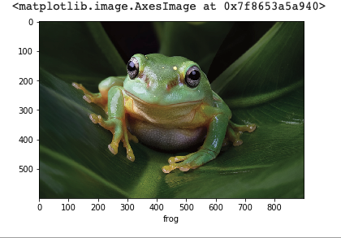

# Basic Skills

In this tutorial, we will go over all of the basic functionalities of SuperGradients very briefly.
Go over the following sections to learn how to train, test and predict using SuperGradients.
Check out our extended tutorials on the various features you can find in SuperGradients, and task-specific guides.

<details>
    <summary>1. Train a Model</summary>


0. Imports:

```python
from super_gradients.common.object_names import Models
from super_gradients.training import Trainer, models
from super_gradients.training.metrics.classification_metrics import Accuracy, Top5
from super_gradients.training.dataloaders.dataloaders import cifar10_train, cifar10_val
from super_gradients.training.utils.distributed_training_utils import setup_device
```


1. Call `init_trainer()` to initialize the super_gradients environment. This should be the first thing to be called by any code running super_gradients:

```python
init_trainer()
```

2. Call <a href="device.md">setup_device()</a> according to your available hardware and needs. For example, if you want the training to be performed entirely on the CPU:

```python
setup_device("cpu")
```

In case multiple GPUs are available, it is also possible to specify the number of GPUs to launch multi-gpu DDP training:

```python
setup_device(num_gpus=4)
```

It is also possible to launch the training with whatever available hardware there is (i.e., if there are 4 GPUs available, we will launch a DDP test with four processes) by passing `num_gpus=-1`:
```python
setup_device(num_gpus=-1)

```

3. Instantiate a Trainer object:

```python
trainer = Trainer(experiment_name="my_cifar_experiment", ckpt_root_dir="/path/to/checkpoints_directory/")
```

4. <a href="models.md">Instantiate a model</a>:

```python
model = models.get(Models.RESNET18, num_classes=10)
```

5. Define <a href="Metrics.md">metrics</a> and other <a href="https://github.com/Deci-AI/super-gradients/blob/master/src/super_gradients/recipes/training_hyperparams/default_train_params.yaml">training parameters</a>:

```python
training_params = {
    "max_epochs": 20,
    "initial_lr": 0.1,
    "loss": "cross_entropy",
    "train_metrics_list": [Accuracy(), Top5()],
    "valid_metrics_list": [Accuracy(), Top5()],
    "metric_to_watch": "Accuracy",
    "greater_metric_to_watch_is_better": True,
}
```

6. Instantiate <a href="https://pytorch.org/tutorials/beginner/basics/data_tutorial.html#preparing-your-data-for-training-with-dataloaders">PyTorch data loaders</a> for training and validation:

```python
train_loader = cifar10_train()
valid_loader = cifar10_val()
```

7. Launch training:

```python
trainer.train(model=model, training_params=training_params, train_loader=train_loader, valid_loader=valid_loader)
```

</details>

<details>
    <summary>2. Test a Model</summary>

0. Imports:

```python
from super_gradients.common.object_names import Models
from super_gradients.training import Trainer, models
from super_gradients.training.metrics.classification_metrics import Accuracy, Top5
from super_gradients.training.dataloaders.dataloaders import cifar10_val
from super_gradients.training.utils.distributed_training_utils import setup_device
```

1. Call `init_trainer()` to initialize the super_gradients environment. This should be the first thing to be called by any code running super_gradients:

```python
init_trainer()
```

2. Call <a href="device.md">setup_device()</a> according to your available hardware and needs. For example, if you want the test to be performed entirely on the CPU:

```python
setup_device("cpu")
```

In case multiple GPUs are available, it is also possible to specify the number of GPUs to launch a multi-gpu DDP test:

```python
setup_device(num_gpus=4)
```

It is also possible to launch the test with whatever available hardware there is (i.e., if there are 4 GPUs available, we will launch a DDP test with four processes) by passing `num_gpus=-1`:

```python
setup_device(num_gpus=-1)
```

3. Instantiate a Trainer object:

```python
trainer = Trainer(experiment_name="test_my_cifar_experiment", ckpt_root_dir="/path/to/checkpoints_directory/")
```

4. <a href="models.md">Instantiate a model</a> and load weights to it. Learn more about the different options for loading model weights from our <a href="Checkpoints.md">checkpoints tutorial</a>:

```python
model = models.get(Models.RESNET18, num_classes=10, checkpoint_path="/path/to/checkpoints_directory/my_cifar_experiment/ckpt_best.pth")
```

5. Define <a href="Metrics.md">metrics</a> for test:

```python
test_metrics = [Accuracy(), Top5()]
```

6. Instantiate a <a href="https://pytorch.org/tutorials/beginner/basics/data_tutorial.html#preparing-your-data-for-training-with-dataloaders">PyTorch data loader</a> for testing:

```python
test_data_loader = cifar10_val()
```

7. Launch test:

```python
test_results = trainer.test(model=model, test_loader=test_data_loader, test_metrics_list=test_metrics)
print(f"Test results: Accuracy: {test_results['Accuracy']}, Top5: {test_results['Top5']}")
```

</details>

<details>
    <summary>3. Use Pre-trained Models</summary>

0. Imports:

```python
from super_gradients.common.object_names import Models
from super_gradients.training import models
from super_gradients.training.metrics.classification_metrics import Accuracy, Top5
from super_gradients.training.dataloaders.dataloaders import cifar10_train, cifar10_val
from super_gradients import Trainer, init_trainer
```

1. Call `init_trainer()` to initialize the super_gradients environment. This should be the first thing to be called by any code running super_gradients:

```python
init_trainer()
```

2. Call <a href="device.md">setup_device()</a> according to your available hardware and needs. For example, if you want the finetuning/test to be performed entirely on the CPU:

```python
setup_device("cpu")
```

In case multiple GPUs are available, it is also possible to specify the number of GPUs to launch multi-gpu DDP finetuning/test:

```python
setup_device(num_gpus=4)
```

It is also possible to launch the finetuning/test with whatever available hardware there is (i.e., if there are 4 GPUs available, a DDP finetuning/test with four processes will be launched) by passing `num_gpus=-1`:

```python
setup_device(num_gpus=-1)
```

3. Instantiate a pre-trained model from SG's <a href="http://bit.ly/3EGfKD4">model zoo</a>:

```python
model = models.get(Models.RESNET18, num_classes=10, pretrained_weights="imagenet")
```

Or use your local weights to instantiate a pre-trained model:

```python
model = models.get(Models.RESNET18, num_classes=10, checkpoint_path="/path/to/imagenet_checkpoint.pth", checkpoint_num_classes=1000)
```

Finetune or test your pre-trained model as done in the previous sections.

</details>

<details>
    <summary>4. Predict</summary>

0. Imports:

```python
from PIL import Image
import numpy as np
import requests
from super_gradients.training import models
from super_gradients.common.object_names import Models
import torchvision.transforms as T
import torch
from super_gradients.training.utils.distributed_training_utils import setup_device
```

1. Call `init_trainer()` to initialize the super_gradients environment. This should be the first thing to be called by any code running super_gradients:

```python
init_trainer()
```

2. Call <a href="device.md">setup_device()</a> according to your available hardware and needs:

```python
setup_device("cpu")
```

3. <a href="models.md">Instantiate a model</a>, load weights to it, and put it in `eval` mode:

```python
# Load the best model that we trained
best_model = models.get(Models.RESNET18, num_classes=10, checkpoint_path="/path/to/checkpoints_directory/my_cifar_experiment/ckpt_best.pth")
best_model.eval()
```

4. Create input data and preprocess it:

```python
url = "https://www.aquariumofpacific.org/images/exhibits/Magnificent_Tree_Frog_900.jpg"
image = np.array(Image.open(requests.get(url, stream=True).raw))

transforms = T.Compose([
    T.ToTensor(),
    T.Normalize(mean=(0.4914, 0.4822, 0.4465), std=(0.2023, 0.1994, 0.2010)),
    T.Resize((32, 32))
])
input_tensor = transforms(image).unsqueeze(0).to(next(best_model.parameters()).device)
```

5. Predict and visualize results:

```python
predictions = best_model(input_tensor)

classes = train_dataloader.dataset.classes
plt.xlabel(classes[torch.argmax(predictions)])
plt.imshow(image)
```



</details>

<details>
    <summary>5. Train using SG's Training Recipes</summary>

0. Setup:
 - Clone the SG repo:

    ```shell
    git clone https://github.com/Deci-AI/super-gradients
    ```

 - Move to the root of the cloned project (where you find "requirements.txt" and "setup.py") and install super-gradients:

    ```shell
    pip install -e .
    ```

- Append super-gradients to the python path (Replace "YOUR-LOCAL-PATH" with the path to the downloaded repo) to avoid conflicts with any installed version of SG:

    ```shell
    export PYTHONPATH=$PYTHONPATH:<YOUR-LOCAL-PATH>/super-gradients/
    ```

1. Launch one of SG's <a href="https://github.com/Deci-AI/super-gradients/blob/master/src/super_gradients/recipes/Training_Recipes.md">training recipes</a>. For example, Resnet18 on Cifar10:

```shell
python -m super_gradients.train_from_recipe --config-name=cifar10_resnet experiment_name=my_resnet18_cifar10_experiment
```

Learn more in detail on how to launch, customize, and evaluate training recipes from our <a href="configuration_files.md">training with configuration files tutorial</a>.
</details>
