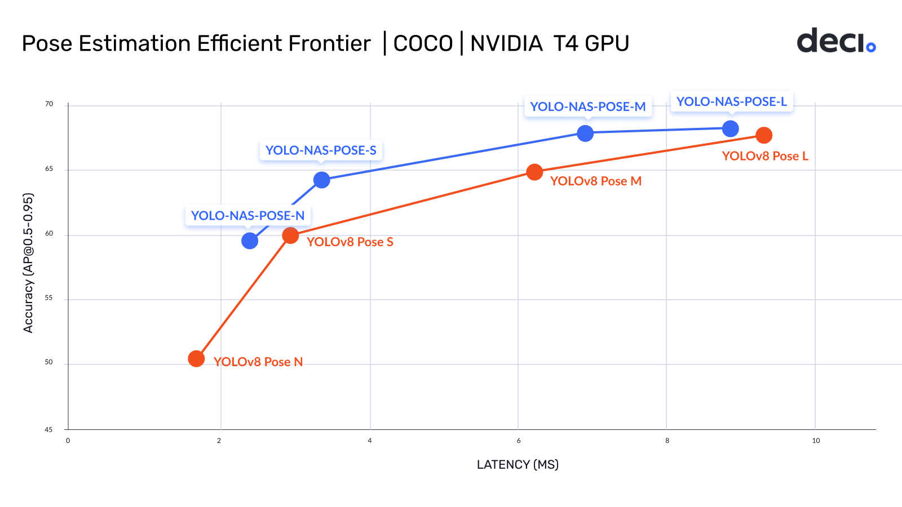
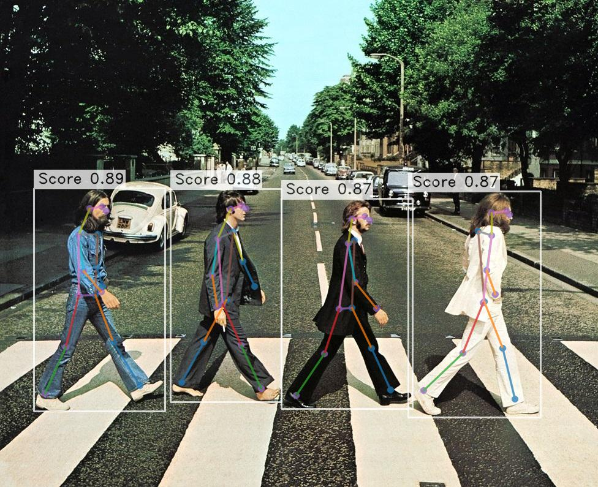

# YOLO-NAS-POSE Quickstart
<div>

</div>

Deci’s leveraged its proprietary Neural Architecture Search engine (AutoNAC) to generate YOLO-NAS-POSE - a new object 
detection architecture that delivers the world’s best accuracy-latency performance. 

The YOLO-NAS-POSE model incorporates quantization-aware RepVGG blocks to ensure compatibility with post-training 
quantization,  making it very flexible and usable for different hardware configurations.

In this tutorial, we will go over the basic functionality of the YOLO-NAS-POSE model. 


## Instantiate a YOLO-NAS-POSE Model

```python
from super_gradients.training import models
from super_gradients.common.object_names import Models

yolo_nas_pose = models.get(Models.YOLO_NAS_POSE_L, pretrained_weights="coco_pose")
```

## Predict

```python
prediction = yolo_nas_pose.predict("https://deci-pretrained-models.s3.amazonaws.com/sample_images/beatles-abbeyroad.jpg")
prediction.show()
```
<div>

</div>

## Export to ONNX & TensorRT

```python
yolo_nas_pose.export("yolo_nas_pose.onnx")
```

Please follow our [Pose Estimation Models Export](models_export_pose.md) tutorial for more details.

## Evaluation using pycocotools

We provide example notebook to evaluate YOLO-NAS POSE using COCO protocol.
Please check [Pose Estimation Models Export](https://github.com/Deci-AI/super-gradients/blob/master/notebooks/yolo_nas_pose_eval_with_pycocotools.ipynb) tutorial for more details.
