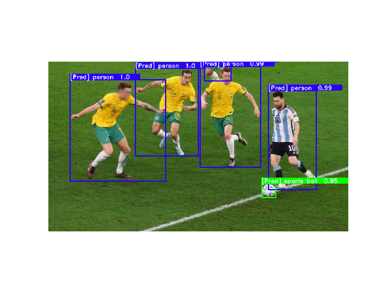

# YOLO-NAS Quickstart
<div>

</div>
Deci’s leveraged its proprietary Neural Architecture Search engine (AutoNAC) to generate YOLO-NAS - a new object detection architecture that delivers the world’s best accuracy-latency performance. 

The YOLO-SG model incorporates quantization-aware RepVGG blocks to ensure compatibility with post-training quantization, making it very flexible and usable for different hardware configurations.

In this tutorial, we will go over the basic functionality of the YOLO-NAS model. 


## Instantiate a YOLO-NAS Model

```python
from super_gradients.training import models
from super_gradients.common.object_names import Models

net = models.get(Models.YOLO_NAS_S, pretrained_weights="coco")
```

## Predict
```python
prediction = net.predict("https://www.aljazeera.com/wp-content/uploads/2022/12/2022-12-03T205130Z_851430040_UP1EIC31LXSAZ_RTRMADP_3_SOCCER-WORLDCUP-ARG-AUS-REPORT.jpg?w=770&resize=770%2C436&quality=80")
prediction.show()
```
<div>

</div>

## Export to ONNX
```python
models.convert_to_onnx(model=net, input_shape=(3,640,640), out_path="yolo_nas_s.onnx")
```


## Train on RF100


Follow the setup instructions for RF100:
```
        - Follow the official instructions to download Roboflow100: https://github.com/roboflow/roboflow-100-benchmark?ref=roboflow-blog
            //!\\ To use this dataset, you must download the "coco" format, NOT the yolov5.

        - Your dataset should look like this:
            rf100
            ├── 4-fold-defect
            │      ├─ train
            │      │    ├─ 000000000001.jpg
            │      │    ├─ ...
            │      │    └─ _annotations.coco.json
            │      ├─ valid
            │      │    └─ ...
            │      └─ test
            │           └─ ...
            ├── abdomen-mri
            │      └─ ...
            └── ...

        - Install CoCo API: https://github.com/pdollar/coco/tree/master/PythonAPI
```
We will use the ```roboflow_yolo_nas_s```configuration to train the small variant of our YOLO-NAS, YOLO-NAS-S.

To launch training on one of the RF100 datasets, we pass it through the dataset_name argument:
```
python -m super_gradients.train_from_recipe --config-name=roboflow_yolo_nas_s  dataset_name=<DATASET_NAME> dataset_params.data_dir=<PATH_TO_RF100_ROOT> ckpt_root_dir=<YOUR_CHECKPOINTS_ROOT_DIRECTORY>
```

Replace <DATASET_NAME> with any of the [RF100 datasets](https://github.com/roboflow/roboflow-100-benchmark/blob/8587f81ef282d529fe5707c0eede74fe91d472d0/metadata/datasets_stats.csv) that you wish to train on.


## Creating a model for a non-RGB image

You can create a model taking arbitrary number of channels by passing the number of channels to the arch_params argument.
Important thing to keep in mind that in this case you cannot use the available pretrained weights and have to provde `num_classes` parameter explicitly.

```python
model = models.get(Models.YOLO_NAS_S, arch_params=dict(in_channels=2), num_classes=15)
```
