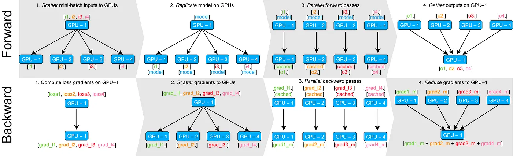
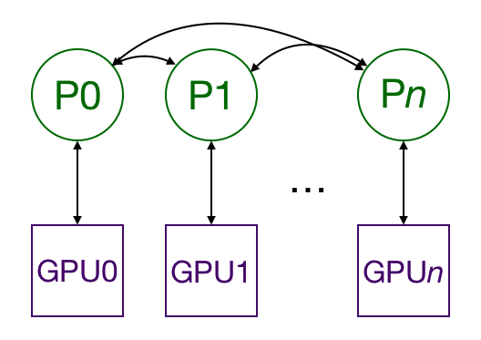

# Training Modes

SuperGradients allows users to train models on different modes:
1. CPU 
2. single GPU - (CUDA)
3. multiple GPUs' - Data Parallel (DP)
4. multiple GPUs' - Distributed Data Parallel (DDP)


## 1. CPU
**Requirement**: None.

**How to use it**: If you don't have any CUDA device available, your training will automatically be run on CPU.
Otherwise, the default device will be CUDA, but you can still easily set it to CPU using `setup_device` as follow:
```py
from super_gradients import Trainer
from super_gradients.training.utils.distributed_training_utils import setup_device

setup_device(device='cpu')

# Unchanged
trainer = Trainer(...)
trainer.train(...)
```


## 2. CUDA
**Requirement**: Having at least one CUDA device available

**How to use it**: If you have at least one CUDA device, nothing! Otherwise, you will have to use CPU...


## 3. DP - Data Parallel
DataParallel (DP) is a single-process, multi-thread technic for scaling deep learning model training across multiple GPUs on a single machine.

The general flow is as below

- Split the data into smaller chunks (mini-batch) on GPU:0
- Move one chunk of data per GPU
- Copy the model to all available GPUs
- Perform the forward pass on each GPU in parallel
- Gather the outputs on GPU:0
- Compute the loss on GPU:0
- Share the loss to all the GPUs
- Compute the gradients on each GPU
- Gather and sum up gradients on GPU:0
- Update model on GPU:0


[Source: towardsdatascience](https://towardsdatascience.com/how-to-scale-training-on-multiple-gpus-dae1041f49d2)


*For more detailed information, feel free to check out [this blog](https://towardsdatascience.com/how-to-scale-training-on-multiple-gpus-dae1041f49d2) for a more in-depth explanation.*

**Requirement**: Having at least one CUDA devices available

**How to use it**: All you need to do is to call a magic function `setup_device` before instantiating the Trainer.
```py
from super_gradients import Trainer
from super_gradients.training.utils.distributed_training_utils import setup_device

# Launch DP on 4 GPUs'
setup_device(multi_gpu='DP', num_gpus=4)

# Unchanged
trainer = Trainer(...)
trainer.train(...)
```
**Tip**: To optimize runtime we recommend to call `setup_device` as early as possible.


## 4. DDP - Distributed Data Parallel
Distributed Data Parallel (DDP) is a powerful technique for scaling deep learning model training across multiple GPUs. 
It involves the use of multiple processes, each running on a different GPU and having its own instance of the model. 
The processes communicate only to exchange gradients, making it a highly efficient and more scalable solution for training large models than Data Parallel (DP).

Although DDP can be more complex to set up than DP, the SuperGradients library abstracts away the complexity by handling the setup process behind the scenes. 
This makes it easy for users to take advantage of the benefits of DDP without having to worry about technical details. 
We highly recommend using DDP over DP whenever possible.



[Source: towardsdatascience](https://towardsdatascience.com/how-to-scale-training-on-multiple-gpus-dae1041f49d2)

*For more detailed information, feel free to check out [this blog](https://towardsdatascience.com/how-to-scale-training-on-multiple-gpus-dae1041f49d2) for a more in-depth explanation.*

**Requirement**: Having multiple CUDA devices available

**How to use it**: All you need to do is to call a magic function `setup_device` before instantiating the Trainer.
```py
from super_gradients import Trainer
from super_gradients.training.utils.distributed_training_utils import setup_device

# Launch DDP on 4 GPUs'
setup_device(num_gpus=4) # Equivalent to: setup_device(multi_gpu='DDP', num_gpus=4)

# Unchanged
trainer = Trainer(...)
trainer.train(...)
```
**Tip**: To optimize runtime we recommend to call `setup_device` as early as possible.


### What should you be aware of when using DDP ?

#### A. DDP runs multiple processes
When running DDP, you will work with multiple processes that will go through the whole training loop.
This means that if you run DDP on 4 gpus, any action that you do will be run 4 times.

This impacts especially printing, logging, and file writing. To face this issue, SuperGradients provides a decorator 
that will ensure that only one process will execute a specific function, whether you work with CPU, GPU, DP, or DDP.

In the following example, the `print_hello` function will print *Hello world* only once, when it would be printed 4 times without the decorator... 
```py
from super_gradients.training.utils.distributed_training_utils import setup_device
from super_gradients.common.environment.ddp_utils import multi_process_safe

setup_device(num_gpus=4)

@multi_process_safe # Try with and without this decorator
def print_hello():
    print('Hello world')

print_hello()
```


#### B. DDP requires specific Metric implementation!
As explained, multiple processes are used to train a model with DDP, each on its own GPU. 
This means that the metrics must be computed and aggregated across all the processes, and it requires the metric to be implemented using states.

States are attributes to be reduced. They are defined using the built-in method `add_state()` and enable broadcasting 
of the states among the different ranks when calling the `compute()` method.

An example of a state would be the number of correct predictions, which will be summed across the different processes, and broadcasted to all of
them before computing the metric value. You can see an example below. 

*Feel free to check [torchmetrics documentation](https://torchmetrics.readthedocs.io/en/stable/references/metric.html) for more information on how to implement your own metric.* 

**Example**
In the following example, we start with a custom metric implemented to run on a single device:
```py
import torch
from torchmetrics import Metric


class Top5Accuracy(Metric):
    def __init__(self):
        super().__init__()
        self.correct = torch.tensor(0.)
        self.total = torch.tensor(0.)

    def update(self, preds: torch.Tensor, target: torch.Tensor):
        batch_size = target.size(0)

        # Get the top k predictions
        _, pred = preds.topk(5, 1, True, True)
        pred = pred.t()

        # Count the number of correct predictions only for the highest 5
        correct = pred.eq(target.view(1, -1).expand_as(pred))
        correct5 = correct[:5].reshape(-1).float().sum(0)

        self.correct += correct5.cpu()
        self.total += batch_size

    def compute(self):
        return self.correct.float() / self.total
```
All you need to change to use your metric on DDP is to define your attributes `self.correct` and `self.total` with `add_state` and to define 
a reduce function `dist_reduce_fx` that will be used to know how to combine the states when calling compute:
```py
import torch
import torchmetrics

class DDPTop1Accuracy(torchmetrics.Metric):
    def __init__(self, dist_sync_on_step=False):
        super().__init__(dist_sync_on_step=dist_sync_on_step)

        self.add_state("correct", default=torch.tensor(0.), dist_reduce_fx="sum")   # Set correct to be a state
        self.add_state("total", default=torch.tensor(0), dist_reduce_fx="sum")      # Set total to be a state

    def update(self, preds: torch.Tensor, target: torch.Tensor):
        batch_size = target.size(0)

        # Get the top k predictions
        _, pred = preds.topk(5, 1, True, True)
        pred = pred.t()

        # Count the number of correct predictions only for the highest 5
        correct = pred.eq(target.view(1, -1).expand_as(pred))
        correct5 = correct[:5].reshape(-1).float().sum(0)

        self.correct += correct5
        self.total += batch_size

    def compute(self):
        return self.correct.float() / self.total
```
**Step by step explanation**
1. DDP launches, and pytorch creates a separate instance of your custom metric for each process.
2. The `update()` method modifies the internal state of each instance in each process based on the inputs `preds` and `target` specific to that process.
3. After an epoch, each process will have a unique state, for example:
   - Process 1: correct=50, total=100
   - Process 2: correct=30, total=100
   - Process 3: correct=100, total=100
4. Calling `compute()` triggers `torchmetrics.Metric` to gather and combine the states of each process. This reduction step can be customized by setting the `dist_reduce_fx`, which in this case is the `sum`. This usually happens at the end of the epoch.
   - All processes: correct=180, total=300
5. The `compute()` method then calculates the metric value according to your implementation. In this example, every process will return the same result: `0.6` (180 correct predictions out of 300 total predictions).
6. Finally, calling `reset()` will reset the internal state of the metric, making it ready to accumulate new data at the start of the next epoch.

---

## How to set training mode with recipes ?
When using [recipes](configuration_files.md) you simply need to set values of `gpu_mode` and `num_gpus`.

```yaml
# training_recipe.yaml
default:
   - ...

...

# Simply add this to run DDP on 4 nodes.
gpu_mode: DDP
num_gpus: 4
```
