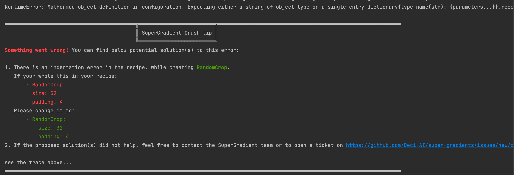

# Local Logging

SuperGradients automatically logs locally multiple files that can help you explore your experiments results. This includes 1 tensorboard and 3 .txt files.


## I. Tensorboard logging
To easily keep track of your experiments, SuperGradients saves your results in `events.out.tfevents` format that can be used by tensorboard.

**What does it include?** This tensorboard includes all of your training and validation metrics but also other information such as learning rate, system metrics (CPU, GPU, ...), and more.

**Where is it saved?** `<ckpt_root_dir>/<experiment_name>/events.out.tfevents.<unique_id>`

**How to launch?**`tensorboard --logdir checkpoint_path/events.out.tfevents.<unique_id>`


## II. Experiment logging
In case you cannot launch a tensorboard instance, you can still find a summary of your experiment saved in a readable .txt format.

**What does it include?** The experiment configuration and training/validation metrics.

**Where is it saved?** `<ckpt_root_dir>/<experiment_name>/experiment_logs_<date>.txt`


## III. Console logging
For better debugging and understanding of past runs, SuperGradients gathers all the print statements and logs into a 
local file, providing you the convenience to review console outputs of any experiment at any time.

**What does it include?** All the prints and logs that were displayed on the console, but not the filtered logs.

**Where is it saved?**
- Upon importing SuperGradients, console outputs and logs will be stored in `~/sg_logs/console.log`.
- When instantiating the super_gradients.Trainer, all console outputs and logs will be redirected to the experiment folder `<ckpt_root_dir>/<experiment_name>/console_<date>.txt`.

**How to set log level?** You can filter the logs displayed on the console by setting the environment variable `CONSOLE_LOG_LEVEL=<LOG-LEVEL> # DEBUG/INFO/WARNING/ERROR`


## IV. Loggers logging
Contrary to the console logging, the logger logging is restricted to the loggers messages (such as `logger.log`, `logger.info`, ...).
This means that it includes any log that was under the logging level (`logging.DEBUG` for instance), but not the prints.

**What does it include?** Anything logged with a logger (`logger.log`, `logger.info`, ...), even the filtered logs.

**Where is it saved?** `<ckpt_root_dir>/<experiment_name>/logs_<date>.txt`

**How to set log level?** You can filter the logs saved in the file by setting the environment variable `FILE_LOG_LEVEL=<LOG-LEVEL> # DEBUG/INFO/WARNING/ERROR`


## (Additional) Hydra config folder
Only when training using hydra recipe.

**What does it include?**
```     
 <ckpt_root_dir>/<experiment_name>
        ├─ ...
        └─ .hydra
             ├─config.yaml       # A single config file that regroups the config files used to run the experiment  
             ├─hydra.yaml        # Some Hydra metadata
             └─overrides.yaml    # Any override passed after --config-name=<config-name>
```


## SUMMARY 
```     
 <ckpt_root_dir>/<experiment_name>
        ├─ ... (all the model checkpoints)
        ├─ events.out.tfevents.<unique_id>  # Tensorboard artifact
        ├─ experiment_logs_<date>.txt       # Config and metrics related to experiment 
        ├─ console_<date>.txt               # Logs and prints that were displayed in the users console
        ├─ logs_<date>.txt                  # Every log
        └─ .hydra                # (Additional) If experiment launched from a recipe:
             ├─config.yaml          # A single config file that regroups the config files used to run the experiment  
             ├─hydra.yaml           # Some Hydra metadata
             └─overrides.yaml       # Any override passed after --config-name=<config-name>
```

## Other


#### Environment Sanity Check
SuperGradients automatically checks compatibility between the installed libraries and the required ones.
It will log an error - but not stop the code - for each library that was installed with a version lower than required.
For libraries with version higher than required, this information will just be logged at a DEBUG level.


#### Crash Tip
It can sometimes be very time consuming to debug an exceptions when the error raised is not explicit.
To avoid this, SuperGradients implemented a Crash Tip system that decorates errors raised from different libraries to help you fix the issue.

**Example**
The error raised by hydra when you made an indentation error is hard to understand (see topmost RuntimeError).
Under the exception, SuperGradients prints a Crash Tip that explains what went wrong, and how to fix it.


The number of crash tips is limited to cases that were faced by the community, so if you face an exception that is hard to understand feel free to share with us!

**How to disable?** The Crash tip can be shut down by setting the environment variable `CRASH_HANDLER=FALSE`.
