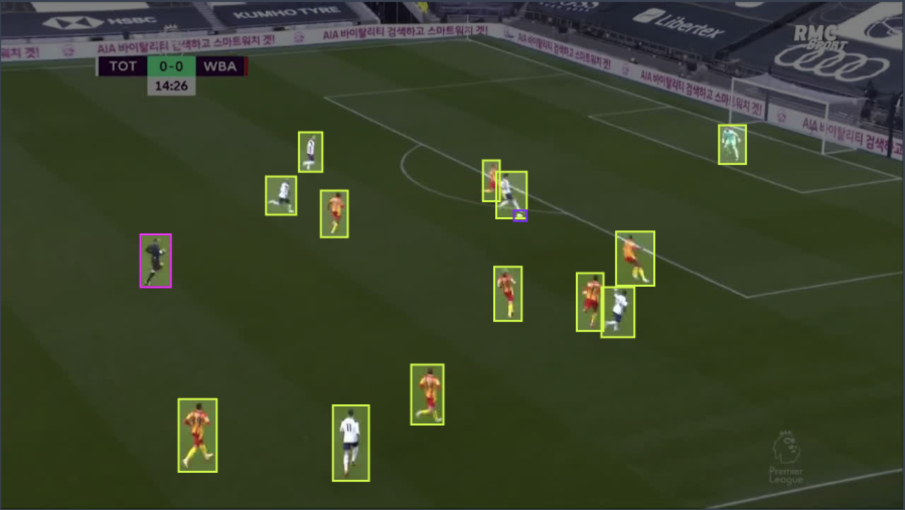

#PTQ and QAT with DeciYolo



In this tutorial we will guide you step by step on how to prepare  our DeciYolo to production!
We will leverage DeciYolos architecture which includes quantization friendly blocks, and train a deci yolo model on Roboflow's [Soccer Player Detection Dataset](https://universe.roboflow.com/roboflow-100/soccer-players-5fuqs)
in a way that would maximize our throughput without comprimising on the model's accuracy.

The steps will be:
1. Training from scratch on one of the downstream datasets- these will play the role of the users dataset (i.e the one which the model will need to be trained for the user's task)
2. Performing post training quantization and quantization aware training

Pre-requisites:
- [Training with configuration files]()
- [PTQ and QAT]()


Now, lets get to it.

## Step 0: Installations and Dataset Setup

Follow setup instructions for RF100:
```
        - Follow the official instructions to download Roboflow100: https://github.com/roboflow/roboflow-100-benchmark?ref=roboflow-blog
            //!\\ To use this dataset, you have to download the "coco" format, NOT the yolov5.

        - Your dataset should loook like this:
            rf100
            ├── 4-fold-defect
            │      ├─ train
            │      │    ├─ 000000000001.jpg
            │      │    ├─ ...
            │      │    └─ _annotations.coco.json
            │      ├─ valid
            │      │    └─ ...
            │      └─ test
            │           └─ ...
            ├── abdomen-mri
            │      └─ ...
            └── ...

        - Install CoCo API: https://github.com/pdollar/coco/tree/master/PythonAPI
```

Install the latest version of SG:
```commandline
pip install super-gradients
```

Install torch + pytorch-quantization (note that later versions should be compatible as well and that you should essentially just follow torch installation according to https://pytorch.org/get-started/locally/)
```commandline
pip install torch==1.11.0+cu113 torchvision==0.12.0+cu113 torchaudio==0.11.0 --extra-index-url https://download.pytorch.org/whl/cu113 &> /dev/null
pip install pytorch-quantization==2.1.2 --extra-index-url https://pypi.ngc.nvidia.com &> /dev/null
```

## Launch Training (non QA)

Although this might come as a surprise - the name quantization aware training is a bit misleading, and is performed on a trained checkpoint rather then from-scratch.
So in practice, we need to fully train our model on our dataset, then after we perfrom calibration we fine tune our model once again, which will be our final step.
As we fiscuss in our [Training with configuration files](), we clone the SG repo, then use the repo's configuration files in our training examples.
We will use the ```src/super_gradients/recipes/roboflow_deciyolo_s.yaml``` configurataion in order to train the small variant of our DeciModel, DeciModel S.

So we navigate to our ```train_from_recipe``` script:

```commandline
cd <YOUR-LOCAL-PATH>/super_gradients/src/super_gradients/examples/train_from_recipe_example
```

Then in order to avoid collisions between our cloned and installed SG:
```commandline
export PYTHONPATH=$PYTHONPATH:<YOUR-LOCAL-PATH>/super_gradients/
```

In order to launch training on one of RF100 datasets, we simply pass it through the dataset_name argument:
```
python -m train_from_recipe --config-name=roboflow_deciyolo_s  dataset_name=soccer-players-5fuqs dataset_params.data_dir=<PATH_TO_RF100_ROOT> ckpt_root_dir=<YOUR_CHECKPOINTS_ROOT_DIRECTORY> experiment_name=deciyolo_s_soccer_players

...

Train epoch 99: 100%|██████████| 32/32 [00:23<00:00,  1.35it/s, PPYoloELoss/loss=0.853, PPYoloELoss/loss_cls=0.417, PPYoloELoss/loss_dfl=0.56, PPYoloELoss/loss_iou=0.0621, gpu_mem=11.7]
Validation epoch 99: 100%|██████████| 3/3 [00:00<00:00,  5.49it/s]
===========================================================
SUMMARY OF EPOCH 99
├── Training
│   ├── Ppyoloeloss/loss = 0.8527
│   │   ├── Best until now = 0.8515 (↗ 0.0012)
│   │   └── Epoch N-1      = 0.8515 (↗ 0.0012)
│   ├── Ppyoloeloss/loss_cls = 0.4174
│   │   ├── Best until now = 0.4178 (↘ -0.0004)
│   │   └── Epoch N-1      = 0.4178 (↘ -0.0004)
│   ├── Ppyoloeloss/loss_dfl = 0.5602
│   │   ├── Best until now = 0.5573 (↗ 0.0029)
│   │   └── Epoch N-1      = 0.5573 (↗ 0.0029)
│   └── Ppyoloeloss/loss_iou = 0.0621
│       ├── Best until now = 0.062  (↗ 0.0)
│       └── Epoch N-1      = 0.062  (↗ 0.0)
└── Validation
    ├── F1@0.50 = 0.779
    │   ├── Best until now = 0.8185 (↘ -0.0395)
    │   └── Epoch N-1      = 0.796  (↘ -0.017)
    ├── Map@0.50 = 0.9601
    │   ├── Best until now = 0.967  (↘ -0.0069)
    │   └── Epoch N-1      = 0.957  (↗ 0.0031)
    ├── Ppyoloeloss/loss = 1.4472
    │   ├── Best until now = 1.3971 (↗ 0.0501)
    │   └── Epoch N-1      = 1.4421 (↗ 0.0051)
    ├── Ppyoloeloss/loss_cls = 0.5981
    │   ├── Best until now = 0.527  (↗ 0.0711)
    │   └── Epoch N-1      = 0.5986 (↘ -0.0005)
    ├── Ppyoloeloss/loss_dfl = 0.8216
    │   ├── Best until now = 0.7849 (↗ 0.0367)
    │   └── Epoch N-1      = 0.8202 (↗ 0.0014)
    ├── Ppyoloeloss/loss_iou = 0.1753
    │   ├── Best until now = 0.1684 (↗ 0.007)
    │   └── Epoch N-1      = 0.1734 (↗ 0.002)
    ├── Precision@0.50 = 0.6758
    │   ├── Best until now = 0.7254 (↘ -0.0495)
    │   └── Epoch N-1      = 0.6931 (↘ -0.0172)
    └── Recall@0.50 = 0.9567
        ├── Best until now = 0.9872 (↘ -0.0304)
        └── Epoch N-1      = 0.9567 (= 0.0)

===========================================================
[2023-03-30 14:09:47] INFO - sg_trainer.py - RUNNING ADDITIONAL TEST ON THE AVERAGED MODEL...
Validation epoch 100: 100%|██████████| 3/3 [00:00<00:00,  5.45it/s]
===========================================================
SUMMARY OF EPOCH 100
├── Training
│   ├── Ppyoloeloss/loss = 0.8527
│   │   ├── Best until now = 0.8515 (↗ 0.0012)
│   │   └── Epoch N-1      = 0.8515 (↗ 0.0012)
│   ├── Ppyoloeloss/loss_cls = 0.4174
│   │   ├── Best until now = 0.4178 (↘ -0.0004)
│   │   └── Epoch N-1      = 0.4178 (↘ -0.0004)
│   ├── Ppyoloeloss/loss_dfl = 0.5602
│   │   ├── Best until now = 0.5573 (↗ 0.0029)
│   │   └── Epoch N-1      = 0.5573 (↗ 0.0029)
│   └── Ppyoloeloss/loss_iou = 0.0621
│       ├── Best until now = 0.062  (↗ 0.0)
│       └── Epoch N-1      = 0.062  (↗ 0.0)
└── Validation
    ├── F1@0.50 = 0.7824
    │   ├── Best until now = 0.8185 (↘ -0.0361)
    │   └── Epoch N-1      = 0.779  (↗ 0.0034)
    ├── Map@0.50 = 0.9635
    │   ├── Best until now = 0.967  (↘ -0.0036)
    │   └── Epoch N-1      = 0.9601 (↗ 0.0033)
    ├── Ppyoloeloss/loss = 1.432
    │   ├── Best until now = 1.3971 (↗ 0.0349)
    │   └── Epoch N-1      = 1.4472 (↘ -0.0152)
    ├── Ppyoloeloss/loss_cls = 0.588
    │   ├── Best until now = 0.527  (↗ 0.061)
    │   └── Epoch N-1      = 0.5981 (↘ -0.0101)
    ├── Ppyoloeloss/loss_dfl = 0.8191
    │   ├── Best until now = 0.7849 (↗ 0.0343)
    │   └── Epoch N-1      = 0.8216 (↘ -0.0025)
    ├── Ppyoloeloss/loss_iou = 0.1738
    │   ├── Best until now = 0.1684 (↗ 0.0054)
    │   └── Epoch N-1      = 0.1753 (↘ -0.0015)
    ├── Precision@0.50 = 0.6769
    │   ├── Best until now = 0.7254 (↘ -0.0485)
    │   └── Epoch N-1      = 0.6758 (↗ 0.0011)
    └── Recall@0.50 = 0.9567
        ├── Best until now = 0.9872 (↘ -0.0304)
        └── Epoch N-1      = 0.9567 (= 0.0)
```

And so our best checkpoint, that resides in <YOUR_CHECKPOINTS_ROOT_DIRECTORY>/deciyolo_s_soccer_players/ckpt_best.pth reaches 0.967 mAP !

Lets visualize some results:
```python
#TODO: ADD PREDICT ONCE PREPROCESSING IS READY
```

## QAT and PTQ

Now, we will take our checkpoint from our previous section and 
