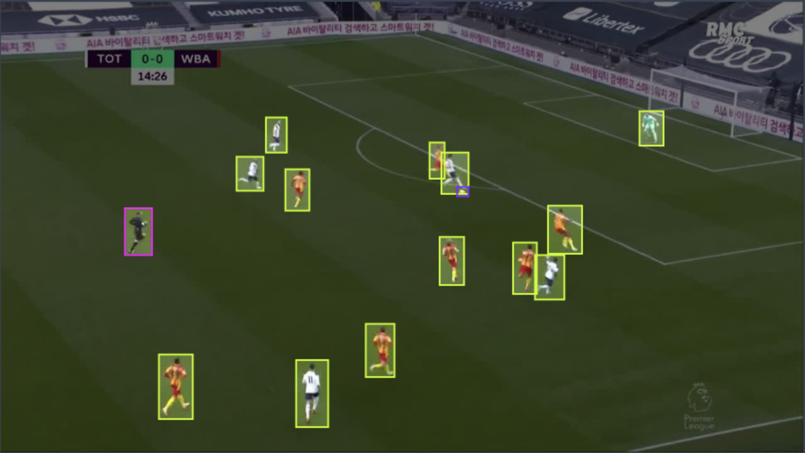

# PTQ and QAT with YOLO-NAS
<div>

</div>

In this tutorial, we will guide you step by step on how to prepare our YOLO-NAS for production!
We will leverage YOLO-NAS architecture which includes quantization-friendly blocks, and train a YOLO-NAS model on Roboflow's [Soccer Player Detection Dataset](https://universe.roboflow.com/roboflow-100/soccer-players-5fuqs)
in a way that would maximize our throughput without compromising on the model's accuracy.

The steps will be:
1. Training from scratch on one of the downstream datasets - these will play the role of the user's dataset (i.e., the one in which the model will need to be trained for the user's task)
2. Performing post-training quantization and quantization-aware training

Pre-requisites:
- [Training with configuration files](https://github.com/Deci-AI/super-gradients/blob/master/documentation/source/configuration_files.md)
- [PTQ and QAT](https://github.com/Deci-AI/super-gradients/blob/master/documentation/source/ptq_qat.md)


Now, let's get to it.

## Step 0: Installations and Dataset Setup

Follow the setup instructions for RF100:
```
        - Follow the official instructions to download Roboflow100: https://github.com/roboflow/roboflow-100-benchmark?ref=roboflow-blog
            //!\\ To use this dataset, you must download the "coco" format, NOT the yolov5.

        - Your dataset should look like this:
            rf100
            ├── 4-fold-defect
            │      ├─ train
            │      │    ├─ 000000000001.jpg
            │      │    ├─ ...
            │      │    └─ _annotations.coco.json
            │      ├─ valid
            │      │    └─ ...
            │      └─ test
            │           └─ ...
            ├── abdomen-mri
            │      └─ ...
            └── ...

        - Install CoCo API: https://github.com/pdollar/coco/tree/master/PythonAPI
```

Install the latest version of SG:
```commandline
pip install super-gradients
```

Install torch + PyTorch-quantization (note that later versions should be compatible as well and that you should essentially follow torch installation according to https://pytorch.org/get-started/locally/)
```commandline
pip install torch==1.11.0+cu113 torchvision==0.12.0+cu113 torchaudio==0.11.0 --extra-index-url https://download.pytorch.org/whl/cu113 &> /dev/null
pip install pytorch-quantization==2.1.2 --extra-index-url https://pypi.ngc.nvidia.com &> /dev/null
```

## Launch Training (non-QA)

Although this might come as a surprise - the name quantization-aware training needs to be more accurate and be performed on a trained checkpoint rather than from scratch.
So in practice, we need to train our model on our dataset fully, then after we perform calibration, we fine-tune our model once again, which will be our final step.
As we discuss in our [Training with configuration files](), we clone the SG repo, then use the repo's configuration files in our training examples.
We will use the ```src/super_gradients/recipes/roboflow_yolo_nas_s.yaml```configuration to train the small variant of our DeciModel, DeciModel S.

So we navigate to our ```train_from_recipe``` script:

```commandline
cd <YOUR-LOCAL-PATH>/super_gradients/src/super_gradients/examples/train_from_recipe_example
```

Then to avoid collisions between our cloned and installed SG:
```commandline
export PYTHONPATH=$PYTHONPATH:<YOUR-LOCAL-PATH>/super_gradients/
```

To launch training on one of the RF100 datasets, we pass it through the dataset_name argument:
```
python -m train_from_recipe --config-name=roboflow_yolo_nas_s  dataset_name=soccer-players-5fuqs dataset_params.data_dir=<PATH_TO_RF100_ROOT> ckpt_root_dir=<YOUR_CHECKPOINTS_ROOT_DIRECTORY> experiment_name=yolo_nas_s_soccer_players

...

Train epoch 99: 100%|██████████| 32/32 [00:23<00:00,  1.35it/s, PPYoloELoss/loss=0.853, PPYoloELoss/loss_cls=0.417, PPYoloELoss/loss_dfl=0.56, PPYoloELoss/loss_iou=0.0621, gpu_mem=11.7]
Validation epoch 99: 100%|██████████| 3/3 [00:00<00:00,  5.49it/s]
===========================================================
SUMMARY OF EPOCH 99
├── Training
│   ├── Ppyoloeloss/loss = 0.8527
│   │   ├── Best until now = 0.8515 (↗ 0.0012)
│   │   └── Epoch N-1      = 0.8515 (↗ 0.0012)
│   ├── Ppyoloeloss/loss_cls = 0.4174
│   │   ├── Best until now = 0.4178 (↘ -0.0004)
│   │   └── Epoch N-1      = 0.4178 (↘ -0.0004)
│   ├── Ppyoloeloss/loss_dfl = 0.5602
│   │   ├── Best until now = 0.5573 (↗ 0.0029)
│   │   └── Epoch N-1      = 0.5573 (↗ 0.0029)
│   └── Ppyoloeloss/loss_iou = 0.0621
│       ├── Best until now = 0.062  (↗ 0.0)
│       └── Epoch N-1      = 0.062  (↗ 0.0)
└── Validation
    ├── F1@0.50 = 0.779
    │   ├── Best until now = 0.8185 (↘ -0.0395)
    │   └── Epoch N-1      = 0.796  (↘ -0.017)
    ├── Map@0.50 = 0.9601
    │   ├── Best until now = 0.967  (↘ -0.0069)
    │   └── Epoch N-1      = 0.957  (↗ 0.0031)
    ├── Ppyoloeloss/loss = 1.4472
    │   ├── Best until now = 1.3971 (↗ 0.0501)
    │   └── Epoch N-1      = 1.4421 (↗ 0.0051)
    ├── Ppyoloeloss/loss_cls = 0.5981
    │   ├── Best until now = 0.527  (↗ 0.0711)
    │   └── Epoch N-1      = 0.5986 (↘ -0.0005)
    ├── Ppyoloeloss/loss_dfl = 0.8216
    │   ├── Best until now = 0.7849 (↗ 0.0367)
    │   └── Epoch N-1      = 0.8202 (↗ 0.0014)
    ├── Ppyoloeloss/loss_iou = 0.1753
    │   ├── Best until now = 0.1684 (↗ 0.007)
    │   └── Epoch N-1      = 0.1734 (↗ 0.002)
    ├── Precision@0.50 = 0.6758
    │   ├── Best until now = 0.7254 (↘ -0.0495)
    │   └── Epoch N-1      = 0.6931 (↘ -0.0172)
    └── Recall@0.50 = 0.9567
        ├── Best until now = 0.9872 (↘ -0.0304)
        └── Epoch N-1      = 0.9567 (= 0.0)

===========================================================
[2023-03-30 14:09:47] INFO - sg_trainer.py - RUNNING ADDITIONAL TEST ON THE AVERAGED MODEL...
Validation epoch 100: 100%|██████████| 3/3 [00:00<00:00,  5.45it/s]
===========================================================
SUMMARY OF EPOCH 100
├── Training
│   ├── Ppyoloeloss/loss = 0.8527
│   │   ├── Best until now = 0.8515 (↗ 0.0012)
│   │   └── Epoch N-1      = 0.8515 (↗ 0.0012)
│   ├── Ppyoloeloss/loss_cls = 0.4174
│   │   ├── Best until now = 0.4178 (↘ -0.0004)
│   │   └── Epoch N-1      = 0.4178 (↘ -0.0004)
│   ├── Ppyoloeloss/loss_dfl = 0.5602
│   │   ├── Best until now = 0.5573 (↗ 0.0029)
│   │   └── Epoch N-1      = 0.5573 (↗ 0.0029)
│   └── Ppyoloeloss/loss_iou = 0.0621
│       ├── Best until now = 0.062  (↗ 0.0)
│       └── Epoch N-1      = 0.062  (↗ 0.0)
└── Validation
    ├── F1@0.50 = 0.7824
    │   ├── Best until now = 0.8185 (↘ -0.0361)
    │   └── Epoch N-1      = 0.779  (↗ 0.0034)
    ├── Map@0.50 = 0.9635
    │   ├── Best until now = 0.967  (↘ -0.0036)
    │   └── Epoch N-1      = 0.9601 (↗ 0.0033)
    ├── Ppyoloeloss/loss = 1.432
    │   ├── Best until now = 1.3971 (↗ 0.0349)
    │   └── Epoch N-1      = 1.4472 (↘ -0.0152)
    ├── Ppyoloeloss/loss_cls = 0.588
    │   ├── Best until now = 0.527  (↗ 0.061)
    │   └── Epoch N-1      = 0.5981 (↘ -0.0101)
    ├── Ppyoloeloss/loss_dfl = 0.8191
    │   ├── Best until now = 0.7849 (↗ 0.0343)
    │   └── Epoch N-1      = 0.8216 (↘ -0.0025)
    ├── Ppyoloeloss/loss_iou = 0.1738
    │   ├── Best until now = 0.1684 (↗ 0.0054)
    │   └── Epoch N-1      = 0.1753 (↘ -0.0015)
    ├── Precision@0.50 = 0.6769
    │   ├── Best until now = 0.7254 (↘ -0.0485)
    │   └── Epoch N-1      = 0.6758 (↗ 0.0011)
    └── Recall@0.50 = 0.9567
        ├── Best until now = 0.9872 (↘ -0.0304)
        └── Epoch N-1      = 0.9567 (= 0.0)
```

And so our best checkpoint resides in <YOUR_CHECKPOINTS_ROOT_DIRECTORY>/yolo_nas_s_soccer_players/ckpt_best.pth reaches 0.967 mAP!

Let's visualize some results:
```python
from super_gradients.common.object_names import Models
from super_gradients.training import models

model = models.get(Models.YOLO_NAS_S,
                   checkpoint_path=<YOUR_CHECKPOINTS_ROOT_DIRECTORY>/yolo_nas_s_soccer_players/ckpt_best.pth>,
                   num_classes=4)
predictions = model.predict("messi_penalty.mp4")
predictions.show(show_confidence=False)
```


## QAT and PTQ

Now, we will take our checkpoint from our previous section and perform post-training quantization, then quantization-aware training.
To do so, we will need to launch training with our `qat_from_recipe` example script, which simplifies taking any existing training recipe and making it a quantization-aware one with the help of some of our recommended practices.
So this time, we navigate to the `qat_from_recipe` example directory:
```commandline
cd <YOUR-LOCAL-PATH>/super_gradients/src/super_gradients/examples/qat_from_recipe_example
```

Before we launch, let's see how we can easily create a configuration from our `roboflow_yolo_nas_s` config to get the most out of QAT and PTQ.
We added a new config that inherits from our previous one, called `roboflow_yolo_nas_s_qat.yaml`. Let's peek at it:
```yaml

defaults:
  - roboflow_yolo_nas_s
  - quantization_params: default_quantization_params
  - _self_

checkpoint_params:
  checkpoint_path: ???
  strict_load: no_key_matching

experiment_name: soccer_players_qat_yolo_nas_s

pre_launch_callbacks_list:
    - QATRecipeModificationCallback:
        batch_size_divisor: 2
        max_epochs_divisor: 10
        lr_decay_factor: 0.01
        warmup_epochs_divisor: 10
        cosine_final_lr_ratio: 0.01
        disable_phase_callbacks: True
        disable_augmentations: False
```

Let's break it down:
- We inherit from our original non-QA recipe

- We set `quantization_params` to the default ones. Reminder - this is where QAT and PTQ hyper-parameters are defined. 

- We set our checkpoint_params.checkpoint_path to ??? so that passing a checkpoint is required. We will override this value when launching from the command line.

- We add a `QATRecipeModificationCallback` to our `pre_launch_callbacks_list`: This callback accepts the entire `cfg: DictConfig` and manipulates it right before we start the training. This allows us to adapt any non-QA recipe to a QA one quickly.
  Here we will:
  - Use half the batch size of the original recipe.
  - Use 10 percent of the number of the epochs (and warmup epochs).
  - Use 1 percent of the original learning rate.
  - Set the final learning rate ratio of the cosine scheduling to 0.01
  - Disable augmentations and the phase_callbacks.
    
Now we can launch PTQ and QAT from the command line:
```commandline
python -m qat_from_recipe --config-name=roboflow_yolo_nas_s_qat experiment_name=soccer_players_qat_yolo_nas_s dataset_name=soccer-players-5fuqs dataset_params.data_dir=<PATH_TO_RF100_ROOT> checkpoint_params.checkpoint_path=<YOUR_CHECKPOINTS_ROOT_DIRECTORY>/yolo_nas_s_soccer_players/ckpt_best.pth ckpt_ckpt_root_dir=<YOUR_CHECKPOINTS_ROOT_DIRECTORY>
...

[2023-04-02 11:37:56,848][super_gradients.training.pre_launch_callbacks.pre_launch_callbacks][INFO] - Modifying recipe to suit QAT rules of thumb. Remove QATRecipeModificationCallback to disable.
[2023-04-02 11:37:56,858][super_gradients.training.pre_launch_callbacks.pre_launch_callbacks][WARNING] - New number of epochs: 10
[2023-04-02 11:37:56,858][super_gradients.training.pre_launch_callbacks.pre_launch_callbacks][WARNING] - New learning rate: 5e-06
[2023-04-02 11:37:56,858][super_gradients.training.pre_launch_callbacks.pre_launch_callbacks][WARNING] - New weight decay: 1.0000000000000002e-06
[2023-04-02 11:37:56,858][super_gradients.training.pre_launch_callbacks.pre_launch_callbacks][WARNING] - EMA will be disabled for QAT run.
[2023-04-02 11:37:56,859][super_gradients.training.pre_launch_callbacks.pre_launch_callbacks][WARNING] - SyncBatchNorm will be disabled for QAT run.
[2023-04-02 11:37:56,859][super_gradients.training.pre_launch_callbacks.pre_launch_callbacks][WARNING] - Recipe requests multi_gpu=False and num_gpus=1. Changing to multi_gpu=OFF and num_gpus=1
100%|███████████████████████████████████████████████████████████████████████████████████████████████████████████████████████████████████████████████████████████████████████| 32/32 [00:32<00:00,  1.01s/it]
[2023-04-02 11:38:34,316][super_gradients.training.qat_trainer.qat_trainer][INFO] - Validating PTQ model...

  0%|          | 0/3 [00:00<?, ?it/s]
Test:   0%|          | 0/3 [00:00<?, ?it/s]
Test:  33%|███▎      | 1/3 [00:00<00:00,  2.87it/s]
Test:  67%|██████▋   | 2/3 [00:00<00:00,  2.90it/s]
Test: 100%|██████████| 3/3 [00:00<00:00,  3.86it/s]
[2023-04-02 11:38:35,106][super_gradients.training.qat_trainer.qat_trainer][INFO] - PTQ Model Validation Results
   - Precision@0.50: 0.6727069020271301
   - Recall@0.50: 0.95766681432724
   - mAP@0.50  : 0.9465919137001038
   - F1@0.50   : 0.7861716747283936
```

Observe that for PTQ, our model's mAP decreased from 0.967 to 0.9466. After PTQ, QAT is performed automatically:

```commandline

[2023-04-02 11:38:47] INFO - sg_trainer.py - Started training for 10 epochs (0/9)

Train epoch 0: 100%|██████████| 32/32 [00:26<00:00,  1.21it/s, PPYoloELoss/loss=0.909, PPYoloELoss/loss_cls=0.444, PPYoloELoss/loss_dfl=0.57, PPYoloELoss/loss_iou=0.0721, gpu_mem=10.1]
Validation epoch 0: 100%|██████████| 3/3 [00:00<00:00,  3.75it/s]
===========================================================
SUMMARY OF EPOCH 0
├── Training
│   ├── Ppyoloeloss/loss = 0.9088
│   ├── Ppyoloeloss/loss_cls = 0.4436
│   ├── Ppyoloeloss/loss_dfl = 0.5696
│   └── Ppyoloeloss/loss_iou = 0.0721
└── Validation
    ├── F1@0.50 = 0.7885
    ├── Map@0.50 = 0.9556
    ├── Ppyoloeloss/loss = 1.4303
    ├── Ppyoloeloss/loss_cls = 0.5847
    ├── Ppyoloeloss/loss_dfl = 0.8186
    ├── Ppyoloeloss/loss_iou = 0.1745
    ├── Precision@0.50 = 0.671
    └── Recall@0.50 = 0.9734

===========================================================
[2023-04-02 11:39:14] INFO - sg_trainer.py - Best checkpoint overriden: validation mAP@0.50: 0.9556358456611633
Train epoch 1: 100%|██████████| 32/32 [00:26<00:00,  1.22it/s, PPYoloELoss/loss=0.91, PPYoloELoss/loss_cls=0.445, PPYoloELoss/loss_dfl=0.574, PPYoloELoss/loss_iou=0.0712, gpu_mem=10.1]
Validation epoch 1: 100%|██████████| 3/3 [00:00<00:00,  3.88it/s]
===========================================================
SUMMARY OF EPOCH 1
├── Training
│   ├── Ppyoloeloss/loss = 0.9097
│   │   ├── Best until now = 0.9088 (↗ 0.001)
│   │   └── Epoch N-1      = 0.9088 (↗ 0.001)
│   ├── Ppyoloeloss/loss_cls = 0.4448
│   │   ├── Best until now = 0.4436 (↗ 0.0011)
│   │   └── Epoch N-1      = 0.4436 (↗ 0.0011)
│   ├── Ppyoloeloss/loss_dfl = 0.5739
│   │   ├── Best until now = 0.5696 (↗ 0.0044)
│   │   └── Epoch N-1      = 0.5696 (↗ 0.0044)
│   └── Ppyoloeloss/loss_iou = 0.0712
│       ├── Best until now = 0.0721 (↘ -0.0009)
│       └── Epoch N-1      = 0.0721 (↘ -0.0009)
└── Validation
    ├── F1@0.50 = 0.7537
    │   ├── Best until now = 0.7885 (↘ -0.0348)
    │   └── Epoch N-1      = 0.7885 (↘ -0.0348)
    ├── Map@0.50 = 0.9581
    │   ├── Best until now = 0.9556 (↗ 0.0025)
    │   └── Epoch N-1      = 0.9556 (↗ 0.0025)
    ├── Ppyoloeloss/loss = 1.4312
    │   ├── Best until now = 1.4303 (↗ 0.0009)
    │   └── Epoch N-1      = 1.4303 (↗ 0.0009)
    ├── Ppyoloeloss/loss_cls = 0.5881
    │   ├── Best until now = 0.5847 (↗ 0.0034)
    │   └── Epoch N-1      = 0.5847 (↗ 0.0034)
    ├── Ppyoloeloss/loss_dfl = 0.8166
    │   ├── Best until now = 0.8186 (↘ -0.002)
    │   └── Epoch N-1      = 0.8186 (↘ -0.002)
    ├── Ppyoloeloss/loss_iou = 0.1739
    │   ├── Best until now = 0.1745 (↘ -0.0006)
    │   └── Epoch N-1      = 0.1745 (↘ -0.0006)
    ├── Precision@0.50 = 0.6262
    │   ├── Best until now = 0.671  (↘ -0.0448)
    │   └── Epoch N-1      = 0.671  (↘ -0.0448)
    └── Recall@0.50 = 0.9734
        ├── Best until now = 0.9734 (= 0.0)
        └── Epoch N-1      = 0.9734 (= 0.0)

===========================================================
...
...
Validation epoch 10: 100%|██████████| 3/3 [00:00<00:00,  4.07it/s]
===========================================================
SUMMARY OF EPOCH 10
├── Training
│   ├── Ppyoloeloss/loss = 0.8901
│   │   ├── Best until now = 0.889  (↗ 0.0011)
│   │   └── Epoch N-1      = 0.8957 (↘ -0.0056)
│   ├── Ppyoloeloss/loss_cls = 0.4365
│   │   ├── Best until now = 0.4359 (↗ 0.0005)
│   │   └── Epoch N-1      = 0.4384 (↘ -0.002)
│   ├── Ppyoloeloss/loss_dfl = 0.5677
│   │   ├── Best until now = 0.5665 (↗ 0.0012)
│   │   └── Epoch N-1      = 0.5702 (↘ -0.0025)
│   └── Ppyoloeloss/loss_iou = 0.0679
│       ├── Best until now = 0.0672 (↗ 0.0007)
│       └── Epoch N-1      = 0.0689 (↘ -0.001)
└── Validation
    ├── F1@0.50 = 0.7373
    │   ├── Best until now = 0.7885 (↘ -0.0512)
    │   └── Epoch N-1      = 0.721  (↗ 0.0164)
    ├── Map@0.50 = 0.968
    │   ├── Best until now = 0.9672 (↗ 0.0007)
    │   └── Epoch N-1      = 0.9517 (↗ 0.0163)
    ├── Ppyoloeloss/loss = 1.4326
    │   ├── Best until now = 1.4303 (↗ 0.0023)
    │   └── Epoch N-1      = 1.4322 (↗ 0.0004)
    ├── Ppyoloeloss/loss_cls = 0.5887
    │   ├── Best until now = 0.5847 (↗ 0.004)
    │   └── Epoch N-1      = 0.5889 (↘ -0.0002)
    ├── Ppyoloeloss/loss_dfl = 0.8164
    │   ├── Best until now = 0.8154 (↗ 0.001)
    │   └── Epoch N-1      = 0.8158 (↗ 0.0006)
    ├── Ppyoloeloss/loss_iou = 0.1743
    │   ├── Best until now = 0.1737 (↗ 0.0006)
    │   └── Epoch N-1      = 0.1742 (↗ 1e-04)
    ├── Precision@0.50 = 0.6052
    │   ├── Best until now = 0.671  (↘ -0.0658)
    │   └── Epoch N-1      = 0.5953 (↗ 0.01)
    └── Recall@0.50 = 0.9853
        ├── Best until now = 0.9853 (= 0.0)
        └── Epoch N-1      = 0.9734 (↗ 0.0119)
```

We not only observed no decline in the accuracy of our quantized model, but we also gained an improvement of 0.08 mAP!
The QAT model is available in our checkpoints directory, already converted to .onnx format under  <YOUR_CHECKPOINTS_ROOT_DIRECTORY>/soccer_players_qat_yolo_nas_s/soccer_players_qat_yolo_nas_s_16x3x640x640_qat.onnx, ready to be converted to [converted and deployed to int8 using TRT](https://docs.nvidia.com/deeplearning/tensorrt/quick-start-guide/index.html#onnx-export).
